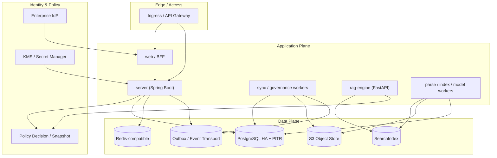

# 通用企业知识库平台 (rag-knowledge-platform)

> 为 SaaS 与私有化场景提供**知识接入、治理、检索、引用问答和开放集成**能力,并保证租户、权限、来源、版本和模型使用全程可追溯。

[](LICENSE)
[](service/pom.xml)
[](service/pom.xml)
[](rag-engine/pyproject.toml)
[](rag-engine/pyproject.toml)
[](web/package.json)
[](deploy/ddl/init.sql)

平台**不是单一聊天机器人**,也不把某个云厂商、向量库或模型写入领域语义。其核心闭环为:

```text
企业身份与组织
      ↓
内容源接入 → 安全隔离 → 解析/OCR → 元数据/审核/保留 → 版本化索引
                                                      ↓
             统一授权 → 搜索/问答 → 引用与反馈 → 质量/成本/审计
```

---

## 功能特性

| 能力域 | 说明 |
| --- | --- |
| **身份与租户** | OIDC Authorization Code + PKCE、租户成员、组织/用户组,预留 SCIM/SAML |
| **知识接入** | 上传、对象存储、SharePoint/OneDrive、Confluence、Web 等连接器端口 |
| **内容安全** | quarantine、真实类型识别、压缩炸弹、恶意软件、DLP/密钥、间接提示词注入检测 |
| **知识治理** | 来源血缘、不可变版本、元数据 schema、分类分级、审核、复审、保留与法律保全 |
| **检索与索引** | 关键词 + 向量 + 融合 + 精排;不可变 index profile、别名原子切换 |
| **权限与审计** | 租户/KB/文档 allow-list、统一策略决策(PDP/PEP)、fail-closed、追加写审计 |
| **可信问答** | 授权检索、可定位引用、拒答、版本/策略可追溯、AI 安全与持续评测 |
| **开放运营** | 有 scope 的 API Key、Webhook、配额、SLO、RPO/RTO、成本与质量分析 |

## 架构概览

采用 **模块化单体 server + 独立 rag-engine / workers** 的架构(ADR-1),关系库内使用**本地事务 + outbox**(ADR-2),搜索索引可替换(默认 OpenSearch,ADR-3),身份交给企业 OIDC、授权留在领域层(ADR-4)。



> 详细运行拓扑、信任边界与可靠性设计见 [`docs/06-架构方案.md`](docs/06-架构方案.md);技术选型与 ADR 见 [`docs/05-技术选型.md`](docs/05-技术选型.md)。

## 技术栈

| 层 | 技术 | 目录 |
| --- | --- | --- |
| 领域 API 服务 | Java 21 · Spring Boot 3 · Spring Security/Data | [`service/`](service/) |
| RAG 引擎 | Python 3.12+ · FastAPI · provider-neutral pipeline | [`rag-engine/`](rag-engine/) |
| Web / BFF | Next.js 15 (App Router) · TypeScript | [`web/`](web/) |
| 业务数据库 | PostgreSQL 16+ · Flyway | [`deploy/ddl/init.sql`](deploy/ddl/init.sql) |
| 中间件编排 | Docker Compose（PostgreSQL/Redis/MinIO） | [`deploy/compose/`](deploy/compose/) |
| 对象存储 / 搜索 / 缓存 | S3-compatible · OpenSearch(默认)· Redis-compatible | — |
| 异步一致性 | PostgreSQL transactional outbox + worker | — |
| 可观测性 | OpenTelemetry + Prometheus-compatible metrics | — |

## 仓库结构

```text
.
├── service/          # Java Spring Boot 领域 API 服务(模块化单体)
├── rag-engine/       # Python FastAPI RAG 引擎(解析/检索/精排/生成)
├── web/              # Next.js 前端 / BFF
├── deploy/           # 部署资产与数据库 DDL
│   └── ddl/          #   PostgreSQL 初始化 / Schema / 种子数据
├── docs/             # 需求、设计、API 契约、测试、运维文档
├── engineering/      # AI 工程规则与 Skill
├── .ai/              # AI 项目上下文与验证命令
├── .github/          # CI 工作流
├── Makefile          # 统一验证入口(lint / typecheck / test / security)
└── AGENTS.md         # AI 工作入口
```

## 快速开始

### 环境要求

| 工具 | 版本 | 用途 |
| --- | --- | --- |
| JDK | 21 (LTS) | 构建 `service/`(本机仅 JDK 8 时不可构建,CI 已用 JDK 21) |
| Maven | 3.9+ | 构建 `service/` |
| Python | 3.12+ | 运行 `rag-engine/` |
| uv | 0.5+ | `rag-engine/` 依赖管理 |
| Node.js | Active LTS (22+) | 运行 `web/` |
| pnpm | 9+ | `web/` 包管理 |
| PostgreSQL | 16+ | 业务数据库(可选,本地演示可暂不启动) |

### 拉取依赖

```bash
# 后端 (service)
cd service && mvn -B dependency:go-offline

# RAG 引擎
cd rag-engine && uv sync

# 前端
cd web && pnpm install
```

### 本地运行

```bash
# RAG 引擎(FastAPI,默认 :8000)
cd rag-engine && uv run uvicorn rag_engine.main:app --reload

# 领域服务(Spring Boot,默认 :8080,需 JDK 21)
cd service && mvn spring-boot:run

# 前端(Next.js,默认 :3000)
cd web && pnpm dev
```

### 一键验证

```bash
make lint        # 前端 lint + rag-engine ruff
make typecheck   # 前端类型检查
make test        # 前端 + rag-engine + service 测试
make security    # 轻量硬编码密钥扫描
```

### 数据库初始化

一条命令完成新装（角色 + 库 + 48 表 + 最小种子）：

```bash
# 密码通过 psql 变量传入,不写入仓库
psql -v ragkb_app_password='***' -v ragkb_migrator_password='***' \
     -U postgres -d postgres -f deploy/ddl/init.sql
```

> 使用 [`deploy/compose/`](deploy/compose/) 时，PostgreSQL 首次启动会自动执行 `init.sql`（密码取自 `deploy/compose/.env` 的 `RAGKB_APP_PASSWORD` / `RAGKB_MIGRATOR_PASSWORD`）；以下命令适用于独立/托管 PostgreSQL 或空库重建场景。完整启动顺序见 [`docs/09-部署运维指南.md`](docs/09-部署运维指南.md)。

## 文档导航

- [文档总入口](docs/README.md) · [v0.2 文档索引](docs/00-README.md)
- [01 需求分析](docs/01-需求分析.md) · [02 概要设计](docs/02-概要设计.md) · [03 详细设计](docs/03-详细设计.md)
- [04 数据库设计](docs/04-数据库设计.md) · [05 技术选型](docs/05-技术选型.md) · [06 架构方案](docs/06-架构方案.md)
- [07 API 契约](docs/07-API契约.md) · [08 测试与质量评估](docs/08-测试与质量评估.md)
- [09 部署运维指南](docs/09-部署运维指南.md) · [10 里程碑与开发计划](docs/10-里程碑与开发计划.md)（v0.1 已废弃，替代为 [11 开发路线图](docs/11-开发路线图.md)）
- 业务模块文档:`docs/modules/<module>/`(enterprise-generalization / order / user)

> **注意**:`07-API契约.md` 与 `10-里程碑与开发计划.md` 为 v0.1 人工摘要,**已废弃**;权威机器契约是 `docs/api/*.openapi.yaml`(当前 v0.2 评审中,未冻结)。实现前务必以 OpenAPI 与 v0.2 设计为准。

## 模块与当前状态

| 端 | 状态 |
| --- | --- |
| `service/` | v0.2 模块化单体**架构骨架**,健康检查可用,业务模块待按 OpenAPI 冻结后实现 |
| `rag-engine/` | v0.2 **架构骨架**,`/healthz` 探针可用,内部契约待冻结 |
| `web/` | Next.js 工程 + **完整 mock 数据层**,可脱离后端演示 |
| 数据库 | v0.2 Schema 文件基线,未执行 |

当前阶段:设计基线收敛(v0.1 → v0.2)与工程脚手架初始化。路线图见 [`docs/10-里程碑与开发计划.md`](docs/10-里程碑与开发计划.md)。

## 开源信息

- **许可证**:本项目使用 [MIT License](LICENSE)。
- **行为准则**:参与项目请遵守 [Contributor Covenant Code of Conduct](CODE_OF_CONDUCT.md)。
- **安全**:发现安全漏洞请按 [SECURITY.md](SECURITY.md) 负责任披露,勿公开提交。
- **贡献**:欢迎提交 Issue 与 PR,贡献指南见 [CONTRIBUTING.md](CONTRIBUTING.md)。

## 致谢与免责

本项目由 AI 辅助脚手架生成(Assisted-by: Claude Code),所有设计结论以 `docs/` 下 v0.2 文档为准;文档中标注"评审中/草稿/未冻结"的内容均**不构成实现或验收依据**。
