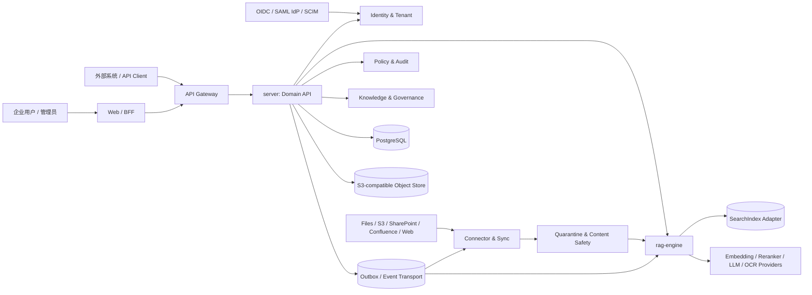
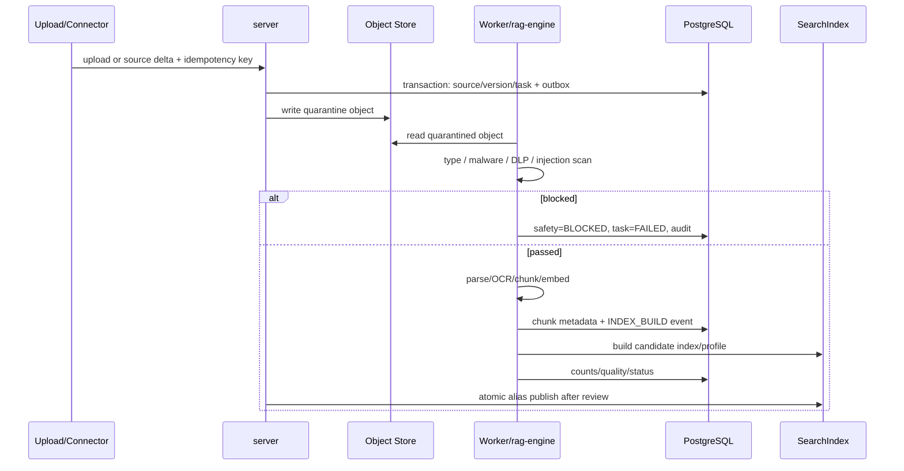
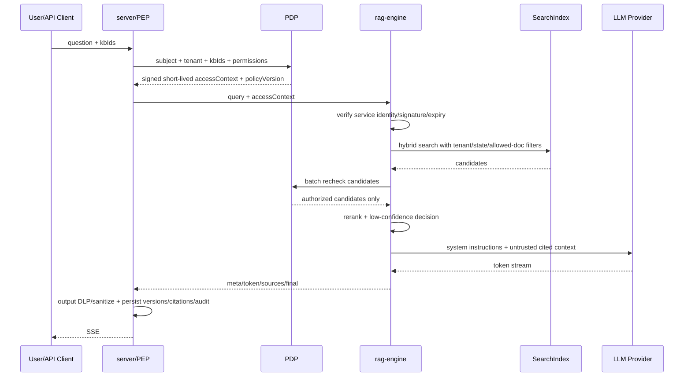

# 通用企业知识库平台概要设计

> **文档状态**：评审中 · **版本**：v0.2.0-design · **负责人**：待指定 · **最近更新**：2026-08-10
> **需求依据**：[`01-需求分析.md`](01-需求分析.md) F2.x + [`modules/enterprise-generalization/requirements/README.md`](modules/enterprise-generalization/requirements/README.md) GKB-x
> **关联文档**：详细设计→[`03-详细设计.md`](03-详细设计.md)；数据→[`04-数据库设计.md`](04-数据库设计.md)；技术→[`05-技术选型.md`](05-技术选型.md)；部署→[`06-架构方案.md`](06-架构方案.md)

## 1. 目标与原则

### 1.1 目标

- 面向 SaaS 与私有化部署复用同一领域模型，不把某个 IdP、内容源、对象存储、搜索引擎或模型写入业务规则。
- 打通知识发现、接入、安全、解析、治理、索引、搜索、问答、反馈与运营闭环。
- 在所有读取面统一执行 tenant、KB、文档 ACL、分类、审核、禁用、版本和保留策略。
- 使原始内容、元数据、策略、索引、模型和引用均可追溯、重建、灰度和回滚。

### 1.2 设计原则

1. **数据库是真相，索引是派生物**：PostgreSQL 保存业务状态与策略，对象存储保存不可变原文，搜索索引可重建。
2. **默认拒绝**：调用者不提供 tenant/角色；身份和授权上下文由可信边界产生，缺失/过期即失败。
3. **端口优先**：领域层依赖 `IdentityProvider/ContentConnector/SearchIndex/ModelProvider/...`，供应商 SDK 仅在 adapter。
4. **本地事务 + outbox**：不以分布式事务伪装 PostgreSQL、对象存储和搜索索引之间的原子性。
5. **不可变版本 + 显式指针**：文档版本、索引 profile、提示模板和模型策略均版本化；当前版本通过指针/别名选择。
6. **先安全再可用**：授权、DLP、数据驻留和法律保全不可降级放宽。

## 2. 系统上下文



### 2.1 信任边界

- 浏览器、外部 API、连接器内容、模型输入/输出和 Webhook 目标均不可信。
- gateway/BFF 验证用户或机器身份；server 是资源授权和业务状态的最终执行点。
- rag-engine 不是公开 API，只接受工作负载身份 + server 签名的短期 `RetrievalAccessContext`。
- NetworkPolicy 只减少攻击面，不代替服务身份、授权或输入校验。

## 3. 逻辑模块

| 模块 | 核心职责 | 事实源/输出 |
| --- | --- | --- |
| identity | OIDC subject 映射、全局用户、租户成员、组织/组、SCIM 同步 | sys_user / identity_account / tenant_member / sys_org |
| access-policy | KB 角色、文档 ACL、scope、分类许可、policyVersion、批量授权 | kb_member / document_acl / policy_snapshot |
| knowledge | 知识库、文档、不可变版本、标签、所有者、权威状态 | kb / document / document_version |
| connector | 内容源配置、发现、delta、Webhook、源 ACL、删除墓碑 | source_connection / source_object / sync_job |
| content-safety | quarantine、格式、恶意软件、DLP、密钥、提示词注入风险 | document_version.safety_status + 审计事件 |
| ingestion | 解析、OCR、结构化提取、分块、embedding、幂等补偿 | parse_task / chunk_meta / outbox_event |
| metadata-governance | schema、受控词表、分类、审核、复审、保留、法律保全 | metadata_schema / document_metadata / review / retention / hold |
| indexing | index profile、全量/增量 build、数量/质量校验、alias 切换 | index_profile / index_build / SearchIndex |
| retrieval | 授权预过滤、BM25/向量、融合、精排、候选二次授权 | 授权候选与引用 |
| conversation | 会话、SSE、拒答、引用、反馈、追问建议 | chat_session / chat_message / source |
| analytics | 质量、使用、成本、新鲜度、同步健康与配额 | usage_daily / cost_record / 指标系统 |
| integration | scoped API Key、Webhook 签名投递、死信与重放 | api_key / webhook_* |
| audit-ops | 追加写审计、outbox、SLO、告警、删除证明 | audit_log / outbox_event / deletion receipt |

### 3.1 代码边界（目标）

```text
service/
  identity/ access/ knowledge/ connector/ governance/
  ingestion/ indexing/ conversation/ analytics/ integration/
  application/ ports/ adapters/ common/

rag-engine/
  api/ auth/ ingestion/ safety/ parsing/
  indexing/ retrieval/ rerank/ generation/
  providers/ observability/

web/
  app/ api-client/ features/ components/ auth/ observability/
```

- HTTP/controller 只做协议、认证上下文、校验与 use case 调用。
- domain/application 不引用 Spring MVC、供应商 SDK 或索引 DSL。
- adapter 负责协议翻译、超时、重试、熔断和 provider capability。

## 4. 核心数据流

### 4.1 OIDC 登录与租户选择

1. Web 经 BFF 发起 Authorization Code + PKCE，使用 state/nonce 防重放。
2. IdP 回调后，identity 以 `issuer + subject` 查找 `identity_account`，同步基础 profile。
3. 加载有效 `tenant_member`；一个用户可加入多个 tenant，但每次会话只激活一个 tenant。
4. BFF/session 或 access token 携带不可伪造 tenant、subject、audience 和 scope；server 每次重新校验关键 claim。
5. 切换 tenant 时创建新上下文并清空旧 tenant 的前端、server 与策略缓存。

### 4.2 手工上传/连接器同步



规则：

- `connection + externalId + sourceVersion` 与 idempotency key 阻止重复摄取。
- 原始对象先 quarantine，扫描通过后才转为受控版本；扫描组件不可用时不继续。
- 源撤权/删除优先于普通内容更新传播；数据库策略即时收紧，索引异步更新不得造成放权。
- 同步失败保留 cursor 和最近成功版本，超过新鲜度 SLA 标记 stale 并告警。

### 4.3 发布、撤回与复审

1. 版本解析 READY 不等于业务可检索；元数据、内容安全、审核、有效期和 legal hold 分别判定。
2. 发布创建/更新 `document.current_version_id` 和 `policy_version`，通过 outbox 更新索引。
3. 撤回、禁用、过期或 ACL 收紧立即从 PDP 的可见集合移除；搜索/问答先使用数据库生成的授权快照。
4. 索引更新成功后记录传播延迟；超 SLA 暂停受影响 KB 的问答，不放宽过滤。
5. 历史会话保存原引用版本，但再次打开引用时按当前权限和文档状态重新授权。

### 4.4 授权检索与问答



安全不变量：

- accessContext 缺失、过期、签名无效、policyVersion 过旧或无法解析时不检索。
- `PUBLISHED + ACTIVE + currentVersion + !disabled` 与 allowed document filter 同时生效。
- 检索文本是数据，不得覆盖 system/developer policy；输出 HTML/Markdown/URL 经上下文净化。
- 外部模型路由同时满足敏感级、区域、用途、预算和 provider 健康策略；无合规 fallback 时安全失败。

### 4.5 换模与索引重建

1. 创建新的不可变 index profile；旧 profile 不原地修改。
2. 构建新物理索引，按文档 current version 全量重放；记录输入数、chunk 数、失败数和模型 checksum。
3. 运行检索/引用/ACL 泄漏/延迟/成本评测，未达门禁不发布。
4. 原子切换 KB 的读取 alias；观察期内保留旧索引。
5. 回滚只切回旧 alias；确认无引用后按保留策略清理旧索引。

## 5. 数据与一致性

| 数据 | 权威存储 | 一致性 |
| --- | --- | --- |
| tenant/identity/membership/policy | PostgreSQL | 本地事务；policyVersion 单调递增 |
| 文档元数据/版本/治理 | PostgreSQL | 本地事务；current version 显式指针 |
| 原始/解析产物 | S3-compatible object store | 不可变 key + checksum + versioning |
| chunk/搜索索引 | SearchIndex adapter | 派生；outbox 至少一次 + 消费幂等 |
| 短期策略快照/会话缓存 | Redis-compatible cache | 有 TTL；失效不放宽权限 |
| 审计 | PostgreSQL + 可选不可变归档 | 追加写；高价值事件外送独立存储 |

- 不使用 Seata 管理对象存储、搜索索引或模型调用；这些外部副作用通过 saga/补偿和可重放任务处理。
- outbox 与业务变更同事务提交，消费者以 eventId/idempotencyKey 去重。
- 删除先进入 `DELETING` 并从授权集合移除，再异步处置对象、索引和缓存，最后生成删除证明；legal hold 可阻断处置。

## 6. 部署形态

### 6.1 SaaS

- control plane 管理 tenant、provider policy、配额与审计；data plane 可按区域/客户分片。
- tenant 数据通过复合外键、应用过滤和可选 PostgreSQL RLS 隔离。
- 高敏租户可绑定专属对象 bucket、索引、KMS key 和模型 provider 集合。

### 6.2 私有化

- 同一服务镜像部署在客户环境；IdP、S3、SearchIndex、模型和事件适配器指向客户资源。
- 离线环境允许本地解析/OCR/embedding/LLM，但保持相同 provider capability 和安全策略。
- 所有镜像固定 digest；不依赖公网运行时下载模型或插件。

### 6.3 从单体起步的扩展路径

- v0.2 可用 modular monolith + 独立 rag-engine/worker 起步。
- 仅当同步、解析、索引或生成负载需要独立扩缩容时拆分进程；领域边界和事件契约不随部署形态变化。
- 不为“看起来微服务化”提前引入跨服务分布式事务。

## 7. 外部边界与适配器

| 端口 | 首选默认 | 可替换示例 |
| --- | --- | --- |
| IdentityProvider | 企业 OIDC | SAML bridge、Keycloak、Entra、Okta、客户 IdP |
| ContentConnector | upload/S3/SharePoint/Confluence | WebDAV、Git、数据库、业务系统插件 |
| ObjectStore | S3-compatible | MinIO、云对象存储、客户私有对象存储 |
| SearchIndex | OpenSearch adapter | Milvus + keyword index、pgvector（小规模） |
| EventTransport | PostgreSQL outbox worker | Kafka、Pulsar、Redis Streams |
| ModelProvider | OpenAI-compatible/local adapter | 云模型、本地推理、客户网关 |
| ContentSafety | ICAP/AV + DLP port | ClamAV、云 DLP、客户安全网关 |

## 8. 公共契约影响与状态

当前 `docs/api/*.openapi.yaml` 仍为 v0.1，状态为 `conflicting`。v0.2 实现前必须先完成：

- 移除 password grant，定义 OIDC/BFF 登录、登出和 tenant 切换边界。
- Query/Search 内部契约加入不可省略的授权上下文、policyVersion 和服务认证。
- 内容访问拆分 excerpt/preview/download 权限。
- 增加连接器、同步任务、元数据 schema、保留/hold、index build、删除证明和 scoped API Key 资源。
- 所有异步命令定义 `Idempotency-Key`、task 状态/进度/错误/取消/重试。
- OpenAPI lint 和三端生成类型纳入 CI；人工摘要不再手工复制字段。

在上述契约确认前，后端、rag-engine 与前端只能做脚手架、接口适配验证和非业务原型，不得把本概要中的候选字段当成冻结 API。

