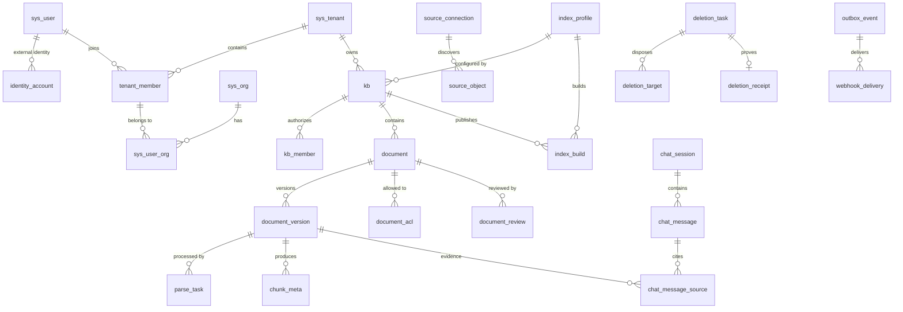

# 数据库设计

> **文档状态**：v0.2 设计基线 · 最近变更：2026-08-10  
> **适用范围**：通用企业知识库，新装 PostgreSQL 16+；旧 v0.1 环境采用分阶段迁移。  
> **权威边界**：本文定义领域模型、约束和迁移策略；精确表名、列名、类型、索引与外键以 [`deploy/ddl/init.sql`](../deploy/ddl/init.sql) 为准；请求/响应字段仍以 OpenAPI 为准。  
> **关联文档**：[`02-概要设计`](02-概要设计.md)、[`03-详细设计`](03-详细设计.md)、[`06-架构方案`](06-架构方案.md)。

## 1. 设计目标

数据库承担业务事实、权限依据、审计证据和异步事件的权威存储，不承担向量相似度检索或原始文件存储。

- PostgreSQL 是租户、身份关系、知识资产、版本、ACL、审核、保留策略、会话引用和事件状态的事实源。
- 对象存储保存不可变原始版本和中间产物；数据库只保存 `object_key`、摘要、大小与安全结果。
- SearchIndex 与缓存均为可重建的派生数据，不得成为授权事实源。
- 所有租户业务表带 `tenant_id`；跨表关系优先使用 `(tenant_id, id)` 复合外键，阻止跨租户误关联。
- 文档版本、审核记录、引用记录和审计日志采用追加写；运行时角色不可更新或删除关键证据表。
- 跨组件一致性采用本地事务、transactional outbox、幂等消费者和补偿任务，不使用 Seata AT。

## 2. 存储边界

| 数据 | 权威存储 | 数据库保存内容 | 恢复方式 |
|---|---|---|---|
| 租户、组织、成员、角色 | PostgreSQL | 完整关系及版本 | PITR/备份恢复 |
| 知识库、文档、版本、治理状态 | PostgreSQL | 元数据、状态、摘要、对象键 | 数据库与对象版本联合恢复 |
| 原始文件、解析产物 | 对象存储 | `object_key`、SHA-256、MIME、大小 | 对象版本/跨区副本 |
| 切片正文元数据 | PostgreSQL | 可审计切片、位置、摘要 | 由不可变文档版本重算 |
| 关键词/向量索引 | SearchIndex | 构建号、物理名、别名和质量报告 | 按 `index_profile` 重建 |
| 授权快照 | 分布式缓存 | 数据库仅保存校验和、数量、过期时间和 `cache_ref` | 失效后重新计算；失败时拒绝 |
| 会话与引用 | PostgreSQL | 消息、模型/策略版本、引用坐标和摘要 | 数据库恢复 |
| 密钥 | Secret Manager/KMS | `secret_ref` 或不可逆 digest/prefix | 密钥轮换流程 |

## 3. 核心关系



全局 `sys_user` 不绑定某一租户。同一自然人通过 `identity_account(issuer, subject)` 关联外部身份，并通过 `tenant_member` 加入一个或多个租户；租户角色和组织归属分别由 `tenant_member_role`、`sys_user_org` 表达。

## 4. 表目录

新装基线共 48 张业务表。

| 领域 | 表 | 关键职责 |
|---|---|---|
| 租户与身份 | `sys_tenant`、`sys_user`、`identity_account`、`identity_provider`、`tenant_member`、`tenant_member_role`、`sys_org`、`sys_user_org` | 全局身份、多身份源、多租户成员、多个组织、租户角色 |
| 知识配置 | `retention_policy`、`index_profile`、`kb`、`kb_member`、`metadata_schema` | 保留策略、不可变索引档案、知识库、成员、元数据模式 |
| 来源与同步 | `source_connection`、`sync_job`、`source_object` | 连接器配置、增量游标、外部版本/ETag、源 ACL、删除墓碑 |
| 文档治理 | `document`、`document_version`、`parse_task`、`document_metadata`、`document_acl`、`document_review`、`legal_hold`、`legal_hold_document` | 业务身份、不可变版本、安全摄取、元数据、允许列表、审批、法律保留 |
| 切片与检索 | `chunk_meta`、`index_build`、`policy_snapshot` | 确定性切片、蓝绿索引构建、短期授权快照元数据 |
| 会话与度量 | `chat_session`、`chat_session_kb`、`chat_message`、`chat_message_source`、`usage_daily`、`cost_record`、`model_route_config` | 多知识库会话、可追溯引用、用量成本、合规模型路由 |
| 集成与可靠性 | `api_key`、`api_key_kb`、`idempotency_record`、`audit_log`、`outbox_event` | 最小权限机器身份、请求去重、追加审计、可靠事件 |
| 处置证据 | `deletion_task`、`deletion_target`、`deletion_receipt` | 删除预览、逐存储目标处置、备份例外和追加写校验收据 |
| 辅助能力 | `tag`、`document_tag`、`user_favorite`、`notification`、`webhook_subscription`、`webhook_delivery` | 标签、收藏、租户内用户通知、Webhook 配置与投递状态 |

## 5. 关键模型与不变量

### 5.1 租户与身份

- `sys_tenant.code` 是稳定外部键；显示名称可以修改，租户 ID 和 code 不复用。
- `identity_account` 以 `(issuer, subject)` 唯一定位身份。邮件只作属性和受控关联依据，不能替代 OIDC subject。
- `tenant_member(tenant_id, user_id)` 唯一；禁用成员后必须使会话、API 权限快照和缓存失效。
- 一个成员可以属于多个组织；不再在用户表保存单一 `org_id`。
- `identity_provider.secret_ref` 只引用 Secret Manager；禁止存 client secret 明文。

### 5.2 知识库与索引档案

- `index_profile` 一经激活不可原地修改。模型提供方、模型名、revision、维度、归一化、距离度量、切片器、分析器和重排器共同定义一个版本。
- `kb.index_profile_id` 指向目标档案；档案变更必须创建 `index_build`，通过完整性、召回、权限泄漏与性能门禁后再切换 `active_index_build_id`/读别名。
- 数据库只保存 SearchIndex 的逻辑信息，不保存向量。重建输入由 `document_version + chunk_meta + index_profile` 确定。
- `kb.visibility=TENANT` 只扩大知识库入口可见性，不能越过文档 ACL、敏感级别、有效期或发布状态。
- **数据驻留（C7 决策，冻结）**：`kb.data_region` 在创建时由应用写入、继承 `sys_tenant.data_region`（不信任客户端自报）；`document.data_region` 可空，非空时覆盖 KB 区域。Provider 路由解析顺序为 `document.data_region ?? kb.data_region ?? tenant.data_region`（03-详细设计 §8.5）；高敏文档不得被解析到不满足其驻留策略的区域。

### 5.3 文档、版本与摄取

`document` 表示稳定业务身份，`document_version` 表示不可变内容版本。当前版本约束使用 `(tenant_id, document_id, version_id)`，不能把其他文档或租户的版本设置为当前版本。

文档是否可检索至少同时满足：

```text
lifecycle_status = ACTIVE
AND review_status = PUBLISHED
AND authority_status IN (AUTHORITATIVE, DRAFT-by-policy)
AND is_disabled = false
AND now() within [valid_from, valid_until)
AND current version ingest_status = READY
AND current version safety_status = PASSED
AND subject passes KB permission and document ACL
```

其中 `DRAFT-by-policy` 不是默认配置；通用基线默认只检索 `AUTHORITATIVE`。具体策略由 PDP 版本化配置决定。

状态域相互独立，避免一个 `status` 同时承载生命周期、发布、安全与摄取含义：

| 状态 | 取值 |
|---|---|
| `document.lifecycle_status` | `ACTIVE`、`ARCHIVED`、`DELETING`、`DELETED` |
| `document.review_status` | `DRAFT`、`PENDING_REVIEW`、`PUBLISHED`、`REJECTED`、`WITHDRAWN` |
| `document.authority_status` | `DRAFT`、`AUTHORITATIVE`、`SUPERSEDED` |
| `document.sensitivity` | `PUBLIC`、`INTERNAL`、`CONFIDENTIAL`、`RESTRICTED` |
| `document_version.ingest_status` | `QUARANTINED`、`SCANNING`、`PARSING`、`CHUNKING`、`EMBEDDING`、`INDEXING`、`READY`、`FAILED`、`BLOCKED` |
| `document_version.safety_status` | `PENDING`、`PASSED`、`BLOCKED`、`FAILED` |

原始版本以 `(tenant_id, object_key)` 唯一，保存真实 MIME、文件大小和 SHA-256。只有安全扫描通过后才能进入解析；解析/OCR/切片/嵌入/索引任务以 `parse_task.idempotency_key` 去重并通过租约恢复。

### 5.4 元数据、权限和治理

- `metadata_schema` 自身有版本；`document_metadata` 同时记录 `schema_id` 和写入时的 `schema_version`，便于重新校验。
- 文档 ACL 是纯允许列表，支持 `USER`、`ORG`、`TENANT_ROLE`、`KB_ROLE`；不存在 ACL 记录不代表公开，仍由知识库默认策略决定。
- 默认权限蕴含关系为 `DOWNLOAD_ORIGINAL -> VIEW_CONTENT -> VIEW_EXCERPT`，由策略层解释，数据库不复制隐含行。
- `document_review` 只追加 `SUBMIT/APPROVE/REJECT/WITHDRAW` 证据；发布状态更新和审核记录必须在同一本地事务提交。
- 活跃 `legal_hold` 优先于普通保留/删除策略。删除工作流先进入 `DELETING`，异步清理对象、索引、缓存与派生物，核对完成后进入 `DELETED`。

### 5.5 切片、授权快照与引用

- `chunk_id` 是确定性 SHA-256 标识，建议输入为 `tenant_id | version_id | index_profile_id | ordinal | text_sha256`。
- `chunk_meta.policy_version` 表示建立派生索引时采用的权限策略版本；查询时仍必须用当前策略二次约束。
- `policy_snapshot` 只保存允许集合的数量、校验和和短期缓存引用。快照过期、丢失或版本不一致时必须重新计算；无法计算时 fail closed。
- `chat_message_source` 归一化保存文档版本、切片、排序、坐标和引用文本摘要，不把引用只塞入不可校验的 JSON。
- 每条助手消息记录模型 provider/name/revision、prompt 版本、索引档案版本、策略版本和 trace ID，支持重放与审计。

### 5.6 集成、审计与一致性

- API Key 只存 `key_digest` 和不可敏感的 prefix；scope 与允许知识库分别由 `api_key.scopes`、`api_key_kb` 收敛。
- 写接口用 `(tenant_id, operation, idempotency_key)` 去重；相同键但请求摘要不同必须返回冲突。
- 领域变更与 `outbox_event` 在同一数据库事务提交。`event_id` 是跨组件稳定 UUID，发布器按状态索引拉取，消费者以事件 ID/业务幂等键去重。
- **事件路由（C1 决策，冻结）**：`outbox_event.topic` 为路由键（`sync`/`ingestion`/`index`/`webhook`/`governance`/`general`），决定由哪类 worker 消费；`dead_letter_at`/`last_error_code` 记录死信。路由与重计算任务模型见 03-详细设计 §11.2。
- `audit_log.detail` 禁止保存原文、令牌、密钥和完整提示词；高敏字段使用摘要、分类标签或脱敏值。
- Webhook secret 只保存 `secret_ref`；投递记录保存状态码和响应摘要，不保存完整响应正文。
- 删除由 `deletion_task` 编排并在 `deletion_target` 逐项记录对象、切片、索引、缓存、预览、来源关系和备份例外；终态生成唯一、追加写的 `deletion_receipt` 及 SHA-256 校验和。

### 5.7 用户通知

- `notification` 是租户内用户级资源，绑定 `(tenant_id, user_id)`，不允许跨租户或跨用户读取。
- `kind` 收敛为 `TASK_DONE / TASK_FAILED / REVIEW_TODO / QUOTA_WARN / SYSTEM`；`level` 为 `info/success/warning/error`。
- `read` 与 `read_at` 由 mark-read 端点原子更新；未读通知按 `(tenant_id, user_id, created_at DESC)` 排序展示。
- 通知是派生展示数据，不参与授权事实源与审计决策；来源为任务、审核、配额告警等业务事件。

## 6. 多租户隔离

隔离采用四层共同生效：

1. 应用从已验证身份建立 `SubjectContext`，禁止信任客户端自报的 `tenant_id`。
2. Repository 查询显式带 `tenant_id`，复合外键阻止跨租户关系落库。
3. SearchIndex 以租户/知识库过滤并使用授权文档集合约束候选。
4. PostgreSQL RLS 作为可选纵深防御；无租户上下文时默认返回零行/拒绝写入。

RLS 启用不再提供独立脚本：策略 SQL 与前置门禁以 `deploy/ddl/init.sql` 末尾「附录 A（注释）」的形式保留。启用时会按当前 schema 动态对 `sys_tenant` 和所有带 `tenant_id` 的 `public` 业务表启用策略。启用前必须验证：

- 应用只使用 `ragkb_app`，该角色不拥有表、没有 `BYPASSRLS`。
- 每个业务事务鉴权后执行 `SET LOCAL app.tenant_id = '<verified-id>'`。
- 连接池清理、异步任务传播、两租户交叉读写和缺失上下文均有自动化测试。
- 迁移和维护使用独立 `ragkb_migrator`/受审计维护角色，不把高权限凭证交给应用。

RLS 不表达文档 ACL、角色和法律保留等业务策略，因此不能替代 PDP/PEP。

## 7. 索引与性能策略

- 高频列表索引统一以 `tenant_id` 开头，随后是知识库/主体/状态和排序时间。
- 审核到期、任务租约、outbox 分发、Webhook 重试使用部分索引，降低活跃队列扫描范围。
- 复合唯一键既服务业务幂等，也提供复合外键目标。
- JSONB 仅承载变化频繁但仍需验证的配置/报告；高频过滤、关系和权限字段必须正规化。
- `audit_log`、`chat_message`、`cost_record`、`outbox_event` 按数据量阈值规划按月或按租户哈希分区；不在无压测数据时提前固化分区数量。
- 大租户上线前使用真实规模验证查询计划、锁等待、膨胀、自动清理和索引构建 I/O；慢查询必须带 trace/request ID。

## 8. 角色与权限

| 角色 | 登录 | 用途 | 主要权限 |
|---|---:|---|---|
| `ragkb_owner` | 否 | 对象所有者 | Schema/表/函数所有权 |
| `ragkb_migrator` | 是 | 受控迁移 | 可 `SET ROLE ragkb_owner`，不供应用使用 |
| `ragkb_app` | 是 | 运行时 | 业务 DML、序列使用、必要函数执行；无 DDL/BYPASSRLS |

运行时角色被显式禁止更新/删除 `audit_log`、`document_review`、`chat_message_source`。证据保留期结束后的清理由单独 maintenance 作业执行并审计。

## 9. 安装与迁移

### 9.1 新装

一条命令完成新装（角色 + 库 + 48 表 + 最小种子）：

```bash
# DBA/受控账号：密码用 psql 变量或受控临时文件传入
psql -U postgres -d postgres \
  -v ragkb_app_password='***' \
  -v ragkb_migrator_password='***' \
  -f deploy/ddl/init.sql
```

> 中间件（PostgreSQL/Redis/MinIO）可用 [`deploy/compose/docker-compose.yml`](../deploy/compose/docker-compose.yml) 一键拉起；容器内初始化命令见 `docs/09-部署运维指南.md`。目标为 PostgreSQL 16+。

种子只创建本地私有化结构自检租户和一个 `DRAFT/待部署校验`性质的模型档案，不创建密码、管理员、API Key、身份源或模型密钥。生产控制面必须创建真实租户和身份管理员。

### 9.2 v0.1 存量环境

存量升级使用 Expand → Migrate → Contract（v0.2 不再提供独立迁移脚本，按策略与迁移单逐环境执行）：

1. **预检**：备份与恢复演练；统计租户、用户、知识库、版本、引用和失败任务；确认对象与索引可重建。
2. **Expand**：只增加租户属性、并行身份关系、索引档案、治理列、幂等与 outbox 基础；新增列/表均为可选加法，不改写旧业务列。
3. **Migrate**：应用双写；校验旧用户到全局身份/租户成员映射；锁定真实 embedding revision/dimension；全量重建索引并通过权限泄漏与召回门禁。
4. **Cutover**：小流量读 v0.2，核对行数、摘要、权限结果、审计与 SLO；再切换主读。
5. **Contract**：停止旧写并经过至少一个可回退观察窗后，另行评审旧列/旧表处理。仓库不提供自动 `DROP` 或破坏性 down migration。

`undo_log`（Seata AT 遗留表）已废弃，初始化脚本不再创建。只有确认所有旧实例与 Seata 全局事务已结束、备份和审批完成后，运维才能单独处理历史 `undo_log`。

### 9.3 回退

- Expand 阶段回退应用版本并停用双写即可；新增表/列保留，不执行自动删除。
- 索引切换通过读别名原子回指上一个 `PUBLISHED` build；数据库保留两个构建的元数据直至观察窗结束。
- 若已经写入新身份或治理数据，回退前先停止写入并导出差异，禁止用旧备份直接覆盖较新的审计/业务事实。
- RLS 启用异常由 DBA 在变更窗内逐表禁用策略；必须保留应用层租户过滤并记录安全事件。生产环境不提供一键无审计关闭脚本。

## 10. 验证清单

- 48 张新装表存在，所有租户业务表均带 `tenant_id` 或明确属于全局身份域。
- 任意跨租户知识库、文档版本、ACL、引用、API Key 关联均被复合外键拒绝。
- 同一幂等键的重放返回原结果；摘要不同返回冲突。
- 未扫描/被阻断/未发布/过期/禁用/无权限文档不进入候选集。
- embedding 维度、模型 revision、索引档案和物理索引映射一致；别名切换可回退。
- 审核、引用和审计记录对 `ragkb_app` 追加可写、更新/删除不可写。
- 缺失或错误租户上下文下，RLS 测试为零行且写入失败；两个租户交叉矩阵全部拒绝。
- PITR、对象版本恢复和索引重建演练达到架构文档定义的 RPO/RTO。

## 11. 已知待办

- [`docs/api/server.openapi.yaml`](api/server.openapi.yaml) 与 [`docs/api/rag-engine.openapi.yaml`](api/rag-engine.openapi.yaml) 仍是 v0.1 契约，身份、连接器、元数据、索引构建、治理和 API Key 范围接口必须单独评审后同步；不得从本 DDL 反推并擅自发布 API。
- v0.1 存量升级的 Expand 基线已并入 §9.2 策略描述（不再有独立脚本），不替代每个生产环境的容量评估、数据映射报告和 Contract 迁移单。
- RLS、分区、归档周期和保留天数需按部署模式、法规和租户合同配置，不能使用全局固定值。
