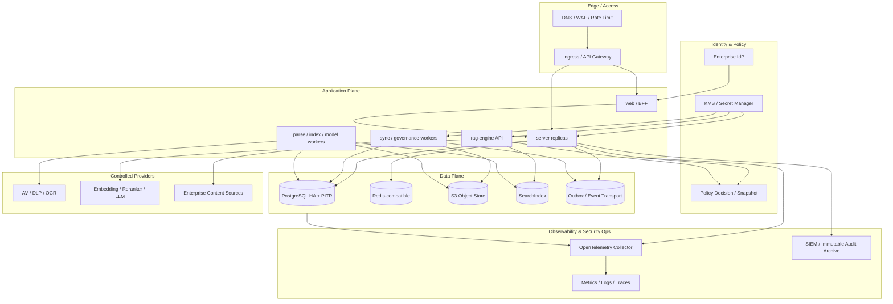

# 通用企业知识库平台架构方案

> **文档状态**：评审中 · **版本**：v0.2.0-design · **负责人**：待指定 · **最近更新**：2026-08-10
> **权威范围**：运行拓扑、信任边界、可靠性、安全、可观测性和伸缩；领域流程见 [`02-概要设计.md`](02-概要设计.md)，实现细节见 [`03-详细设计.md`](03-详细设计.md)。

## 1. 运行架构



### 1.1 部署单元

| 单元 | 同步/异步 | 伸缩指标 | 说明 |
| --- | --- | --- | --- |
| web/BFF | 同步 | request/QPS、CPU | 持有短期 OIDC session，不持有企业密码 |
| server API | 同步 | QPS、P95、线程/连接池 | 领域用例、PEP、本地事务、SSE 代理 |
| sync worker | 异步 | connector backlog/newest age | 源发现、delta、ACL、删除墓碑 |
| safety/parse worker | 异步 | task backlog、CPU/内存 | 隔离扫描、解析、OCR、分块 |
| index worker | 异步 | outbox/index backlog | embedding、bulk index、build 校验/切换 |
| rag-engine API | 同步 | retrieval/first-token P95 | 授权检索、融合、精排、生成 |
| model runtime | 同步/批量 | GPU/queue/token | 可本地或受控外部 provider |

起步可把多个 worker 合并制品部署，但队列、幂等键、资源限制和指标必须独立，便于后续拆分。

## 2. 网络与零信任

### 2.1 网络分区

- `edge`：只暴露 Ingress/Gateway；限制 body、连接、上传大小、速率和来源。
- `app`：web/server/worker/engine；默认拒绝东西向流量，按服务账户放行。
- `data`：PostgreSQL、cache、object、search、event；不允许公网入口。
- `provider-egress`：连接器、Webhook、云 OCR/模型统一出站；通过 allowlist/proxy 记录目的、tenant 和用途。
- `observability`：OTLP 单向采集；日志/trace 出域前脱敏。

### 2.2 服务身份

- server、engine、worker 使用不同 workload identity；mTLS 或短期 service token 绑定 audience。
- engine 必须同时验证调用服务身份和签名 `RetrievalAccessContext`，不能只看来源 IP。
- 凭证短期化、自动轮换；Secret Manager/KMS 只授予目标 workload，禁止共享万能 Secret。
- NetworkPolicy、mTLS、应用授权和数据库权限是叠加层，任一层不替代其他层。

### 2.3 出站 SSRF 防护

- Webhook 和 Web connector URL 只允许 `https`，拒绝 userinfo、非常规端口和重定向越界。
- DNS 解析结果与连接目标双重校验，阻止 loopback、link-local、RFC1918、云元数据和集群 Service 网段；私有源通过显式 connector gateway 配置，不靠绕过规则。
- 每次重试重新解析并复核 IP；响应大小、时间、跳转和内容类型设上限。

## 3. 身份、权限与数据隔离

### 3.1 身份链

1. 企业 IdP 完成 MFA/登录；BFF 使用 OIDC Code + PKCE。
2. `issuer + subject` 映射 global user；tenant membership、组织/组和角色来自平台/SCIM。
3. server 生成 `SubjectContext`，tenant 由服务端选定并校验 membership。
4. PEP 在每个 use case 调 PDP；页面按钮和网关路由不构成最终授权。

### 3.2 文档授权

- KB 访问先要求有效 kb_member 或 tenant 管理 scope。
- 无 document ACL：继承 KB 角色；有 ACL：只允许匹配 user/org/tenant-role/kb-role principal 的权限。
- 默认蕴含关系为 `DOWNLOAD_ORIGINAL -> VIEW_CONTENT -> VIEW_EXCERPT`；只由 PDP 按版本化策略展开，数据库不复制隐含 ACL 行。
- 搜索/问答使用 policy snapshot 的 allowed document filter；候选进入 LLM 前批量二次授权。
- ACL/组织/成员/审核/禁用变更使 policyVersion 增长并清理 snapshot/cache。

### 3.3 PostgreSQL 隔离

- 所有租户资源保留 `tenant_id`，父子表使用 `(tenant_id, id)` 复合外键。
- runtime role 不拥有 Schema、不具 `BYPASSRLS`；migration owner 与 runtime role 分离。
- 可选 RLS 从 `current_setting('app.tenant_id', true)` 取 tenant；连接借出前设置、归还前 `RESET`，未设置默认拒绝。
- RLS 不覆盖 table owner、TRUNCATE 或 REFERENCES 等所有场景，仍需最小数据库权限和复合约束。

## 4. 内容安全与 AI 安全

### 4.1 摄取门禁

```text
receive -> quarantine -> type/size/archive limits -> malware
        -> DLP/secret/classification -> injection-risk scan
        -> parse/OCR -> metadata/review -> index candidate -> publish
```

- 原文件永不由 web/server 进程直接执行或通过 shell 拼接参数。
- 解析器在低权限、只读根文件系统、无默认网络、CPU/内存/时间限制的 sandbox 中运行。
- 宏、脚本、嵌入对象和外链按文件策略剥离/阻断；扫描结果含 engine/rule version。
- 高敏内容是否允许 OCR/embedding/LLM 外发由 tenant policy 判定，无允许 provider 时停在本地或失败。

### 4.2 RAG 信任边界

- 用户问题与检索文档都属于 untrusted data；system policy 与引用数据采用结构化分区。
- 模型没有数据库、网络、文件系统或业务写权限；工具调用若后续引入，需逐工具 schema、scope、确认和审计。
- output 经过敏感信息、引用归属、URL 和 HTML/Markdown 安全处理；前端不执行模型生成脚本。
- red-team 指标覆盖 prompt injection、data poisoning、vector weakness、sensitive disclosure、improper output 和 unbounded consumption。

## 5. 数据架构与高可用

| 组件 | HA/持久化 | 备份/恢复 | 失败行为 |
| --- | --- | --- | --- |
| PostgreSQL | 托管 HA 或 primary/standby | 全量 + WAL/PITR，定期空环境恢复 | 核心写入停止；不得切到无一致性存储 |
| ObjectStore | versioning、跨盘/跨 AZ | replication/lifecycle/object lock | 新上传失败；已索引内容可按策略继续查询 |
| SearchIndex | 多副本、分片、alias | snapshot；亦可从 PG+object+outbox 重建 | 搜索/问答明确降级，不回退到未授权全集 |
| Redis-compatible | 主从/哨兵/托管 | 可选快照；非事实源 | 缓存失效重算；授权服务不可用则 fail-closed |
| Event transport | outbox 是事实 | PG 备份；broker 自身按需复制 | backlog 增长并告警，消费者可重放 |
| Audit archive | 独立账户/不可变策略 | 按合规保留 | 本地落库后外送；外送失败进入高优先级 backlog |

### 5.1 删除与法律保全

- 删除请求先授权和预览影响，创建 deletion task；document 立即进入 `DELETING` 并退出可见集合。
- legal hold 命中时拒绝对象/版本处置，但可按策略撤出在线检索。
- worker 处置当前/历史对象、chunk、搜索索引、缓存和派生预览；备份按保留窗口自然到期并记录例外。
- 每个目标记录状态、checksum/数量和完成时间，最终生成 deletion receipt；失败可重放。

## 6. 可观测性

### 6.1 标准

- OpenTelemetry trace 跨 web/server/worker/engine/provider；W3C Trace Context 作为传播协议。
- 统一资源属性：service.name/version、deployment.environment、region；tenant/user 仅在允许 backend 中使用哈希/受控维度。
- 日志 JSON 化并包含 traceId/requestId/eventId/taskId；禁止记录 token、API Key、connector secret、完整问题/原文或 DLP 命中内容。

### 6.2 关键指标

| 域 | 指标 |
| --- | --- |
| Identity/Policy | login success、authz deny/error、snapshot build/age、policy lag、candidate recheck removal |
| Sync/Ingestion | source freshness、cursor age、task backlog、malware/DLP hit、parse success、retry/dead-letter |
| Index/Retrieval | build duration/count mismatch、alias version、Recall@K、MRR/nDCG、search P95、zero-result |
| Generation | first-token/completion P95、faithfulness、citation correctness、refusal accuracy、provider route/fallback |
| Data/Ops | DB/cache/search saturation、outbox age、backup age、restore duration、deletion propagation |
| Cost/Quota | storage/chunks/tokens/provider cost、quota rejection、hot tenant impact |

### 6.3 告警原则

- 安全：跨租户拒绝异常、ACL 二次剔除、policyVersion 落后、DLP 外发阻断、内部服务认证失败立即告警。
- 数据：outbox/deletion/sync backlog 以“最老事件年龄”而非仅数量告警。
- 质量：按业务域/语言/角色监测，不用全局平均掩盖弱场景。
- 告警必须关联 runbook、owner、严重级、抑制和恢复条件；无 owner 的指标不进入生产告警。

## 7. SLO、容量与隔离

具体承诺由产品和运维按交付形态确认；架构必须至少提供：

- 登录、授权、搜索、问答、上传、同步、ACL/删除传播的成功率和延迟 SLI。
- tenant 存储、文档、chunk、同步 QPS、查询并发、token、导出和 Webhook 配额。
- admission control、bulkhead、队列上限和 per-tenant concurrency，防止热点租户拖垮共享资源。
- 成本预算与外部模型 hard limit；超过预算不自动切换到更昂贵或不合规 provider。

建议初始可用性目标可参考 [`modules/enterprise-generalization/ops/README.md`](modules/enterprise-generalization/ops/README.md)，但未确认值不得写成 SLA。

## 8. RPO/RTO 与演练

- 元数据/权限、原始对象、审计、会话、索引和配置分别定级；索引通常可重建，RPO 不能与元数据等同。
- 每季度至少一次空环境恢复：PG PITR → object restore → outbox replay → search rebuild → alias publish → tenant/ACL/引用校验。
- 演练记录实际 RPO/RTO、数据差异、未恢复对象和改进任务；“存在备份”不等于“已验证可恢复”。
- 恢复或回滚不得复活已撤权/已删除内容；安全策略版本和 legal hold 在恢复后优先校验。

## 9. 配置、制品与供应链

- 非敏感配置进入 ConfigMap/配置中心；Secret/KMS 只保存引用和加密材料，按 workload 最小授权。
- 镜像、模型、parser、规则库和前端依赖固定 digest/checksum；生成 SBOM、签名并做漏洞/许可证扫描。
- 禁止生产 `latest`、运行时从不可信 URL 下载模型、把 Secret 烘焙进镜像或将生产配置写入仓库。
- provider capability、区域、用途、数据保留和退出方案进入 registry；不可用或合同变化时可切换 adapter/重建索引。

## 10. 发布与回滚

1. migration 使用 expand/contract：先加兼容结构，再部署双写/回填/校验，最后在独立版本删除旧结构。
2. API 先做向后兼容 OpenAPI；消费者全部升级后再移除旧字段/端点。
3. 索引/embedding 通过新 profile 和 alias 切换，不原地修改 mapping 或维度。
4. canary 同时观察功能、安全、质量、延迟、成本和 backlog；任一 P0 安全门禁失败立即停止。
5. 应用回滚只回旧制品/alias；数据库优先 forward-fix，禁止自动执行会丢失新数据的 down migration。

## 11. 部署前门禁

- [ ] OIDC/tenant/service identity/ACL 数据流完成威胁建模和负向测试。
- [ ] DDL migration dry-run、复合租户约束与 RLS 连接池行为验证完成。
- [ ] quarantine、AV/DLP、解析 sandbox 和外部模型数据策略可执行。
- [ ] OpenAPI 已与 v0.2 设计对齐，三端类型由契约生成。
- [ ] SearchIndex 过滤/召回/alias/恢复压测完成，ACL 泄漏率为 0。
- [ ] RPO/RTO、配额、SLO、告警 owner 和恢复演练获得真实证据。
