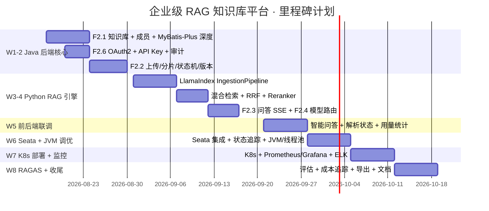

# 里程碑与开发计划

> **文档状态**：草稿 · 版本：v0.1.0 · 最近变更：2026-08-10
> **引用约定**：功能/验收→01；任务→本文档；接口→07；表→04；ADR→05。
> **关联文档**：`00-README`、`01-需求分析`、`08-测试与质量评估`。

> **⚠️ 文档状态：已废弃（v0.1）**
>
> 本文档的 W1–W8 排期基于已被 v0.2 设计基线否决的架构（Seata AT / MyBatis-Plus / Milvus / Ollama / LlamaIndex / 密码模式 OAuth / 按用量切 embedding）。
> **请勿按本文档实施**。v0.2 阶段（OIDC Code+PKCE / 本地事务+outbox / 默认 OpenSearch adapter / 模块化单体 + rag-engine / 不可变 index profile）的开发计划待重排。
> 权威源：设计决策见 [`05-技术选型.md`](05-技术选型.md) ADR-1..9，功能基线保留 F2.x。

---

## 1. 里程碑总览（W1–W8）

| 周次 | 里程碑 | 核心产出 |
|------|--------|----------|
| W1-2 | Java 后端核心 | F2.1 + F2.6 + F2.2 上传/状态机 + MyBatis-Plus 深度定制 |
| W3-4 | Python RAG 引擎 | LlamaIndex Pipeline + OCR(F2.11) + 搜索模式(F2.9) + F2.3 + F2.4 |
| W5 | 前后端联调 | F2.3 问答 + F2.9 搜索 + F2.10 预览 + F2.2 解析状态 + F2.5 统计 |
| W6 | Seata + 企业治理 | Seata + F2.13 审核 + F2.14 ACL + F2.12 组织 + F2.7 JVM + 线程池 |
| W7 | K8s 部署 + 监控 | F2.8 K8s + Prometheus/Grafana + ELK |
| W8 | RAGAS + 收尾 | RAGAS 评估 + 成本追踪 + 导出 + Webhook/标签/收藏 + 文档 |

---

## 2. W1–W2 Java 后端核心

**任务分解**：

- [ ] W1 脚手架：Maven 多模块（server + starter）、Compose 中间件、建库脚本 `deploy/ddl/00-create-database.sql` + `01-schema.sql`（`04§3` 全部 DDL）
- [ ] W1 MyBatis-Plus 深度：多租户插件 + 乐观锁 + 分页插件 + 敏感字段加解密拦截器（`04§5`）
- [ ] W1 `sys_user`/`kb`/`kb_member` Entity + Mapper + Service（F2.1）
- [ ] W2 OAuth2 资源服务器 + Token 签发/刷新/吊销 + `JwtAuthenticationConverter`（F2.6）
- [ ] W2 API Key 过滤器 + `@AuditLog` AOP（F2.6）
- [ ] W2 上传/分片/合并 + 状态机 + 版本管理（F2.2，解析编排先接 mock rag-engine）

**依赖**：`01§4.1/4.2/4.6`；`04§3`；`07§2.1-2.3`
**验收**：知识库 CRUD 权限正确；上传到解析状态推进（mock）；跨租户过滤生效；审计落库
**风险**：MyBatis-Plus 插件与多表 JOIN 冲突 → 用 `ignoreTable` 白名单 + 集成测试覆盖

---

## 3. W3–W4 Python RAG 引擎

**任务分解**：

- [ ] W3 IngestionPipeline：PyMuPDF/Docx/Markdown Reader + SentenceSplitter(512/50) + BGE-M3 + Milvus 入库（`03§3.1`）
- [ ] W3 Milvus Collection 设计落地（`03§3.4`）
- [ ] W3 **OCR 集成**：无文本页检测 + 阿里云 OCR + 文本层重建（F2.11，`03§3.1`）
- [ ] W3 **格式扩展**：Pptx/Xlsx/Html Reader（F2.2）
- [ ] W4 QueryPipeline：BM25 + 向量 → RRF(k=60) → Reranker → Top-K（`03§3.2`）
- [ ] W4 **搜索模式**：BM25 为主 + 高亮片段（F2.9，`03§3.6`）
- [ ] W4 F2.3 SSE 流式问答 + 引用 + 置信度判定（`03§3.2/4.2`）
- [ ] W4 F2.4 Model Router：Embedding/LLM 路由 + Fallback（`03§3.3/7`）

**依赖**：`03§3`；`05§4`（版本红线）；OCR 凭证 `ALIYUN_OCR_ACCESS_KEY`
**验收**：PDF 上传解析至 READY（含扫描件 OCR）；问答 SSE 流式 + 引用正确；停 Ollama 自动 fallback 云端；搜索返回高亮片段；`08§3` 集成测试通过
**风险**：BGE-M3 与 text-embedding-3-large 维度不同（1024 vs 3072）→ 提前冻结 Collection 决策（`03§3.4`）

---

## 4. W5 前后端联调

**任务分解**：

- [ ] `/chat` 问答页：SSE 消费 Hook、打字机渲染、引用跳转、追问建议（`02§2.3`、`07§5`）
- [ ] `/kb/[id]` 文档页：上传/分片/进度条、解析状态轮询、版本回滚（`07§2.3`）
- [ ] **`/search` 搜索页**：关键词 + 过滤 + 高亮片段 + 点击跳转预览（F2.9，`07§2.7`）
- [ ] **`/kb/[id]/documents/[docId]` 预览页**：PDF.js/mammoth/SheetJS 渲染 + 页码定位（F2.10，`07§2.8`）
- [ ] F2.5 用量统计：ECharts 日/周/月、热门文档、健康度（`07§2.5`）
- [ ] `/admin`：用户管理（含部门归属）、API Key、审计查询
- [ ] **标签/收藏**：`/kb/[id]` 标签筛选 + `/favorites`（F2.15，`07§2.12`）
- [ ] E2E 关键路径用例（`08§4`）

**依赖**：`07` 全部端点；`03§2.4/2.5/2.9/2.10`
**验收**：联调 bug 收敛；搜索/预览/引用跳转闭环；`08§4` E2E 路径通过
**风险**：SSE 断线重连 → 前端指数退避 + 后端幂等

---

## 5. W6 Seata + JVM 调优 + 线程池

**任务分解**：

- [ ] Seata TC 部署 + `@GlobalTransactional` 事务边界（`03§6.1`）+ undo_log 表（`04§3.16`）
- [ ] 知识库创建/克隆/上传 complete/版本回滚/审核/部门操作 事务化（`03§6.1`）
- [ ] 解析/上传线程池参数落地 + 监控指标（`03§6.2`、`06§3.1`）
- [ ] **F2.13 内容审核**：审核状态机 + 审核队列 + document_review 留痕（`03§2.11/5.3`、`07§2.10`）
- [ ] **F2.14 文档级 ACL**：ACL 判定 + 检索白名单 + 预览校验（`03§2.12`、`07§2.11`）
- [ ] **F2.12 组织**：部门树 CRUD + 用户归属 + SsoProvider 接口占位（`03§2.8`、`07§2.9`）
- [ ] **Webhook 集成**：订阅 + 事件推送（F2.15，`03§2.13`、`07§2.13`）
- [ ] F2.7 JVM：大文件解析 OOM 排查、G1 调优、jmap/MAT、Arthas（`09§7`）
- [ ] 批量导入 ZIP（F2.2）

**依赖**：`04` 表结构（含扩展表）；`05§4` Seata 版本匹配
**验收**：模拟成员写失败 → 全局回滚无残留；审核通过/驳回后检索可见性正确；ACL 越权 403；批量导入 100 文档无死锁不丢任务；GC 暂停 < 200ms
**风险**：Seata 与 MyBatis-Plus 多租户插件叠加 → 验证 undo_log 与租户过滤共存

---

## 6. W7 K8s 部署 + 监控

**任务分解**：

- [ ] Helm Chart：server/engine/web/pg/redis/milvus/ollama（`09§3`）
- [ ] 探针（liveness/readiness/startup）+ HPA（`06§2.4/2.5`、`09§3`）
- [ ] Prometheus + JMX Exporter + Grafana Dashboard（ID 4701 + 业务面板）
- [ ] 日志：Filebeat→ELK 或 Promtail→Loki（`09§5`）
- [ ] AlertManager 告警规则（`06§3.4`、`09§6`）

**依赖**：`06§2-3`；`09§3-6`
**验收**：全部工作负载 K8s 就绪；Pod 异常自动重启/摘流；告警触发通知成功
**风险**：Milvus/Ollama 在 K8s 的资源与调度 → 亲和性约束 + 内存限额

---

## 7. W8 RAGAS 评估 + 收尾

**任务分解**：

- [ ] 黄金问答集构建（≥100 条，`08§5.1`）
- [ ] RAGAS 离线评估 + 基线对比（`08§5.2/5.3`）
- [ ] 参数实验矩阵（chunk_size/top_k/reranker，`08§5.4`）
- [ ] F2.4 成本追踪 Dashboard + F2.5 数据导出
- [ ] 文档定稿 + 对外产品材料沉淀（架构说明/使用指南/白皮书）

**依赖**：`08§5`；`01§6` 验收
**验收**：Faithfulness ≥0.85 等指标达标；评估报告 + 实验报告产出；文档全量定稿

---

## 8. 每里程碑通用约定

| 项 | 约定 |
|----|------|
| 提交 | 每完成一个功能点提交一次；Conventional Commits |
| 测试 | 功能提交同时补单测；集成测试随联调补齐（`08§2-3`） |
| 契约 | 改契约先改 OpenAPI YAML 再同步 `07` 摘要表（`07§8`） |
| 文档 | 里程碑结束更新 `00` 文档状态表 |

---

## 9. 工程化资产与基建规划

> 以下为本系统**自建**的公共基础设施，作为独立工程资产沉淀于各自模块，跨功能复用，不依赖任何外部项目。

| 资产 | 规划位置 | 复用场景 |
|------|----------|----------|
| 统一响应 / 全局异常 | `common` 模块（`03§1.3`） | 全接口错误码 E-xxxx（`03§9`）与 requestId 链路 |
| Redis 工具（分布式锁/限流/幂等键） | `common` 模块（`03§6.3`） | 解析互斥、登录限流、回调幂等、分片上传 |
| MinIO 客户端 | `document` 模块 | 文档对象存储（对象键：租户/库/文档/版本） |
| 业务健康检查 HealthIndicator | `common` 模块 | 探针 + 指标暴露（`06§2.4`） |
| SSE 事件协议 | `07§5` | 问答流式输出，前后端与 rag-engine 共用 |
| 容器编排模板 | `deploy/compose/`（`09§2`） | 本地开发一键启动全部中间件 |
| 前端请求封装（TanStack Query fetcher） | `web/src/api/` | 全页面统一鉴权头 + OAuth2 刷新拦截 |
| CI 流水线 | `.github/workflows/` | lint + 单测 + 构建 + RAGAS 门禁（`08§5.3`） |

> 注：CI 增加 RAGAS 门禁需配套黄金问答集（`08§5.1`），在流水线中离线跑批，指标不达标阻断合并。

---

## 10. 里程碑变更流程

1. 范围/排期调整 → 更新 `01§2`（范围）与本文档甘特图。
2. 契约变更 → 按 `07§8` 流程，并同步受影响里程碑任务。
3. 重大偏差（延期 >1 周）→ 触发 `01` 的 Out of Scope 裁剪（优先砍 F2.5 导出/健康度等 P1 项）。
