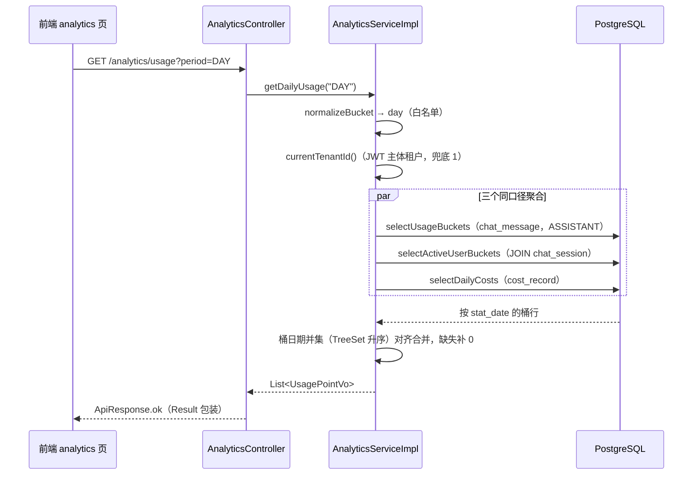
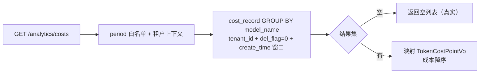
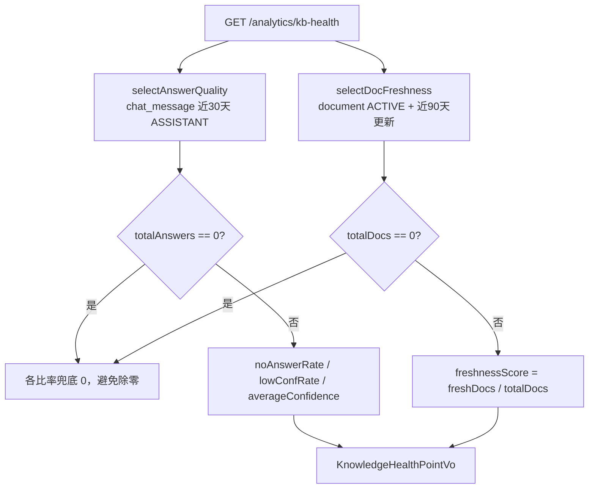

# analytics 后端实现说明（AnalyticsServiceImpl）

代码：`service/src/main/java/com/ragkb/service/modules/analytics/service/impl/AnalyticsServiceImpl.java`
SQL：`service/src/main/resources/mapper/{ChatMessageMapper,ChatMessageSourceMapper,CostRecordMapper,DocumentMapper}.xml`
查询行对象：`service/src/main/java/com/ragkb/service/modules/analytics/persistence/query/`

## 1. getDailyUsage(period) —— 按日/周/月问答用量

### 业务口径

- **period**：`DAY`（默认）/ `WEEK` / `MONTH`，白名单校验（非法值 → `E-1000` 400），映射为 `date_trunc` 桶名 `day/week/month`。
- **窗口**：DAY 近 14 天（对齐前端「14 天」文案）、WEEK 近 12 周、MONTH 近 12 个月。
- **qaCount**：一条 `role='ASSISTANT'` 回答消息计一次问答。
- **noAnswerCount / lowConfCount**：按 `answer_status = 'NO_ANSWER' / 'LOW_CONFIDENCE'` 过滤计数（枚举来自 DDL CHECK）。
- **activeUsers**：该桶内发过消息的去重用户（`chat_message` JOIN `chat_session` 取 `user_id`）。
- **cost**：`cost_record` 同桶聚合 `SUM(cost)`（真实数据；表空则该桶为 0）。
- **searchCount**：**恒为 0**——当前系统没有独立搜索日志事实源表，不做假数据。

### 数据流转



### 关键 SQL（ChatMessageMapper.selectUsageBuckets）

```sql
SELECT to_char(date_trunc(#{bucket}, m.create_time AT TIME ZONE #{tz}), 'YYYY-MM-DD') AS stat_date,
       COUNT(*) FILTER (WHERE m.answer_status = 'NO_ANSWER')      AS no_answer_count, ...
FROM chat_message m
WHERE m.tenant_id = #{tenantId} AND m.del_flag = 0
  AND m.role = 'ASSISTANT' AND m.create_time >= #{since}
GROUP BY stat_date ORDER BY stat_date
```

## 2. getTokenCosts(period) —— 按模型 Token 与成本

- 事实源 `cost_record`，GROUP BY `model_name`，按 `SUM(cost)` 降序。
- 窗口：DAY 近 30 天、WEEK 近 12 周、MONTH 近 12 个月。
- **表为空（当前无写入方）→ 返回真实空列表**，不造演示数据。
- `calls` = 计费记录行数（EMBEDDING/RERANK/LLM/OCR 全场景）。



## 3. getTopDocuments() —— 热门文档 TOP 10

- 事实源 `chat_message_source`（近 30 天），JOIN `chat_message`（排除孤儿来源行）+ `document`（回填文件名）+ LEFT JOIN `kb`（回填知识库名，库删除时 kbName 为 null 但不丢统计）。
- **qaCount** = `COUNT(DISTINCT message_id)`：被多少条不同回答引用。
- **searchCount** = `COUNT(*)`：来源命中总行数（同一回答引用多次重复计，体现检索热度）。
- 排序：qaCount 降序 → searchCount 降序 → documentId，`LIMIT 10`。

## 4. getDau() —— 日活跃用户

- 近 14 天、`day` 桶、`COUNT(DISTINCT chat_session.user_id)`。
- 「活跃」定义：当日发送过任意消息（USER 提问或 ASSISTANT 回答）。
- 与 `getDailyUsage` 复用同一条 `selectActiveUserBuckets` SQL，口径一致。

## 5. getKnowledgeHealth() —— 知识库健康度

契约 VO（`KnowledgeHealthPointVo`）为租户级四指标；kb 级明细（每库文档数/就绪率/失败率）不在当前契约内，不擅自扩字段。

| 指标 | 口径 | 事实源 |
| --- | --- | --- |
| `noAnswerRate` | 近 30 天 `NO_ANSWER` 回答数 / 回答总数 | `chat_message` |
| `lowConfRate` | 近 30 天 `LOW_CONFIDENCE` 回答数 / 回答总数 | `chat_message` |
| `averageConfidence` | 近 30 天 `AVG(confidence)`（ASSISTANT） | `chat_message` |
| `freshnessScore` | 近 90 天有更新（`update_time`）的 ACTIVE 在库文档占比 | `document` |



## 6. export(kind, period, out) —— CSV 导出

- **kind 白名单**：`usage` / `costs` / `top-documents` / `dau`；非法值先抛 `E-1000`（未写入任何字节）。
- 各 kind **复用对应查询方法**（口径与页面一致，避免第二套聚合逻辑）；`usage`/`costs` 透传 period。
- 格式：UTF-8 带 BOM（Excel 中文表头不乱码）、CRLF 行尾、RFC 4180 转义（含逗号/引号/换行时双引号包裹并翻倍内部引号）。
- 流管理：`BufferedWriter` 逐行写出，仅 `flush()` 不 `close()`（响应流由 Servlet 容器管理）；`IOException` 统一转 `E-9999`。
- 说明：Controller 现设定 `Content-Type: application/octet-stream`（红线：不改 Controller），功能为附件下载不受影响；若需 `text/csv` 需另行修改 Controller。

## 7. 边界条件

| 场景 | 行为 |
| --- | --- |
| 空数据（无问答/无引用/无成本记录） | 返回真实空列表 / 全 0 指标，**不造假** |
| 分母为 0（窗口内无回答 / 无文档） | 各比率兜底 0.0，避免除零 |
| `AVG(confidence)` 为 NULL | 兜底 0.0 |
| period 非法（非 DAY/WEEK/MONTH） | `E-1000` 400（白名单，脏值不进 SQL） |
| kind 非法 | `E-1000` 400，响应体不写入任何字节 |
| 租户隔离 | 全部 SQL 带 `tenant_id = 当前租户`；JWT 主体取 `tenantId`，dev/API Key/未认证兜底默认租户 1（与 `KbServiceImpl` 约定一致） |
| 逻辑删除 | 手写 SQL 显式 `del_flag = 0`（含 JOIN 表） |
| 知识库被删（热门文档） | LEFT JOIN kb，统计保留、kbName 为 null |
| 统计时区 | `Asia/Shanghai`：`TIMESTAMPTZ` 先 `AT TIME ZONE` 转本地时间再 `date_trunc` |
| SQL 注入 | bucket/tz 由服务层白名单/常量产生；XML 全部 `#{}` 预编译参数 |

## 8. 权限与后续项

- 权限：沿用全局安全配置对 `/api/v1/analytics/**` 的认证要求（本任务未改 Controller/安全配置）。
- 后续（不在本次范围）：
  - 搜索日志表落地后回填 `searchCount`（当前真实为 0）；
  - `usage_daily` / `cost_record` 写入方（问答链路计费埋点）接入后，`cost`/模型成本从预汇总表读取；
  - kb 级健康度明细若成为产品需求，需先冻结契约再扩展 VO。
