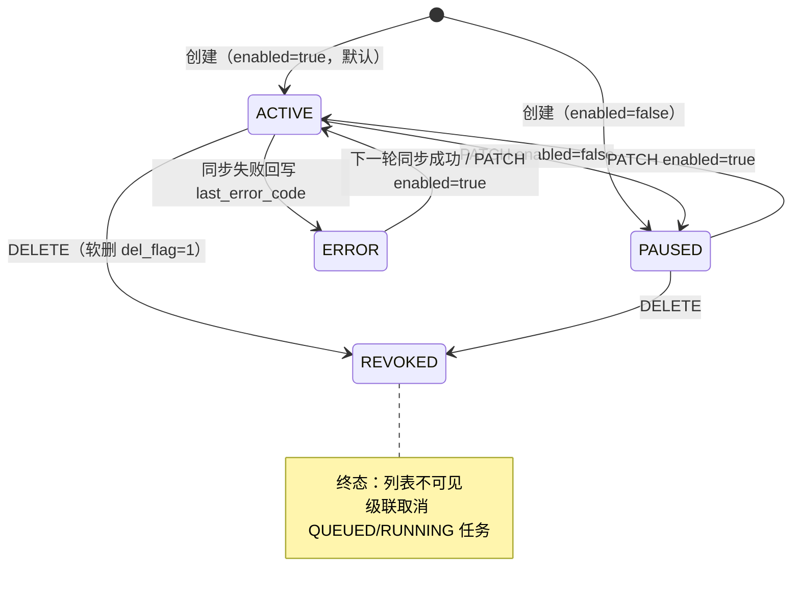
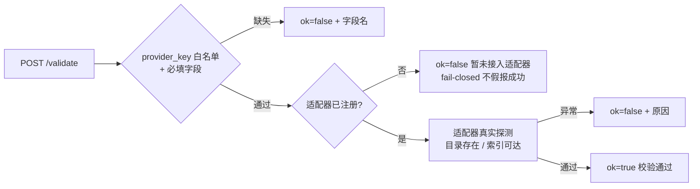
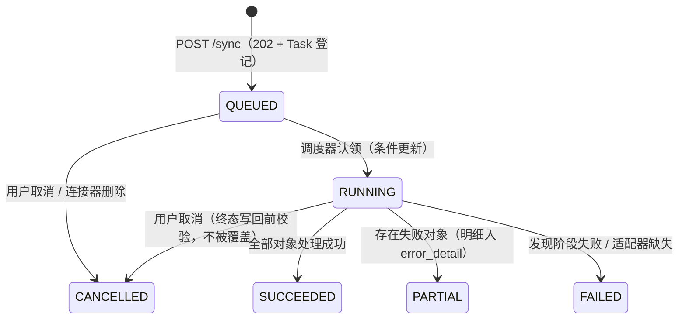
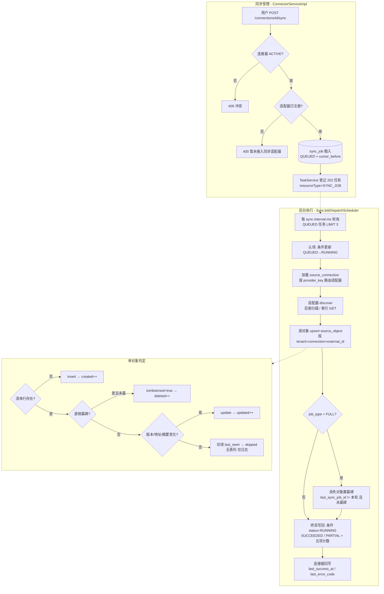

# 连接器管理与同步引擎设计

## 1. 业务流程

### 1.1 连接器生命周期



- 创建/更新均经 `ConnectorConfigRules`：provider_key 白名单 + 按类型的 config 必填字段
  （如 sharepoint 需 `siteUrl`、confluence 需 `baseUrl`+`space`）。
- 删除为两段式：先条件取消未完结同步任务（`QUEUED/RUNNING → CANCELLED`），再把连接器
  置 `REVOKED` 并软删；`source_object` 明细保留供审计对账。

### 1.2 连通性校验（validate）



### 1.3 同步任务（受理 → 执行 → 终态）



## 2. 数据流转（同步一轮的完整链路）



要点：

- **增量模型**：`uq_source_object_external (tenant_id, connection_id, external_id)` 是
  upsert 定位键；`source_version`（本地目录为 size+mtime 摘要，HTTP 索引为清单声明的
  version/etag）驱动 updated/skipped 分支。
- **删除收敛**：两条路径——源侧显式墓碑（HTTP 索引 `deleted:true`）直接落墓碑；
  FULL 全量对账把「本轮未 seen」的存量行置墓碑（快照式源的删除语义）。
- **取消一致性**：取消用条件更新（`status IN (QUEUED,RUNNING)`），执行器终态写回用
  条件更新（`status=RUNNING`），二者互斥——RUNNING 中被取消的任务不会被执行器覆盖回成功。
- **skipped 计数**：DDL `sync_job` 只有 discovered/created/updated/deleted/failed 五列，
  skipped（无变化对象）以日志汇总输出，不落库（表结构限制）。
- **游标**：`cursor_before` 记录同步前水位，快照式源（目录/静态索引）不推进游标，
  `cursor_after` 原样回填；增量型源（Graph API deltaLink 等）接入时再实现推进。

## 3. 适配器扩展指南（新增一个 ContentConnectorPort 实现）

以新增 `sharepoint` 为例：

1. **实现适配器**：在 `modules/connector/adapter/` 新建 `SharePointConnector`
   （继承 `AbstractContentConnector` 复用 config 加载，或直接实现接口）：

   ```java
   @Component
   @ConditionalOnProperty(name = "ragkb.db.enabled", havingValue = "true")
   public class SharePointConnector extends AbstractContentConnector {
       public SharePointConnector(ObjectMapper om, SourceConnectionMapper m) {
           super(om, m, "sharepoint");          // provider_key 路由键
       }
       @Override public void validate(Map<String, Object> config) { /* Graph API 探测 */ }
       @Override public List<SourceObject> discover(TenantId t, long id, String cursor) { /* 分页拉取 */ }
       @Override public void health(TenantId t, long id) { validate(parseConfig(requireConnection(id))); }
   }
   ```

2. **登记规则**：在 `ConnectorConfigRules.REQUIRED_FIELDS` 补充该类型的必填字段
   （sharepoint 已登记 `siteUrl`），单测 `ConnectorConfigRulesTest` 同步覆盖。
3. **无需改动 Service/调度器**：`ConnectorServiceImpl` 与 `SyncJobDispatchScheduler`
   都按 `providerKey()` 自动路由，注册即生效（重复 provider_key 启动即失败，fail-fast）。
4. **安全红线**：
   - 凭证（密码/token/OAuth secret）不落日志、不回显异常消息；
   - Web URL 遵循 SSRF 防护（参考 `HttpIndexConnector`：scheme 白名单 + 私网默认拒绝）；
   - OAuth 回调不得暴露第三方 token（06-架构方案 §2.3），secret 建议走 `secret_ref` 机制；
   - `discover` 返回量设上限（防超大源拖垮调度线程），单对象失败在调度器侧计数不中断。
5. **增量语义**：能提供游标（deltaLink/nextToken）的源在 discover 中消费 `cursor`
   参数并把新游标经返回值或回写通道交给调度器（当前接口为快照式，游标推进需扩展
   Port 返回结构——建议返回 `record DiscoverResult(List<SourceObject> objects, String nextCursor)`）。

## 4. 配置项

| 配置 | 默认 | 说明 |
| --- | --- | --- |
| `ragkb.connector.sync-interval-ms` | 5000 | `sync_job` 队列轮询周期（环境变量 `RAGKB_CONNECTOR_SYNC_INTERVAL_MS`） |
| `ragkb.db.enabled` | true | 适配器/调度器装配开关（false 时模块端点报「数据访问未启用」） |

## 5. 遗留边界（fail-closed TODO）

| 项 | 现状 | 说明 |
| --- | --- | --- |
| source_object → document 转换 | 未实现 | document 模块无「按 source_object 建档」端口；本轮只维护源侧清单，不假报入库 |
| sharepoint / confluence / s3 SDK | 未接入 | 校验/同步明确报「暂不支持」，不假报成功 |
| secret 管理 | config 明文落库 | `secret_ref` 列已预留，待 secret 模块（KMS/加密存储）接入后迁移凭证 |
| SCHEDULED / WEBHOOK 同步模式 | 仅 MANUAL | `sync_mode` 枚举已留，定时调度与 webhook 触发留待接线 |
| 失败对象自动重试 | 无 | 建议 RECONCILE 任务驱动重放；error_detail.failedObjects 已留明细 |
| 生产级 SSRF | 最小实现 | 私网默认拒绝 + 显式放行；DNS rebinding/重定向审计待加固 |
| rootPath 白名单 | 无 | local_directory 可扫任意路径，生产应限制根目录范围 |
