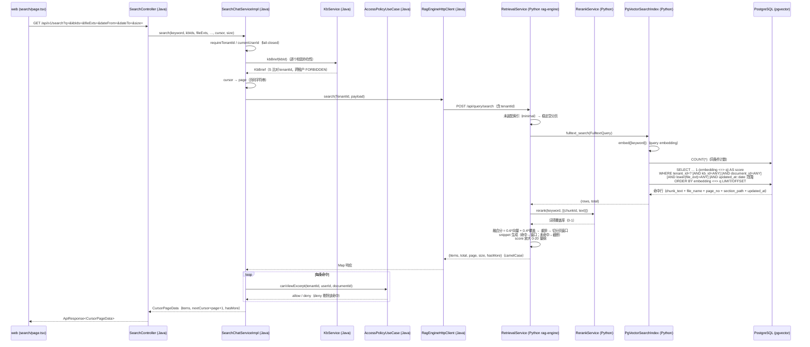

# 全文搜索（Full-Text Search）功能设计

> 2026-08-17 链路打通：web → Java（conversation 模块）→ Python rag-engine → pgvector。
> 本文描述业务流程、跨服务数据流转、权限过滤边界与已知限制。

## 1. 业务流程

全文搜索面向知识库正文内容的检索场景（`/search` 页面），与智能问答（chat）共用
chunk_meta 向量索引，但目标不同：问答追求「高置信证据」，搜索追求「尽量召回 + 关键词命中优先」。

```
用户输入关键词（可选：知识库 / 文件类型 / 日期范围 / 排序）
  → web searchApi（GET /api/v1/search，游标分页）
  → SearchController → SearchChatServiceImpl.search
      ① 认证与租户上下文（fail-closed）
      ② kbIds 权限校验（存在性 + 租户归属）
      ③ cursor（页码字符串）→ page 换算
      ④ 组装请求 → RagEnginePort.search → POST /api/query/search
  → Python RetrievalService.search
      ⑤ query embedding → pgvector 余弦召回（tenant/kb/白名单/类型/时间过滤）
      ⑥ 词项覆盖率融合重排（vector_fusion=true 时）
      ⑦ snippet 生成（纯文本，前端客户端高亮）
  → Java 解析命中 → view_excerpt 二次授权过滤 → CursorPageData（items/nextCursor/hasMore）
  → web 渲染结果卡片（fileName/snippet/pageNo/sectionTitle/score/updatedAt）
```

摘录回查（`GET /api/v1/search/hits/{hitId}/excerpt`）：

```
hitId（= chunkId）→ SearchChatServiceImpl.getSearchExcerpt
  → RagEnginePort.getChunk → GET /api/query/hits/{chunkId}?tenantId=…
  → Python RetrievalService.get_hit → PgVectorSearchIndex.get_chunk（chunk_id + tenant_id）
  → Java 文档存在性校验 + VIEW_EXCERPT 权限 → 返回片段正文
```

## 2. 跨服务数据流转（mermaid 序列图）



## 3. 检索策略

| 环节 | 实现 | 说明 |
| --- | --- | --- |
| 向量召回 | `chunk_meta.embedding <=> query_vector`（HNSW 余弦） | tenant_id 恒为首个过滤条件 |
| 关键词融合 | `0.6 × 向量相似度 + 0.4 × 词项覆盖率`（RerankService 本地确定性精排） | Java 侧固定 `vectorFusion=true`；精排不可用时退化为纯向量序 |
| 召回窗口 | 融合模式取 `size×3 + offset`（上限 300）重排后内存切片 | 纯向量模式直接 SQL `LIMIT size OFFSET offset` |
| 阈值 | 搜索路径不做 min_score 过滤 | 与问答不同：问答要「无证据不生成」，搜索要尽量召回 |
| 高亮 | Python 生成纯文本 snippet；前端 `search/page.tsx` 客户端 `<mark>` | 服务端不做标记包裹（与前端渲染方式对齐） |
| 分页 | Python page/size ↔ Java cursor（页码字符串） | `nextCursor = page+1`；`hasMore` 按 total 判定 |
| score 量纲 | Python 侧 `score × 20`（0-20 区间） | 前端按 `score/20×100` 渲染相关度百分比 |

snippet 规则：关键词命中 → 以命中位置为中心的 200 字符窗口（左侧前置 1/4），
前后截断以 `…` 示意；未命中（纯语义召回）→ 开头 200 字符截断。

## 4. 权限过滤边界

三层过滤，逐层收紧，全部 deny-by-default：

| 层 | 位置 | 规则 |
| --- | --- | --- |
| ① 认证/租户 | Java `SearchChatServiceImpl` | 未认证/无租户上下文直接 `UNAUTHORIZED`（fail-closed） |
| ② kb 级 | Java `authorizeKbIds` | 显式传入的 kbIds 逐一 `KbService.kbBrief` 校验：不存在 → `NOT_FOUND`；租户归属不一致 → `FORBIDDEN` |
| ③ 文档级（VIEW_EXCERPT） | Java 命中后过滤 | `AccessPolicyUseCase.canViewExcerpt`（kb_member → document_acl → 文档状态逐层判定），deny 的命中直接剔除 |
| ④ 数据隔离 | Python `PgVectorSearchIndex` | 所有 SQL 强制 `tenant_id = ?`（贯穿向量召回、计数、摘录直查）；跨租户 chunkId 按 404 处理 |

摘录端点额外做：文档存在性/租户校验（`documentService.getDocument`）+ `VIEW_EXCERPT`
档位校验（不满足 → `FORBIDDEN`）。

未认证 / dev 场景（无 userId）时 ③ 层放行（与预览/下载链路的既有约定一致），
①②④ 层仍然生效。

## 5. 关键代码位置

| 关注点 | 文件 |
| --- | --- |
| 搜索编排（权限/分页换算/二次授权） | `service/.../conversation/service/impl/SearchChatServiceImpl.java` |
| rag-engine HTTP 适配 | `service/.../rag/adapter/RagEngineHttpClient.java`（search/rerank/getChunk） |
| 端口契约 | `service/.../rag/port/RagEnginePort.java` |
| 检索用例（融合/snippet） | `rag-engine/src/rag_engine/retrieval/service.py` |
| HTTP 路由 | `rag-engine/src/rag_engine/retrieval/router.py`（`/api/query/search`、`/api/query/hits/{chunkId}`） |
| pgvector SQL | `rag-engine/src/rag_engine/indexing/pgvector.py`（fulltext_search/get_chunk） |
| 文档域委托（历史遗留双声明收敛） | `service/.../document/service/impl/DocumentServiceImpl.java` |

## 6. 已知限制

1. **kb 成员级过滤未实现**：未传 kbIds 时按「当前租户全部库」检索（Python 侧仅
   tenant_id 过滤）。kb.visibility=PRIVATE 的成员级可见性（kb_member）尚无「当前用户
   可访问 kb 列表」查询能力（`KbService.listKbs` 亦为全量桩），与 listKbs/listDocuments
   现状一致；接入后应在 Java 侧把空 kbIds 展开为可访问 kb 集合。
2. **total 与分页偏差**：view_excerpt 过滤在分页之后进行，`total` 为索引命中数，
   过滤后单页 items 可能少于 size；深翻页时可能出现「有 nextCursor 但下一页为空」。
3. **融合窗口上限 300**：`page×size` 超过 300 后融合重排窗口覆盖不到深页
   （返回结果变少），纯语义结果排序在深页不再保证关键词优先。
4. **cursor 为明文页码**：篡改 cursor 只会跳页不会越权（每次请求重新做全部权限校验），
   但不防爬取式遍历；生产化建议改为签名 token。
5. **无 BM25 倒排**：当前为纯向量召回 + 词项覆盖率精排（无 PostgreSQL 全文索引），
   中英文精确匹配依赖 embedding 语义与词项覆盖融合，长尾关键词可能召回不足。
6. **摘录正文无长度限制**：`/hits/{chunkId}/excerpt` 返回完整 chunk_text（≤chunk_size）。
7. **DocumentService.search 的 sort 参数未消费**：RELEVANCE/TIME 排序由 Python 融合
   序承担（当前等价 RELEVANCE）；TIME 排序待需要时在 SQL 层支持。

## 7. 验证记录（2026-08-17）

- Python：`uv run ruff check .` 通过；`uv run pytest -q` 24 passed（含新增
  `tests/test_retrieval_service.py` 10 个用例：fail-closed 空分页、tenant 贯穿、
  分页 has_more、融合重排、无精排退化、snippet 命中/未命中、摘录回查）。
- Java：`mvn -B -q -DskipTests test-compile` 通过；`mvn -B -q -Dtest='PackageStructureTest' test` 通过。
- 端到端联调（真实 pgvector + Embedding provider）待具备环境后补充。
