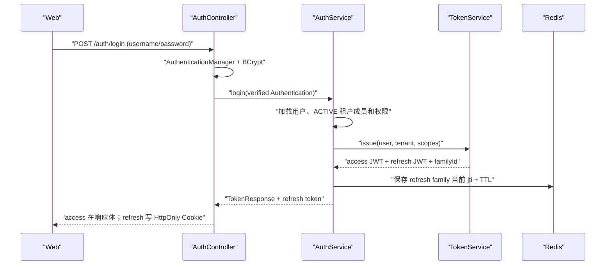
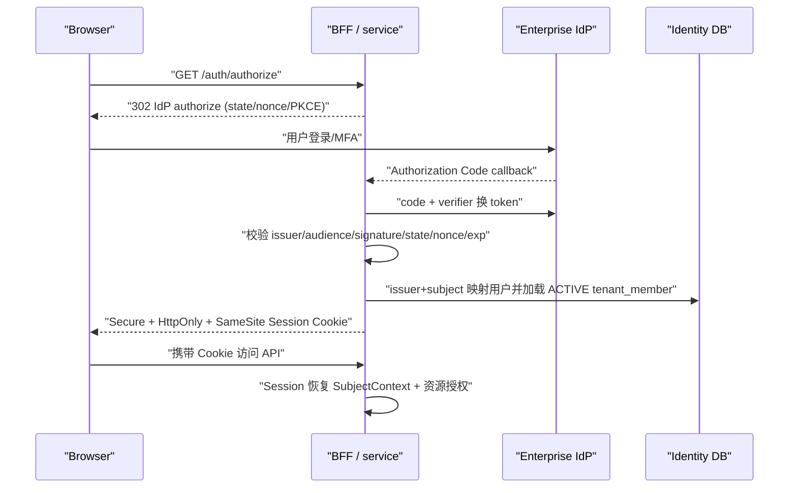

# 认证与授权技术方案

> **文档状态**：待评审 · **版本**：v0.2-draft · **负责人**：待指定 · **最近更新**：2026-08-11
> **适用范围**：`service/`、`web/`、server ↔ rag-engine 安全边界
> **契约依据**：[`docs/api/server.openapi.yaml`](../../../api/server.openapi.yaml)
> **设计依据**：[`03-详细设计.md`](../../../03-详细设计.md) §2～3、[`05-技术选型.md`](../../../05-技术选型.md) §3.4
> **现状依据**：[`SecurityConfig`](../../../../service/src/main/java/com/ragkb/service/config/SecurityConfig.java)、[`AuthServiceImpl`](../../../../service/src/main/java/com/ragkb/service/modules/identity/service/impl/AuthServiceImpl.java)、[`AccessPolicyUseCase`](../../../../service/src/main/java/com/ragkb/service/modules/access/service/AccessPolicyUseCase.java)、[`web HTTP client`](../../../../web/api-client/http/client.ts)、[`init.sql`](../../../../deploy/ddl/init.sql)
>
> **边界声明**：本文梳理当前工作区实现与目标方案，不是第二份 API 契约。新增字段、权限码、响应形态和端点必须先进入 OpenAPI 评审；文中的“目标”与“建议”不代表已经实现。

## 1. 结论

系统需要完整的认证与授权体系，并且二者必须分开设计：

- **认证（Authentication）**回答“调用者是谁、凭证是否可信”。
- **授权（Authorization）**回答“该主体在当前租户、当前知识库、当前文档上能做什么”。
- 生产浏览器默认采用 **企业 OIDC Authorization Code + BFF Session Cookie**。
- 当前 `form` 模式采用“账号密码 + JWT access/refresh”脚手架，仅用于开发/演示；不能代替企业 OIDC，也不得直接作为生产身份源。
- 机器访问采用带 scope、知识库范围和有效期的**高熵 API Key**；如未来开放移动端或第三方 OAuth 客户端，应验证企业 IdP/授权服务器签发的 Access Token，而不是由业务登录接口随意自签生产 JWT。
- 授权采用 **租户 RBAC + 知识库角色 + 文档 ACL + 资源状态/数据策略**，由统一策略执行点处理。前端菜单和按钮过滤只改善体验，不能替代服务端鉴权。

当前成熟度仍是“认证授权脚手架”：入口、DTO、数据库结构和部分前端令牌管理已存在，但关键认证用例和资源授权尚未完成，不具备生产安全闭环。

## 2. 当前实现盘点

### 2.1 已接入或已建骨架的技术

| 能力 | 当前技术/代码 | 状态 |
| --- | --- | --- |
| Web 安全框架 | Spring Security 6（随 Spring Boot 3.4） | 已接入 |
| 开发账号认证 | `AuthenticationManager` + 内存用户 + BCrypt | 已接入，仅开发 |
| form JWT | JJWT 0.12.6、`JwtAuthenticationFilter`、内存 access token | 已接线，签发/解析仍是 TODO |
| refresh token | HttpOnly `ragkb_refresh` Cookie、轮换/复用检测接口 | Controller/Port 已有，核心实现 TODO |
| token 吊销 | Redis 黑名单与 refresh family Port/Adapter | Adapter 是 TODO |
| 生产登录 | Spring Security OAuth2 Client + OIDC 登录链 | 框架骨架已接入，真实 IdP 未验收 |
| BFF 会话 | `HttpSessionSecurityContextRepository` | OIDC 模式使用；生产 Session Store 未配置 |
| API Key | OpenAPI、DTO、Controller、DDL (`api_key/api_key_kb`) | 认证过滤和业务实现 TODO |
| 多租户身份 | `sys_user/identity_account/tenant_member/tenant_member_role` | DDL 已定义，Repository/Service 未实现 |
| 资源授权 | `AccessPolicyUseCase` | 只有接口方法，未实现、未接 Controller/Service |
| 方法级授权 | `@EnableMethodSecurity` | 已开启，但没有实际 `@PreAuthorize` 策略 |
| 知识库授权 | `kb_member` 的 OWNER/EDITOR/VIEWER | DDL 已定义，未接业务授权 |
| 文档权限 | `document_acl` 的三档权限 | DDL 已定义，未接搜索/预览/下载闭环 |
| CORS | 来源白名单 + credentials | 已配置；需与实际部署域名核对 |
| CSRF | Spring Security CSRF | 当前两种模式均禁用，OIDC Cookie 模式生产不可接受 |
| 审计 | `audit_log` 表结构 | DDL 已有，认证/拒绝事件尚未落库 |

### 2.2 当前两种浏览器认证模式

| 项目 | `form` 模式 | `oidc` 模式 |
| --- | --- | --- |
| 用途 | 本地开发、演示 | 生产企业登录 |
| 身份源 | 内存账号 | 企业 IdP |
| 浏览器凭证 | Bearer JWT access + HttpOnly refresh Cookie | BFF Session Cookie |
| 服务端状态 | access 无状态；refresh family/黑名单依赖 Redis | Session 有状态 |
| 当前可用性 | 关键服务和 Redis Adapter 是 TODO | 真实 IdP、身份映射、Session 生产化未验收 |
| 生产建议 | 不作为企业默认登录 | 推荐默认方案 |

### 2.3 当前已有的良好基础

- access token 仅保存在浏览器内存，不进入 `localStorage/sessionStorage`。
- refresh token 限定为 HttpOnly Cookie，并规划了轮换和复用检测。
- 前端已经实现并发 401 的单飞刷新，避免一次过期触发多个 refresh 请求。
- 数据模型已经区分全局身份、租户成员、租户角色、知识库成员、文档 ACL 和 API Key scope。
- `AccessPolicyUseCase`、`RefreshTokenStorePort`、`TokenBlacklistPort` 为后续实现保留了明确边界。

## 3. 主体、凭证和信任边界

| 主体 | 推荐凭证 | 身份来源 | 必须形成的上下文 |
| --- | --- | --- | --- |
| 企业浏览器用户 | OIDC + BFF Session Cookie | 企业 IdP | user、activeTenant、tenantRoles、orgIds、permissions、policyVersion |
| 本地开发用户 | 短期 JWT access + refresh Cookie | 内存账号 | 同上，但明确标记为 dev credential |
| 自动化/第三方程序 | 高熵 API Key | `api_key` 记录 | tenant、keyId、scopes、allowedKbIds、expiry、rate limit |
| OAuth 客户端（未来） | IdP/授权服务器签发的 JWT access token | 受信 issuer | issuer、subject、audience、scope、tenant mapping |
| server → rag-engine | workload identity + 短期签名授权上下文 | 平台工作负载身份 | tenant、allowedKbIds/filter、permission、policyVersion、audience、expiry、jti |

以下数据不能接受浏览器在 body/header 中自报：`tenantId`、用户角色、组织、允许访问的 KB、文档权限和 policyVersion。客户端传来的 tenant 只能是“切换请求目标”，服务端必须重新验证成员关系。

## 4. 认证流程

### 4.1 form + JWT（开发/演示目标流程）



受保护请求：

1. Web 从内存读取 access token，发送 `Authorization: Bearer <token>`。
2. `JwtAuthenticationFilter` 校验签名、issuer、audience、token type、exp/nbf、jti，并检查黑名单。
3. 过滤器只建立经过验证的 `Authentication`；资源授权仍由 Service/PDP 完成。
4. access 过期返回 401；前端只发起一次 `/auth/refresh`。
5. refresh 必须原子执行“旧 jti 校验 + 新 jti 写入”；旧 refresh 被复用时吊销整个 family。
6. 登出将 access jti 加入黑名单、吊销 refresh family，并清除 Cookie。

**当前状态**：步骤 2～6 的后端核心逻辑仍是 TODO。`TokenServiceImpl` 和两个 Redis Adapter 未实现时，不能把该流程描述为可用认证。

### 4.2 OIDC + BFF Session（生产目标流程）



生产要求：

- 使用 Authorization Code；PKCE、state、nonce、issuer、audience、signature、exp/nbf 都必须验证。
- OIDC 回调 URI 必须与 Spring Security 实际 redirection endpoint 和 IdP 注册值一致。当前自定义 `/api/v1/auth/callback` 只是占位，不能与框架回调并存为两套真相。
- Cookie 名、Domain、Path、Secure、HttpOnly、SameSite、Idle/Absolute Timeout 必须显式配置；当前代码使用默认 `JSESSIONID`，而 OpenAPI 写的是 `ragkb_session`。
- 多实例部署使用 Spring Session Redis/JDBC 或网关明确的会话策略，不能依赖单实例内存 Session。
- Cookie 模式的所有写操作必须启用 CSRF 防护；同源、SameSite 和 CORS 不是 CSRF Token 的完整替代。

### 4.3 API Key（机器访问目标流程）

1. 创建时生成至少 256 bit 随机明文，只展示一次；数据库仅保存带服务端 pepper 的 digest 与可识别 prefix。
2. 请求使用 `Authorization: Bearer <apikey>`；认证层解析 key 类型，不能把 API Key 误交给 JWT Parser。
3. 校验状态、有效期、租户、scope、allowedKbIds 和速率限制；更新 `last_used_at` 应异步或限频，避免每次请求写热点行。
4. 构造 `SubjectContext(actorType=API_KEY)`，进入同一 PDP/PEP；API Key 不能绕过文档状态、数据分类和删除/撤权规则。
5. 创建、轮换、吊销、拒绝和使用均写安全审计；明文和 digest 不写日志。

### 4.4 租户切换

1. 从当前可信主体获得 userId，不接受客户端自报 user/role。
2. 查询目标租户的 `tenant_member.status=ACTIVE` 和租户角色。
3. 生成新的授权上下文并使旧租户缓存、SSE、任务轮询和策略快照失效。
4. OIDC/BFF 模式更新服务端 Session；JWT 模式必须重新签发包含新 tenant/audience 的 TokenResponse。
5. 前端用新上下文重建菜单；若当前路由不再允许，跳转工作台并说明原因。

当前 `/auth/tenant/switch` 仅返回 `AuthSession`，但 JWT access token 内含 tenantId，因此 JWT 模式下响应形态不足，必须先做 OpenAPI 评审。

## 5. 授权模型

### 5.1 统一 SubjectContext

认证层成功后应统一转换为内部上下文，业务方法不直接解析 Cookie、JWT 或 API Key：

```text
SubjectContext
├── actorType          USER | API_KEY | SERVICE
├── actorId / credentialId
├── userId / subjectKey
├── activeTenantId
├── tenantRoles[]
├── orgIds[]
├── credentialScopes[]
├── policyVersion
└── credentialExpiresAt
```

JWT 中的角色/scope 只能作为经过签名的凭证输入，涉及成员停用、撤权、敏感文档和危险操作时仍要检查当前数据库/短 TTL 策略缓存，不能让长寿命 claim 成为永久权限真相。

### 5.2 分层授权

```text
认证通过
  -> credential 状态、scope、有效期
  -> tenant ACTIVE + tenant_member ACTIVE
  -> 租户角色粗粒度权限
  -> KB 可见性 + KB 角色 OWNER/EDITOR/VIEWER
  -> 文档 ACL VIEW_EXCERPT/VIEW_CONTENT/DOWNLOAD_ORIGINAL
  -> 文档发布/禁用/删除/审核状态
  -> 数据分类、区域、用途、模型路由策略
  -> allow / deny + reasonCode + policyVersion + audit
```

默认拒绝。权限蕴含关系由策略层统一展开：`DOWNLOAD_ORIGINAL -> VIEW_CONTENT -> VIEW_EXCERPT`，调用方不得各自推断。

### 5.3 角色职责建议

| 层级 | 角色 | 主要职责 | 不应自动获得 |
| --- | --- | --- | --- |
| 租户 | TENANT_ADMIN | 租户成员、组织和租户配置 | 所有受限文档正文/下载 |
| 租户 | SECURITY_ADMIN | IdP、API Key、安全策略、ACL 管理 | 业务内容读取 |
| 租户 | KNOWLEDGE_ADMIN | 知识资产、元数据、审核与生命周期治理 | 平台安全配置 |
| 租户 | AUDITOR | 审计、证明和只读合规视图 | 内容编辑、策略变更 |
| 租户 | MEMBER | 一般知识消费入口 | 管理和治理能力 |
| 知识库 | OWNER | KB 配置、成员、内容与生命周期 | 跨 KB 权限 |
| 知识库 | EDITOR | 内容写入、元数据维护、提交审核 | KB 所有者级危险操作 |
| 知识库 | VIEWER | 已授权内容消费 | 编辑、管理、默认下载 |

角色是权限集合，不是 Controller 中到处硬编码的字符串判断。菜单、接口和按钮应依赖稳定 permission code；角色到 permission 的映射在服务端集中维护。

### 5.4 执行位置

- Security Filter：验证凭证并构造主体，不做资源级数据库查询。
- `@PreAuthorize`/AuthorizationManager：处理稳定的粗粒度权限，例如 `api-key:manage`。
- `AccessPolicyUseCase`：处理 tenant/KB/document 的资源级批量决策，并返回 allow、reason、policyVersion。
- Service/Domain：执行状态机、最后一个 OWNER、法律保全、危险操作预览等业务规则。
- Repository/数据库：tenant 复合键、约束和可选 RLS 做纵深防御。
- 搜索/RAG：检索前授权过滤，候选结果在 rerank 前批量二次授权；历史引用访问时重新授权。

## 6. 所需技术清单

| 优先级 | 技术 | 用途 | 当前决策 |
| --- | --- | --- | --- |
| 必需 | Spring Security Web + Method Security | 认证链、401/403、方法级权限 | 已引入，授权待实现 |
| 必需 | Spring Security OAuth2 Client | OIDC Authorization Code/BFF | 已引入，待真实 IdP 验收 |
| 必需 | PostgreSQL + MyBatis-Plus | 身份映射、成员、角色、ACL、API Key、审计 | Schema 已有，Repository 待实现 |
| 必需 | Redis/Valkey | refresh 轮换、黑名单、权限快照/失效 | 依赖已引入，Adapter 待实现 |
| 必需 | Secret Manager/KMS | OIDC secret、JWT key、API Key pepper、轮换 | 不得写配置文件或日志 |
| 条件必需 | Spring Session Redis/JDBC | OIDC BFF 多实例共享 Session | 多实例生产部署时启用 |
| 开发模式 | JJWT | form 模式短期 access/refresh | 已引入，核心实现 TODO |
| 条件必需 | OAuth2 Resource Server/JOSE | 验证外部授权服务器 JWT | 开放移动端/第三方 OAuth API 时引入 |
| 必需 | OpenTelemetry/MDC + 审计服务 | 登录、刷新、切租户、授权拒绝的可追踪性 | 待实现 |
| 必需 | 限流 | 登录、refresh、API Key、敏感导出防滥用 | 待实现 |

## 7. 当前差距与优先级

### P0：生产前阻断

1. `AuthService#login/refresh/logout`、`TokenServiceImpl`、Redis Token Adapter 均未实现，form JWT 链路不可用。
2. 服务端目前主要是 `authenticated()`；租户角色、KB 角色、文档 ACL、搜索/引用二次授权没有接入，存在越权风险。
3. 用户/租户仍使用默认 tenant 和本地 hash 映射，`switchTenant` 是 TODO，不能作为可信主体上下文。
4. OIDC Session 模式禁用了 CSRF，但系统存在大量写接口；生产 Cookie 会话必须修复。
5. API Key 只有端点/DDL，没有认证过滤、digest 校验、scope/KB 限制和速率限制。

### P1：契约和实现必须对齐

1. OpenAPI 部分 operation 显式只允许 `oidcSession`，会覆盖根级 `bearerJwt`，与 form JWT 实际过滤链不一致。
2. JWT 和 API Key 都使用 Bearer；当前 JWT Filter 会尝试解析所有 Bearer，尚无可靠 credential discriminator/API Key Filter。
3. JWT 租户切换需要返回新 TokenResponse，当前只返回 AuthSession。
4. OIDC Cookie 的约定名 `ragkb_session` 与默认 `JSESSIONID` 不一致。
5. OIDC 自定义 callback 与 Spring Security 框架 callback、PKCE 配置和 returnTo 白名单尚未形成唯一流程。
6. 前端将 `AuthSession.scopes` 直接映射为 `roles`，混淆 credential scope、租户角色和最终权限。

### P2：质量与运维

1. 后端没有 JWT 签名/过期/issuer/audience/token-type、刷新并发、复用检测、黑名单和权限拒绝测试。
2. 没有角色/权限矩阵契约测试、跨租户 IDOR 回归和 RAG 授权泄漏测试。
3. 缺少密钥轮换（`kid`/多 key 验证窗口）、会话/令牌指标、异常登录告警和审计落库。
4. 需要明确 Redis 不可用时的策略：认证和授权不能静默降级为放行。

## 8. 推荐实施顺序

1. **冻结认证决策与 OpenAPI**：明确生产 OIDC/BFF、开发 form/JWT、机器 API Key 三类凭证；修正 operation security 和租户切换响应。
2. **建立真实身份上下文**：实现 identity/tenant member Repository、SubjectContext、禁用/切租户规则。
3. **打通一种生产登录**：优先完成 OIDC/BFF、Cookie/CSRF、Session Store 和真实 IdP 验收。
4. **实现统一授权**：从知识库列表、搜索、引用、预览、下载五个高风险入口接入 `AccessPolicyUseCase`，再覆盖管理和治理写操作。
5. **完成机器访问**：实现 API Key digest、scope、allowedKbIds、限流、吊销与审计。
6. **按开发需要补齐 form JWT**：严格声明验证、refresh CAS/复用检测、黑名单和密钥轮换；如果开发环境不再需要直连 Bearer，可删除该模式降低维护面。
7. **补齐测试与观测**：认证失败、越权、跨租户、撤权传播、Redis/IdP 故障、审计和告警。

## 9. 验收门禁

- 未认证统一 401；已认证但无权限返回 403 或按防枚举策略返回 404，不返回空成功。
- 禁用用户、SUSPENDED tenant member、吊销 API Key 和收窄 ACL 在约定传播 SLA 内生效。
- tenant、角色、scope、allowedKbIds 不接受客户端自报；切租户后旧上下文不能继续访问。
- 搜索、问答、引用、预览、下载使用同一授权决策，且有跨租户/撤权回归测试。
- refresh 并发只成功轮换一次；旧 token 复用会吊销整族；Redis 故障默认拒绝。
- Cookie、JWT、OIDC、API Key 的 secret/token 不写日志、错误响应、URL 或浏览器持久存储。
- 登录、登出、刷新异常、切租户、授权拒绝、API Key 创建/轮换/吊销均有 requestId/traceId 审计。
- 前端隐藏菜单或按钮后，直接请求对应 API 仍会被服务端独立拒绝。

## 10. 影响说明

- 本文不修改数据库、运行配置、API 契约或认证代码。
- P0/P1 实施会影响 OpenAPI、前端 AuthContext、Cookie/Redis 配置和部署 Secret，必须按契约优先流程单独评审。
- 生产切换认证模式需要兼容窗口和回滚方案；不能在已有登录会话中无提示切换 Cookie/JWT 语义。
