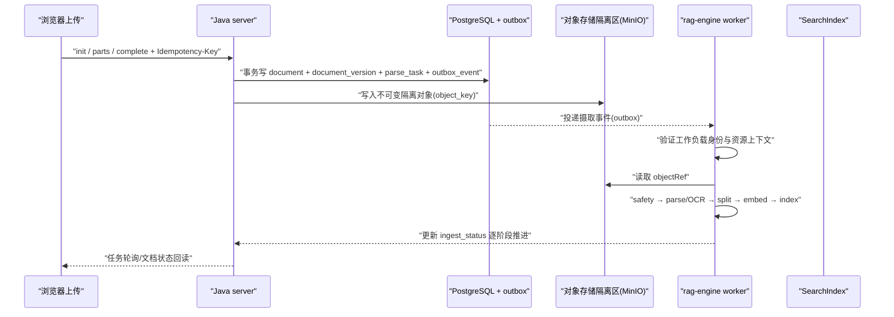

# 文档上传：入口、流程与数据来源走向

> **文档状态**：现状留痕 · **版本**：v0.1 · **记录时间**：2026-08-14
> **适用范围**：Web 上传入口、Java 上传契约、PostgreSQL 摄取状态机、rag-engine 摄取流水线、对象存储
> **依据**：`web/components/upload-document-modal.tsx`、`web/api-client/http/document.ts`、`service/.../document/controller/DocumentController.java`、`service/.../document/service/impl/DocumentServiceImpl.java`、`docs/api/server.openapi.yaml`、`deploy/ddl/init.sql`、`rag-engine/.../ingestion/service.py`

---

## 1. 结论速览

| 问题 | 结论 |
|---|---|
| 在哪里上传 md 等文件 | Web「知识库详情页 / 文档库」的 **上传文档** 按钮（见 §2） |
| 支持的文件类型 | `.pdf .doc .docx .md .txt .pptx .xlsx .csv .html` |
| 单文件大小上限 | **50 MB**（前端硬校验） |
| 当前能否真正落库 | **不能**。前端已接通上传弹窗且固定走真实 HTTP，但后端 `DocumentServiceImpl` 全部为 `TodoSupport.notImplemented` 桩，上传请求返回 `501 E-9998` |
| 文件最终存在哪里 | **对象存储（本地开发为 MinIO）**；数据库只存 `object_key` + `content_sha256`，不存原文（见 §5.4） |
| 摄取后数据走向 | `QUARANTINED → SCANNING → PARSING → CHUNKING → EMBEDDING → INDEXING → READY`，由 rag-engine 分阶段执行（见 §5.2） |

---

## 2. 在哪里上传（Web 入口）

### 2.1 入口一：知识库详情页

- 页面：`web/app/(main)/kbs/[id]/page.tsx`
- 按钮：右上角 **「上传文档」**（仅 `role !== VIEWER` 可见）
- 点击后跳转 `/documents?kbId=<id>&upload=1`，**自动携带该知识库 id 并弹出上传弹窗**

### 2.2 入口二：文档库页面

- 页面：`web/app/(main)/documents/page.tsx`
- 按钮：右上角 **「上传文档」**，点击直接弹出上传弹窗（不预选知识库）

### 2.3 上传弹窗字段

组件：`web/components/upload-document-modal.tsx`

| 字段 | 说明 |
|---|---|
| 目标知识库（必选） | 下拉列出当前有权限（非 VIEWER、ACTIVE）的知识库 |
| 文件（必选） | 隐藏 `<input type=file>`，`accept=".pdf,.doc,.docx,.md,.txt,.pptx,.xlsx,.csv,.html"`；超 50 MB 拒绝 |
| 标题 | 可选，默认取文件名（去扩展名），最长 80 字符 |
| 敏感级 | `PUBLIC / INTERNAL / CONFIDENTIAL / RESTRICTED`，默认 `INTERNAL` |

> 上传成功的提示文案为「已上传，进入解析队列」，但该提示不代表文件已真实解析。

---

## 3. 前端上传流程（真实 HTTP）

web 端已**移除 mock**：`web/api-client/client.ts` 固定导出 `httpClient`，无 `NEXT_PUBLIC_USE_MOCK` 开关，上传统一走真实 HTTP（对齐 OpenAPI）：

### 3.1 真实 HTTP 流程（`web/api-client/http/document.ts`）

```
① POST /api/v1/upload/init        { kbId, fileName, fileSize, title, sensitivity, sha256? }
      → 201 { uploadId, partSize, partCount, uploadedParts, presignedPutUrls? }
② PUT  /api/v1/upload/{uploadId}/parts/{partNumber}    body=二进制分片（幂等，同号覆盖）
③ POST /api/v1/upload/{uploadId}/complete   （服务端重算 SHA-256）
      → 202 { task }   进入 QUARANTINED → 安全扫描 → 解析队列
④ 轮询任务终态（waitForTask）→ 取 resourceId = documentId
⑤ GET  /api/v1/documents/{documentId}      回读文档详情
```

要点：

- `partSize = 0` 表示直传（单分片）；否则分片上传，`uploadedParts` 支持断点续传。
- 请求头可携带 `Idempotency-Key`，同文件重复上传返回同一 `uploadId`（秒传/幂等）。
- `sha256` 由客户端预计算仅用于秒传优化，**完成时服务端必须重算**为准。

---

## 4. 后端契约与当前实现状态

### 4.1 Controller（已就绪）

文件：`service/.../document/controller/DocumentController.java`

| 方法 | 路径 | 说明 |
|---|---|---|
| `initUpload` | `POST /api/v1/upload/init` | 初始化直传/分片（入参 `UploadInitDto`） |
| `uploadPart` | `PUT /api/v1/upload/{uploadId}/parts/{partNumber}` | 接收二进制分片 |
| `completeUpload` | `POST /api/v1/upload/{uploadId}/complete` | 合并、重算 SHA-256、入队 |
| `listDocuments` | `GET /api/v1/kbs/{kbId}/documents` | 库内文档列表 |
| `listAllDocuments` | `GET /api/v1/documents` | 全库文档列表 |
| `getDocument` | `GET /api/v1/documents/{id}` | 文档详情 |
| `reparseDocument` | `POST /api/v1/documents/{id}/reparse` | 重试摄取 |
| `deleteDocument` | `POST /api/v1/documents/{id}/deletion` | 删除任务 |
| 版本/ACL/标签/收藏 | `versions / acl / tags / favorites` | 见契约 |

### 4.2 Service（业务未实现）

- `DocumentServiceImpl` 的 `initUpload / uploadPart / completeUpload / listDocuments / ...` 全部抛 `TodoSupport.notImplemented(...)`。
- `TodoSupport` 抛 `UnsupportedOperationException`，由 `GlobalExceptionHandler` 统一映射为 **501 E-9998**。
- 契约已冻结、入口骨架已就绪；**业务实现由人工按模块完成**，完成后替换桩实现即可，无需改 Controller 与契约。

---

## 5. 数据来源与走向

### 5.1 数据来源（`document.source_type`）

| source_type | 含义 | 状态 |
|---|---|---|
| `UPLOAD` | 手动上传（本页主题） | 契约/前端就绪，后端桩 |
| `CONNECTOR` | 外部源同步（对象存储、SharePoint/OneDrive、Confluence 等，见 `source_object` / `source_connection` 表） | 设计/页面占位 |
| `WEB` | Web 抓取导入 | 设计占位 |

### 5.2 摄取状态机（`document_version.ingest_status`）

```
UPLOADING
   ↓
QUARANTINED ──(安全扫描)──▶ SCANNING ──(解析/OCR)──▶ PARSING
   │                                                      ↓
   ├── FAILED / BLOCKED（隔离或失败，重试上限 3 次）       CHUNKING（分块）
   └───────────────────────────────────────────────▶ EMBEDDING（向量化）
                                                          ↓
                                                         INDEXING（写索引）
                                                          ↓
                                                         READY（可检索/问答）
```

- 完整枚举（前端 `types/document.ts` 与 DDL 一致）：`UPLOADING / QUARANTINED / SCANNING / PARSING / CHUNKING / EMBEDDING / INDEXING / READY / FAILED / BLOCKED`。
- `parse_task` 表按阶段记录 `SAFETY / PARSING / OCR / CHUNKING / EMBEDDING / INDEXING / CLEANUP`，状态 `QUEUED / RUNNING / SUCCEEDED / FAILED / CANCELLED`，`max_attempts=3`。

### 5.3 生产目标调用链（设计目标）



### 5.4 文件内容存在哪里（重要边界）

| 位置 | 存放内容 |
|---|---|
| **对象存储（MinIO）** | 原始文件字节；`document_version.object_key` 引用；隔离区→扫描通过后进入可解析区 |
| **PostgreSQL `document`** | 元数据：标题、文件名、扩展名、敏感级、审核/权限/生命周期状态 |
| **PostgreSQL `document_version`** | 每版本：`object_key`、`content_sha256`、`file_size`、`mime_type`、`ingest_status`、`safety_status`、`chunk_count` |
| **PostgreSQL `parse_task`** | 摄取任务分阶段进度、worker、错误 |
| **PostgreSQL `outbox_event`** | 上传完成后的可靠事件，驱动 rag-engine |

> DDL 注释明确：**原文/密钥不存本 Schema；仅保存 object_key、secret_ref 或不可逆摘要**（`deploy/ddl/init.sql`）。

### 5.5 rag-engine 现状

- `rag-engine/src/rag_engine/ingestion/service.py` 提供最小摄取用例：`submit_document` 创建 `RUNNING` 任务；`process_document` 在未装配 provider 时 **fail-closed**（任务置 `FAILED`），不会假报已解析。
- 已定义端口/契约：对象存储、Parser/OCR、分块、Embedding、SearchIndex、幂等/outbox，真实 provider 待接入。
- 摄取状态当前仅存于 Python 进程内内存（`InMemoryIngestTaskRepository`），重启/多副本/淘汰后 404，只能用于契约联调。

---

## 6. 当前限制与后续事项

> 2026-08-17 更新：上传三件套已实现；摄取/问答最小链路已打通（见
> [`minimal-qa-chain.md`](./minimal-qa-chain.md)）。

| 事项 | 状态 |
|---|---|
| 前端上传弹窗（选库/选文件/敏感级） | ✅ 已实现 |
| mock 客户端 / 数据 / 开关 | ✅ 已删除，web 固定走真实 HTTP |
| 后端上传契约（init/parts/complete） | ✅ Controller + DTO 已冻结 |
| 后端真实落库 / 分片存储 / SHA-256 | ✅ 已实现（写 MinIO + document/document_version/parse_task/outbox） |
| 摄取投递与状态回写 | ✅ Java 调度器轮询 parse_task → rag-engine → 回写 ingest_status |
| rag-engine 解析/分块/Embedding/索引 | ✅ 已接 MinIO + langchain + pgvector（md/txt/csv/html） |
| 问答闭环（会话/SSE/LLM） | ✅ 已打通（含 chat_message/chat_message_source 落库） |
| 安全扫描队列（GKB-03，QUARANTINED→SCANNING） | ⚠️ 最小实现跳过扫描直接投递，见 §5 |
| 全文搜索 `/api/query/search` | ⚠️ 最小闭环走问答，搜索端点仍返回空 |
| PDF/Office / OCR | ⚠️ 摄取仅支持 md/txt/csv/html，其余 FAILED |

**后续迭代**：先跑通本链路（V0.6 迁移 → rag-engine 起服务 → 重启 service → 上传/提问），
再按 `minimal-qa-chain.md` §5 逐项补齐安全扫描、outbox 消费、全文搜索与 PDF/Office。
