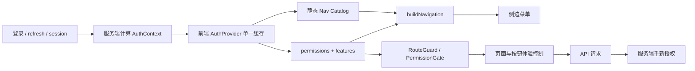

# Web 动态菜单设计

> **文档状态**：待评审 · **版本**：v0.2-draft · **负责人**：待指定 · **最近更新**：2026-08-11
> **关联设计**：[`认证与授权技术方案`](authentication-authorization.md) · [`Web 端产品化设计`](web-product-design.md)
> **当前实现**：[`nav-config.tsx`](../../../../web/components/nav-config.tsx)、[`route-guard.tsx`](../../../../web/components/route-guard.tsx)、[`app-shell.tsx`](../../../../web/components/app-shell.tsx)、[`roles.ts`](../../../../web/lib/roles.ts)
>
> **边界声明**：本文定义菜单体验层方案，不授予任何服务端权限。文中建议的 `permissions/features/policyVersion` 是待评审契约影响，不得在未更新 OpenAPI 时由前后端各自猜测。

## 1. 结论

Web 菜单需要动态呈现，但当前不需要“数据库下发完整菜单树”。推荐采用：

> **前端维护受版本控制的静态路由/菜单目录，服务端返回可信权限与功能能力，前端按当前租户上下文动态过滤。**

这是一种混合动态菜单：

- 路由、组件、图标、文案、层级和排序由前端代码管理，保证类型安全、可测试、可国际化。
- 当前用户的 permission、feature/capability 和 policyVersion 由服务端计算，切租户后重新返回。
- 菜单、路由守卫和按钮使用同一份前端 permission helper；真正的 API 授权仍由服务端执行。

只有未来出现“租户可自定义导航顺序/名称、插件按租户安装、白标产品差异”时，才考虑服务端菜单配置；即使如此，也只下发受信 `routeKey`，不能下发任意组件路径或外部 URL。

## 2. 当前实现现状

| 能力 | 当前实现 | 评价 |
| --- | --- | --- |
| 菜单目录 | `BASE_NAV` 静态定义全部菜单 | 合理，适合作为受控目录 |
| 动态过滤 | `buildNav(user.roles)` 过滤 admin/governance | 已有雏形，但粒度过粗 |
| 路由守卫 | `RouteGuard` 覆盖 admin/governance layout | 仅体验层，覆盖不完整 |
| 登录门禁 | `AuthGate` 调用 `getCurrentUser` | 已有；与 AppShell 重复请求用户信息 |
| 角色来源 | `AuthSession.scopes -> CurrentUser.roles` | 语义错误：scope、role、permission 被混用 |
| 租户切换 | AppShell 使用 `MOCK_TENANTS` 并只改本地 state | 未调用后端、未刷新权限和 token |
| 菜单契约 | OpenAPI 没有 permissions/navigation 字段 | 需要评审后补充权限上下文 |
| 菜单测试 | 尚未发现 buildNav/RouteGuard/角色边界测试 | 需要补齐 |

当前实现值得保留的点：菜单配置集中、父子节点会在子项为空时隐藏、管理/治理页面还有直接路由守卫，并且注释明确“前端不替代服务端授权”。

## 3. 为什么需要动态菜单

系统具备多租户、租户多角色、KB 角色、文档 ACL、治理能力和可选部署能力。同一用户切换租户后，可能从 TENANT_ADMIN 变为 MEMBER；不同租户也可能没有治理、数据大屏或某类连接器能力。因此全员显示同一菜单会造成：

- 大量点击后才 403，体验差且容易误导。
- 菜单与页面按钮权限各自硬编码，角色变更后出现不一致。
- 租户切换后残留旧租户管理入口，产生错误操作风险。
- 后续增加 SECURITY_ADMIN、AUDITOR 或功能开关时形成角色组合爆炸。

动态菜单的目的只是“展示当前上下文可使用的入口”，安全收益仍来自后端统一授权。

## 4. 方案比较

| 方案 | 优点 | 缺点 | 结论 |
| --- | --- | --- | --- |
| 全静态菜单、前端硬编码角色 | 简单 | 角色爆炸、租户切换难同步、权限散落 | 不采用 |
| 服务端下发完整菜单/路由/图标/组件 | 可运营配置 | 强耦合前后端版本、注入风险、难测试和国际化 | 当前不采用 |
| 静态目录 + 服务端 permissions/features | 类型安全、可审计、支持多租户、复杂度适中 | 需要稳定权限契约 | **推荐** |

## 5. 目标模型

### 5.1 服务端返回授权上下文

推荐在现有 `AuthSession` 中增加独立字段，不再把 `scopes` 当作角色：

```json
{
  "activeTenant": {
    "tenantId": 1001,
    "tenantCode": "acme",
    "tenantRoles": ["KNOWLEDGE_ADMIN"]
  },
  "credentialScopes": ["web"],
  "permissions": ["kb:list", "document:list", "governance:review"],
  "features": ["governance", "analytics"],
  "policyVersion": 42
}
```

- `tenantRoles` 用于解释用户身份，不直接散落到菜单判断。
- `credentialScopes` 限制凭证能力，例如 API Key scope。
- `permissions` 是前端菜单/路由/按钮使用的稳定能力码。
- `features` 表示租户套餐、部署模式或后端能力是否可用。
- `policyVersion` 用于判断缓存上下文是否过期。

上述字段属于 OpenAPI 变更，必须评审后再实现。

### 5.2 前端静态菜单目录

```ts
interface NavItem {
  key: string;
  href: string;
  label: string;
  icon: NavIconKey;
  requiredAny?: Permission[];
  requiredAll?: Permission[];
  feature?: FeatureKey;
  children?: NavItem[];
}
```

构建规则：

1. 没有 `feature` 或当前租户已启用该 feature。
2. `requiredAll` 全部满足，`requiredAny` 至少满足一个。
3. 未知 permission 默认不允许，不使用“未知角色按 VIEWER”之类宽松回退。
4. 子菜单过滤后为空时隐藏父菜单。
5. 菜单项只引用前端白名单路由，不消费服务端任意 URL/组件名。

### 5.3 建议权限码

以下仅是设计建议，最终名称以 OpenAPI 权限契约为准：

| 菜单 | 建议 permission | 备注 |
| --- | --- | --- |
| 工作台 | `dashboard:view` | 登录用户基础入口 |
| 智能问答 | `chat:use` | 具体引用仍逐文档授权 |
| 全文搜索 | `search:execute` | 结果必须授权过滤 |
| 知识库 | `kb:list` | 列表也按 tenant/KB 权限过滤 |
| 文档库 | `document:list` | 不代表有正文/下载权限 |
| 我的收藏 | `favorite:list` | 访问收藏内容时重新授权 |
| 审核队列 | `review:list` | 审核动作另需 `review:decide` |
| 元数据与分类 | `metadata-schema:manage` | 治理能力开关 |
| 保留与法律保全 | `retention:manage` | 高风险操作需二次确认 |
| 删除与证明 | `deletion:read` | 审批另需独立 permission |
| 质量与用量 | `analytics:read` | 数据按租户隔离 |
| 数据大屏 | `analytics:screen` | 可受部署 feature 控制 |
| 成员与组织 | `tenant-member:manage` | TENANT_ADMIN 等角色映射 |
| 标签管理 | `tag:manage` | 与 KB/文档权限共同判断 |
| API Key | `api-key:manage` | SECURITY_ADMIN/TENANT_ADMIN |
| Webhook | `webhook:manage` | URL/secret 仍由服务端校验 |
| 审计日志 | `audit:read` | AUDITOR/TENANT_ADMIN |

角色到 permission 的映射应在后端集中维护并测试。例如 SECURITY_ADMIN 是否能管理 API Key、AUDITOR 是否只能读审计，不应由 `nav-config.tsx` 自行决定。

## 6. 菜单生成与路由流程



建议使用单一 `AuthProvider/useAuth()` 保存当前用户和授权上下文，避免 `AuthGate`、`AppShell`、`RouteGuard` 分别调用 `getCurrentUser()`。菜单、路由守卫、按钮和租户切换都读取同一快照。

## 7. 租户切换后的菜单处理

1. 调用服务端 tenant switch，而不是只修改本地 state。
2. 服务端验证目标 tenant membership，并返回该租户的新 AuthContext；JWT 模式还要返回新 access/refresh token。
3. 前端原子替换认证上下文，清空旧 tenant 的请求缓存、SSE、任务轮询和页面状态。
4. 按新的 permissions/features 重建菜单。
5. 如果当前路径不再允许，跳转 `/dashboard`，提示“租户已切换，当前功能不可用”。
6. policyVersion 变化或服务端返回权限相关 403 时，重新拉取 AuthContext；不能无限重试原请求。

## 8. 路由和按钮权限

动态菜单至少包含三道体验层控制：

- **菜单过滤**：没有权限时不显示入口。
- **直接路由守卫**：用户手输 URL 时显示 403 或回到安全入口。
- **动作权限**：查看页面不等于能创建、编辑、审批、下载；按钮使用独立 `PermissionGate`。

服务端必须独立完成第四道、也是唯一可信的控制：每个 API 用例校验当前 SubjectContext 和资源权限。前端权限快照可能过期，不能把“菜单不可见”当作安全措施。

## 9. 是否需要服务端菜单接口

当前阶段**不需要** `/menus` 或 `/navigation` 接口。扩展 `AuthSession` 的 permissions/features 即可。

只有满足以下任一真实需求时再评审服务端菜单配置：

- 不同租户可以自行开关、排序或重命名菜单。
- 插件/行业包可以在运行期安装并注册新路由。
- SaaS 套餐和私有化部署具有大量不同导航结构。
- 运营人员必须在不发布前端的情况下调整导航。

即使引入，也建议只返回：

```text
routeKey + parentKey + order + visible + featureKey
```

前端使用 `routeKey -> 本地路由/组件/图标/文案` 白名单解析。禁止服务端下发任意 React 组件路径、脚本、HTML 或未经 allowlist 的外部 URL。

## 10. 当前实现缺口

### P0

1. 服务端资源授权尚未实现，动态菜单没有可信的 permission 来源。
2. 当前 tenant switch 是 mock，本地切换后仍可能携带旧 tenant JWT/Session。
3. `scopes -> roles` 的映射混淆三种概念，必须在契约层拆开。

### P1

1. `ADMIN_ROLES/GOVERNANCE_ROLES` 是前端硬编码，应迁移为 permission 判断。
2. admin/governance 之外的路由和危险按钮缺少统一 PermissionGate。
3. `kbRoleAtLeast` 对未知角色使用 0，未知值会被当作 VIEWER，应改为默认拒绝。
4. AuthGate、AppShell、RouteGuard 重复获取用户上下文，应统一到 AuthProvider。
5. 缺少菜单过滤、直接路由、空父节点、未知权限、租户切换的自动化测试。

## 11. 实施步骤

1. 先冻结认证授权文档和 permission 命名，更新 OpenAPI `AuthSession`。
2. 后端实现角色 → permission 聚合以及 features/policyVersion 返回；不新增菜单数据库表。
3. 前端引入 AuthProvider，将 `roles` 拆成 tenantRoles/permissions/credentialScopes。
4. 给静态 Nav Catalog 增加 required permissions/features，改造 `buildNav`。
5. RouteGuard 和按钮统一使用 `can(permission)`；后端同步实现相同用例权限。
6. 接通真实 tenant switch，切换后清缓存、重建菜单并处理失效路由。
7. 增加菜单/路由单测和不同角色、不同租户的 E2E 用例。

## 12. 验收标准

- 同一用户切换不同租户后，菜单在一次上下文更新内正确变化，不残留旧租户入口。
- 未知、缺失或过期 permission 默认隐藏并拒绝，不宽松降级。
- 菜单不可见时直接输入 URL 能得到正确 403 体验；直接请求 API 仍由后端拒绝。
- OWNER/EDITOR/VIEWER、TENANT_ADMIN/SECURITY_ADMIN/KNOWLEDGE_ADMIN/AUDITOR/MEMBER 的菜单矩阵均有测试。
- 父菜单无可见子项时不渲染；桌面和移动菜单使用同一构建结果。
- 页面级查看权限与创建、编辑、审批、下载等动作权限分开。
- 前端没有重复定义第二份 API 路径或角色枚举，权限字段来自冻结的客户端类型。

## 13. 影响说明

- 本文不修改 Web 菜单代码、后端权限代码、数据库或 OpenAPI。
- 推荐方案需要后续评审 `AuthSession` 字段，是公共契约变更。
- 当前不建议新增菜单表、菜单管理页面或 `/menus` 接口，避免在没有真实租户自定义需求时增加系统复杂度。
