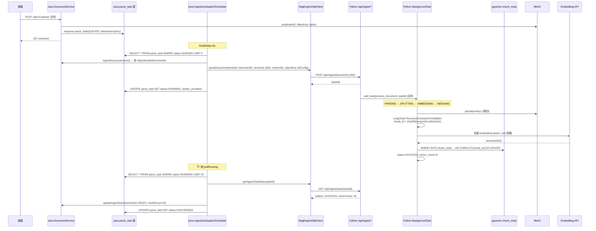
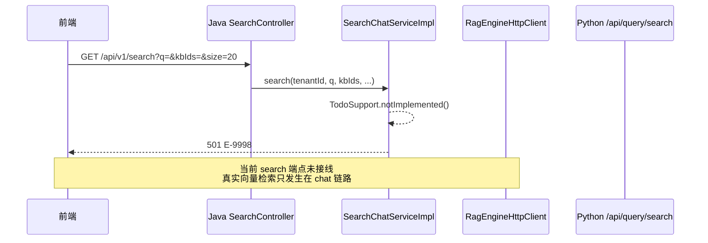
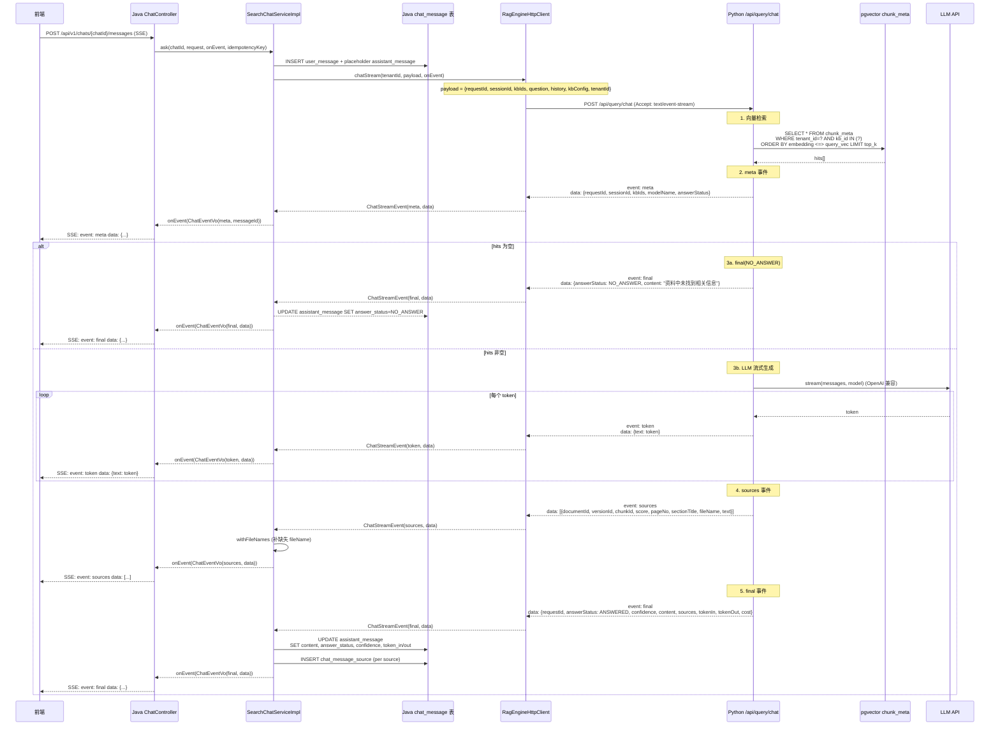

# Java ↔ Python 智能体对接流程

> **文档状态**：对接协议规范 · **版本**：v0.1 · **记录时间**：2026-08-17
> **适用范围**：`service/`（Java 后端）↔ `rag-engine/`（Python 智能体）
> **契约源**：[`server.openapi.yaml`](../../../api/server.openapi.yaml) · [`rag-engine.openapi.yaml`](../../../api/rag-engine.openapi.yaml)
> **配套文档**：[`minimal-qa-chain.md`](./minimal-qa-chain.md)（端到端实现清单）· [`rag-engine-minimal-implementation.md`](./rag-engine-minimal-implementation.md)（rag-engine 单侧行为）

---

## 1. 定位

本文档**只描述两侧对接面**：HTTP 端点契约、数据流时序、共享数据模型、错误码翻译、调度异步模型、已知缺口。不复述单侧实现细节（已在上述配套文档中说明）。

**对接模型一句话**：Java 是面向前端的业务编排层（鉴权、事务、审计、SSE 转发），Python 是无状态 RAG 执行层（解析、向量、LLM 流）。**Java 永远是发起方，Python 永远是被动方**；两侧通过 HTTP + SSE 通信，无共享内存、无消息队列、无回调。

---

## 2. 架构总览

```mermaid
flowchart LR
  subgraph FE[前端 web/]
    UI[Chat / Search / Upload UI]
  end

  subgraph JAVA[Java service/]
    AuthC[AuthN/AuthZ + 多租户]
    DocSvc[DocumentService<br/>上传/删除/重解析]
    Sched[IngestionDispatchScheduler<br/>5s 轮询]
    ChatSvc[SearchChatService<br/>SSE 转发 + 落库]
    Client[RagEngineHttpClient<br/>RestClient + JDK HttpClient]
  end

  subgraph PY[Python rag-engine/]
    IngestR[/api/ingest/*]
    QueryR[/api/query/*]
    EngineR[/api/engine/*]
    IngestSvc[IngestionService<br/>解析→分块→Embedding→pgvector]
    GenSvc[GenerationService<br/>检索→RAG Prompt→LLM 流]
    SearchSvc[RetrievalService<br/>空实现]
    Pg[(chunk_meta + pgvector)]
    Minio[(MinIO 原文)]
    LLM[DashScope LLM/Embedding]
  end

  UI -->|SSE / REST| AuthC
  AuthC --> DocSvc
  AuthC --> ChatSvc
  DocSvc -->|parse_task QUEUED| Sched
  Sched -->|HTTP 投递 + 轮询| Client
  ChatSvc -->|SSE chat| Client
  Client -->|HTTP| IngestR
  Client -->|SSE| QueryR
  Client -->|HTTP| EngineR
  IngestR --> IngestSvc
  QueryR --> GenSvc
  QueryR --> SearchSvc
  IngestSvc --> Minio
  IngestSvc --> Pg
  IngestSvc --> LLM
  GenSvc --> Pg
  GenSvc --> LLM
```

**关键边界**：
- Java ↔ Python **无服务间认证**（无 mTLS、无 token、无签名）
- tenant_id **只在 body 中传**，无 header 透传
- 共享存储：MinIO（原文）+ PostgreSQL/chunk_meta（向量索引）—— 两侧都连同一实例
- 网络隔离依赖部署层（K8s Service DNS `rag-engine.ragkb.svc:8000`，生产期需 NetworkPolicy）

---

## 3. HTTP 端点契约映射

### 3.1 Java → Python 调用矩阵

| Java 调用方 | Python 端点 | 实装状态 | tenant_id 传递 | 说明 |
|---|---|---|---|---|
| `IngestionDispatchScheduler.dispatchOne` → `RagEnginePort.parseDocument` | `POST /api/ingest/documents` | ✅ 真实接线 | body.tenantId | 异步受理，返回 taskId |
| `IngestionDispatchScheduler.pollOne` → `RagEnginePort.getIngestTaskStatus` | `GET /api/ingest/tasks/{id}` | ✅ 真实接线 | ❌ 不传 | taskId 全局可查（无租户隔离） |
| `SearchChatServiceImpl.ask` → `RagEnginePort.chatStream` | `POST /api/query/chat` | ✅ 真实接线 | body.tenantId | SSE 流式 |
| `RagEnginePort.deleteVectors` | `POST /api/ingest/delete` | ⚠️ 已实装无调用方 | ❌ 不传 | 删除链路断开（见 §10.2） |
| `RagEnginePort.search` | `POST /api/query/search` | ❌ Java 桩 | N/A | Python 返回空分页 |
| `RagEnginePort.rerank` | `POST /api/query/rerank` | ❌ Java 桩 | N/A | Python 实现了本地词项精排 |
| `RagEnginePort.health` | `GET /api/engine/health` | ⚠️ 已实装无调用方 | N/A | 未接入 readiness 探针 |
| `RagEnginePort.routeStatus` | `POST /api/engine/route-status` | ⚠️ 已实装无调用方 | N/A | 未接入路由决策 |

### 3.2 字段编码约定

- **传输格式**：JSON，字段命名 **camelCase**（不是 snake_case）
- **Python 侧**：所有 DTO 继承 `ApiModel`，`alias_generator=to_camel` + `populate_by_name=True` + `extra="forbid"`（多余字段直接 422）
- **Java 侧**：`RestClient` 默认 Jackson camelCase，无需额外配置
- **SSE**：`text/event-stream`，事件格式见 §5

---

## 4. 三条核心数据流

### 4.1 摄取链路（上传 → 向量入库）



**关键设计点**：
- **幂等**：`chunk_id = sha256(version_id:ordinal:text)`，同版本重摄取 upsert 不重复
- **异步推进**：Python 用 FastAPI BackgroundTasks，**响应 202 后才真正处理**，Java 永远拿不到实时进度
- **状态同步靠轮询**：Java 每 5s 轮询 RUNNING 任务（一次取 20 条），无主动回调
- **任务仓库是内存**：Python `InMemoryIngestTaskRepository`（LRU 1024），**进程重启后 GET 返回 404**

### 4.2 检索链路（独立 search 端点）



**契约缺口**：Python 侧 `RetrievalService.search` 已实装但**返回空分页**（`items=(), total=0`），未调用 `SearchIndex`。最小闭环走 chat 不走 search。后续接 BM25 + 向量融合再补。

### 4.3 生成链路（问答 SSE）



**关键设计点**：
- **Java 双层 SSE 转发**：`Python → HttpClient.ofLines → SearchChatServiceImpl lambda → SseEmitter → 前端`，每个 token 都穿透三层
- **fail-closed**：Python 无 LLM/SearchIndex 时发 `meta(NO_ANSWER) → final(NO_ANSWER)`，**不伪造答案**
- **三段式 Prompt**：system（只根据资料作答，无答案必须明示）+ history + 参考资料+问题
- **sources 截 200 字符**：避免 SSE 单事件过大
- **无断线重连**：Python 发的 `id: sequence` 行被 Java 忽略，前端断网需重新提问
- **无幂等**：Python `QueryChatRequest` 无 idempotency 字段，重复提问重复调 LLM

---

## 5. SSE 事件协议

### 5.1 事件编码格式

Python 侧（`generation/router.py`）按 SSE 规范逐行输出：

```
id: {sequence}\n
event: {name}\n
data: {single_line_json}\n
\n
```

- JSON 单行（`separators=(",", ":")` + `ensure_ascii=False`），避免换行破坏事件边界
- `id:` 行是事件序号（1, 2, 3...），**Java 侧不消费**（无断线重连）
- `event:` 行是事件类型，缺省时 Python 用 `"data"` 兜底

### 5.2 事件类型与 payload

| 顺序 | event | payload 字段 | Java 侧处理 |
|---|---|---|---|
| 1 | `meta` | `requestId, sessionId, kbIds, modelName, answerStatus(ANSWERED\|NO_ANSWER)` | 注入 messageId 后转发前端 |
| 2..N | `token` | `text` | 累积到 answer StringBuilder，原样转发 |
| N+1 | `sources` | `[{documentId, versionId, chunkId, score, pageNo, sectionTitle, fileName, text}]` | 补 fileName 后转发 + 落 `chat_message_source` |
| N+2 | `final` | `requestId, answerStatus(ANSWERED\|NO_ANSWER\|BLOCKED), confidence, content, sources[], suggestions[], tokenIn, tokenOut, cost` | 落 assistant_message + sources，转发前端 |
| 异常 | `final` | `answerStatus=BLOCKED` | 不泄露内部错误，仅告警 |

### 5.3 Java 侧解析状态机

`RagEngineHttpClient.chatStream` 用 `BodyHandlers.ofLines()` 逐行接收，状态变量 `currentEvent[0]`：

```
遇 "event: X" 行 → currentEvent[0] = X
遇 "data: Y" 行 → 解析 Y 为 JSON
              → 构造 ChatStreamEvent(type=currentEvent[0] ?: "data", data=Y)
              → 回调 onEvent.accept(event)
              → 复位 currentEvent[0] = null（防重复挂名）
遇 "id: Z" 行 → 忽略
```

---

## 6. 共享数据契约

### 6.1 chunk_meta 表（两侧共用）

DDL：`deploy/ddl/migrations/V0.6__pgvector_chunks.sql`

| 列 | 类型 | 写入方 | 读取方 | 说明 |
|---|---|---|---|---|
| `chunk_id` | TEXT PK | Python | — | `sha256(version_id:ordinal:text)`，幂等键 |
| `tenant_id` | BIGINT | Python（来自 IngestRequest.tenantId） | Python（检索过滤） | Java 不直接读 chunk_meta |
| `kb_id` | BIGINT | Python | Python（检索过滤） | |
| `document_id` | BIGINT | Python | Python | |
| `version_id` | BIGINT | Python | Python | **注意是 document_version.id，不是 version_no** |
| `index_profile_id` | BIGINT | Python | — | 从 kb 表解析，空则 fallback 该租户第一个 profile |
| `ordinal` | INT | Python | — | 块序号 |
| `block_type` | TEXT | Python | — | 默认 "text" |
| `page_no` | INT? | Python | Python（sources.pageNo） | |
| `section_path` | TEXT[] | Python | Python（拼接为 sectionTitle） | **Java 侧不保留** |
| `location_json` | JSONB | Python | — | 完整定位信息 |
| `chunk_text` | TEXT | Python | Python（sources.text 截 200） | |
| `text_sha256` | TEXT | Python | — | |
| `token_count` | INT | Python | — | |
| `policy_version` | BIGINT | Python | — | |
| `embedding` | vector(1024) | Python | Python（HNSW 余弦检索） | |

### 6.2 KbConfig 默认值（**两侧不一致，契约隐患**）

| 字段 | Java `RagEnginePort.defaultKbConfig()` | Python `common/api.py KbConfig` | 实际生效 |
|---|---|---|---|
| embeddingModel | `text-embedding-v3` | `bge-m3` | Java（每次显式传） |
| chunkSize | 512 | 512 | 一致 |
| chunkOverlap | 50 | 50 | 一致 |
| topK | 5 | 5 | 一致 |
| rerankerEnabled | `false` | `true` | Java（每次显式传） |

**风险**：Java 侧任何一次忘记传 `kbConfig`（如未来重构），Python 会用本地默认 bge-m3 + 启用 reranker，与 Java 期望不符。**建议**：两侧默认值对齐，或 Python 侧 `KbConfig` 字段全部改必填（去掉默认值），强制 Java 显式传。

### 6.3 sources 数组字段映射

Python 发出 → Java 落库 → 前端展示的字段流转：

| Python 发出 | Java 落库（chat_message_source） | 前端展示 | 备注 |
|---|---|---|---|
| documentId | document_id | ✓ | |
| versionId | version_id | ✓ | |
| chunkId | chunk_id | ✓ | |
| score | score | ✓ | |
| pageNo | location_json.pageNo | ✓ | |
| sectionTitle | location_json.sectionTitle | ✓ | Python 拼接 section_path[] 而来 |
| fileName | — | ✓ | Java 侧 `withFileNames` 补齐 |
| text | cited_text_sha256 = sha256(text) | ✗ | **Java 不存原文，只存哈希** |

**信息损失**：`section_path` 数组在 Python 侧是结构化的，拼成 `sectionTitle` 字符串后丢失层级；`location` 其他字段（如 offset）被 Java 丢弃。

---

## 7. 错误码与异常翻译

### 7.1 Python → Java 错误传播

| Python 抛出 | HTTP 状态 | Java 侧捕获 | 翻译为 | 字段信息保留 |
|---|---|---|---|---|
| `HTTPException(404, "ingest task not found")` | 404 | `RestClient` 抛 `HttpClientErrorException.NotFound` | `ApiException(INTERNAL_ERROR, E-9999)` | ❌ 丢失 |
| Pydantic `ValidationError`（`extra="forbid"`） | 422 | `RestClient` 抛 `HttpClientErrorException.UnprocessableEntity` | `GlobalExceptionHandler.handleUnexpected` → E-9999 | ❌ 丢失字段级信息 |
| 业务失败（摄取异常） | 200（任务内 status=FAILED） | 不抛，由 Java 轮询发现 | `parse_task.error_code = INGEST_FAILED` | ✓ 保留 error_msg |
| generation 异常 | 200（SSE final BLOCKED） | 不抛，Java lambda 收到 final 事件 | `assistant_message.answer_status = BLOCKED` | ❌ 不泄露内部错误 |
| 网络超时 | — | `HttpTimeoutException` | `ApiException(INTERNAL_ERROR, E-9999)` | ❌ |

### 7.2 错误码字典

Java `ErrorCode` 枚举（业务码 E-1000~E-1008，未实现 E-9998，系统繁忙 E-9999）。**Python 侧无错误码概念**，所有错误经 Java 翻译后归一为 E-9999，前端无法区分"rag-engine 不可达"与"rag-engine 返回 422"。

**建议**：Python 侧 HTTPException 统一返回 `{code: "RAG_xxx", message: ...}` 结构，Java 侧解析 code 字段做精细化映射。

---

## 8. 调度与异步模型

### 8.1 Java 侧调度器

`IngestionDispatchScheduler`（`@Scheduled fixedDelay=5000ms`，**非 cron**）：

```
每 5s 触发一次（上次执行结束后再等 5s）：
  AtomicBoolean busy 双保险防重入
  dispatchQueued(): SELECT * FROM parse_task WHERE status=QUEUED LIMIT 5
                    逐条 → parseDocument → UPDATE status=RUNNING, lease_until=now+300s
  pollRunning():    SELECT * FROM parse_task WHERE status=RUNNING LIMIT 20
                    逐条 → getIngestTaskStatus
                      SUCCESS → UPDATE status=SUCCEEDED, document_version.ingest_status=READY
                      FAILED  → UPDATE status=FAILED, document_version.ingest_status=FAILED
                      其他    → 保持 RUNNING（下一轮继续）
```

**已知缺陷**：
- `lease_until` 字段写了但 `pollRunning` 不检查过期 → RUNNING 任务可能永远停留
- Python 进程重启后 GET 404 → Java 抛异常仅 log.warn，**无限重试**
- 多实例部署时无分布式锁 → 同一 task 可能被多实例重复投递（需 outbox 或行锁）

### 8.2 Python 侧异步模型

| 链路 | 异步机制 | 阻塞性 | 状态持久化 |
|---|---|---|---|
| 摄取 | FastAPI `BackgroundTasks`（同进程线程池） | 非阻塞返回 202 | ❌ 内存 LRU 1024，重启丢 |
| 检索 | 同步 | 阻塞 | — |
| 生成 | `StreamingResponse` + 生成器 | 流式非阻塞 | — |

### 8.3 重试机制

- **Python 侧无自动重试**：摄取任一步异常直接 FAILED
- **Java 侧重试靠 reparse 端点驱动**：`IngestionUseCaseImpl.retryIngestion` 校验 `attemptCount < maxAttempts(3)`，重置 status=QUEUED 由调度器重新投递
- **dispatchQueued 失败不重试**：直接标 FAILED + errorCode=DISPATCH_FAILED

---

## 9. 配置与部署对接

### 9.1 关键配置项对齐表

| 配置项 | Java 侧 | Python 侧 | 对齐要求 |
|---|---|---|---|
| Python base URL | `rag-engine.base-url` (env `RAG_ENGINE_BASE_URL`) | — | Java 指向 Python 监听地址 |
| 超时（普通） | `rag-engine.timeout-ms` 默认 10000 | — | |
| 超时（chat） | `rag-engine.chat-timeout-ms` 默认 120000 | `RAG_ENGINE_LLM_TIMEOUT_MS` 默认 120000 | **两侧必须一致**，否则 Java 等不到 Python 完整流 |
| 调度间隔 | `rag-engine.dispatch-interval-ms` 默认 5000 | — | |
| PostgreSQL | `RAGKB_DB_URL` | `RAG_ENGINE_DATABASE_URL` | **必须指向同一实例同一库**（chunk_meta 共用） |
| MinIO 凭证 | `MINIO_ROOT_USER/PASSWORD` | `RAG_ENGINE_MINIO_ACCESS_KEY/SECRET_KEY` | **必须同一组凭证** |
| MinIO bucket | `ragkb.storage.minio.bucket` 默认 `ragkb` | `RAG_ENGINE_MINIO_BUCKET` 默认 `kb-bucket-0814` | ⚠️ **默认值不一致，部署时必须显式对齐** |
| Embedding 模型 | `defaultKbConfig.embeddingModel=text-embedding-v3` | `RAG_ENGINE_EMBEDDING_MODEL` 默认 `text-embedding-v3` | 一致 |
| Embedding 维度 | — | `RAG_ENGINE_EMBEDDING_DIMENSION` 默认 1024 | 必须与 pgvector `vector(1024)` 一致 |

### 9.2 Docker Compose 现状

`deploy/compose/docker-compose.yml` 当前**只编排中间件**（postgres pgvector / redis / minio），**Java 与 Python 服务均未编排**。开发期手动启动：

```bash
# 1. 中间件
docker compose -f deploy/compose/docker-compose.yml up -d

# 2. Python
cd rag-engine && uv run uvicorn rag_engine.main:app --host 0.0.0.0 --port 8000

# 3. Java
cd service && mvn spring-boot:run
```

生产部署建议：K8s 中 Java Deployment 通过 Service DNS `http://rag-engine.ragkb.svc:8000` 访问 Python Deployment，需配套 NetworkPolicy 限制仅 Java Pod 可访问 Python 8000 端口（补无服务间认证的安全缺口）。

---

## 10. 已知对接缺口与红线

### 10.1 多租户隔离不完整（**严重**）

| 端点 | tenant_id 传递 | 风险 |
|---|---|---|
| POST /api/ingest/documents | ✅ body | 正确 |
| GET /api/ingest/tasks/{id} | ❌ 不传 | **任意租户可查任意 taskId** |
| POST /api/ingest/delete | ❌ 不传 | DELETE SQL 无 tenant 过滤 |
| POST /api/query/chat | ✅ body | 正确（但 Python schema 默认值=1，Java 漏传会跨租户） |
| POST /api/query/search | ❌ 无字段 | Python schema 缺 tenant_id |
| GET /api/engine/health | ❌ | 无租户语义，可接受 |

**修复建议**：
- Python 侧所有业务端点 schema 加 `tenant_id: int = Field(gt=0)` 必填（去默认值）
- Java 侧 `RagEngineHttpClient` 所有方法补传 tenantId（GET 走 query param，DELETE 走 body）
- Python `delete_by_version` SQL 加 `AND tenant_id = %s`

### 10.2 向量删除链路断开（**严重**）

```
DocumentService.deleteDocument (逻辑删除 del_flag=1)
  → 注释说"物理清理由 deletion_task + rag-engine CLEANUP 异步执行"
  → 但 CLEANUP 流程未实现
  → RagEnginePort.deleteVectors 已实装但无调用方
  → 即使调用，参数语义错位：
      Java 传 versionNo（版本序号 1/2/3）
      Python delete_by_version 用 WHERE version_id = %s（期望 document_version.id 主键）
      → 误删或不删
```

**修复建议**：
- Java 侧 `deleteDocument` 流程中显式调 `ragEnginePort.deleteVectors(tenantId, documentId, versionId)`（注意传 versionId 不是 versionNo）
- Python 侧 `DeleteRequest` 字段 `version_no` 改名 `version_id`，或 service 层做映射
- DELETE SQL 加 `AND tenant_id = %s AND document_id = %s` 双重过滤

### 10.3 服务间零认证（**中等**）

Python 侧 `auth/ports.py` 定义了 `WorkloadAuthenticator / RetrievalAccessContextVerifier` Protocol，但**未在任何 router Depends 中接入**。任何能访问 Python 8000 端口的进程都能调所有端点。

**修复建议**：
- 短期：部署层 NetworkPolicy 限制仅 Java Pod 可访问
- 中期：Java 调用时加 `X-Internal-Token` header，Python 中间件校验
- 长期：mTLS（K8s Service Mesh）

### 10.4 其他缺口清单

| 缺口 | 影响 | 优先级 |
|---|---|---|
| `RetrievalAccessContext.allowed_document_ids` 未在 chat 流程填充 | 文档级 ACL 未传到向量检索层，仅 kb_id 过滤 | 中 |
| Python 任务仓库内存实现 + Java 轮询模型 | Python 重启后 RUNNING 任务在 Java 侧无限重试 | 中 |
| Outbox 表无限增长 | 调度器不消费 outbox，需独立清理任务 | 中 |
| `lease_until` 字段写了不检查 | RUNNING 任务可能永远停留 | 中 |
| KbConfig 两侧默认值不一致 | Java 漏传时 Python 用错误默认 | 低 |
| SSE `id:` 行被 Java 忽略 | 无断线重连续传 | 低 |
| `Idempotency-Key` 未透传到 Python | 重复提问重复调 LLM | 低 |
| sources.location 字段在 Java 侧丢弃 section_path | 引用定位信息损失 | 低 |
| Java 422 错误归一为 E-9999 | 前端无法区分字段校验错误 | 低 |
| `IngestionUseCaseImpl` 类文档注释过期 | 仍写"rag-engine provider 未装配" | 低 |

---

## 11. 后续演进路线

### 短期（补缺口）
1. 修复 §10.1 多租户传递 + §10.2 删除链路（**当前最近 commit 已部分修复 chat/ingest 主链路**）
2. Python 任务仓库改 PostgreSQL 持久化（避免重启 404 死循环）
3. Outbox 清理任务（cron 删除已消费的 outbox_event）

### 中期（补功能）
4. 接 `RetrievalService.search` 真实实现（BM25 + 向量融合）
5. 接 `RagEnginePort.search/rerank` Java 侧实现（去 TodoSupport.notImplemented）
6. 接 `RagEnginePort.health` 到 Java readiness 探针
7. 服务间认证（X-Internal-Token）

### 长期（架构演进）
8. Python 侧多副本部署 → 任务仓库必须改共享存储
9. Outbox 模式落地 → 调度器消费 outbox 而非轮询 parse_task
10. mTLS + OpenTelemetry 跨服务追踪
11. 文档级 ACL 在 chat 流程完整传递

---

## 附录 A：关键文件索引

### Java 侧
- [RagEnginePort.java](../../../../service/src/main/java/com/ragkb/service/modules/rag/port/RagEnginePort.java) — 对接端口契约
- [RagEngineHttpClient.java](../../../../service/src/main/java/com/ragkb/service/modules/rag/adapter/RagEngineHttpClient.java) — HTTP 客户端实现
- [ChatStreamEvent.java](../../../../service/src/main/java/com/ragkb/service/modules/rag/port/ChatStreamEvent.java) — SSE 事件 record
- [IngestionDispatchScheduler.java](../../../../service/src/main/java/com/ragkb/service/modules/ingestion/service/impl/IngestionDispatchScheduler.java) — 调度投递+轮询
- [SearchChatServiceImpl.java](../../../../service/src/main/java/com/ragkb/service/modules/conversation/service/impl/SearchChatServiceImpl.java) — chat 主流程
- [ChatController.java](../../../../service/src/main/java/com/ragkb/service/modules/conversation/controller/ChatController.java) — SSE 入口
- [DocumentServiceImpl.java](../../../../service/src/main/java/com/ragkb/service/modules/document/service/impl/DocumentServiceImpl.java) — 上传/删除/重解析
- [application.yml](../../../../service/src/main/resources/application.yml) — base-url 等配置

### Python 侧
- [api/router.py](../../../../rag-engine/src/rag_engine/api/router.py) — 路由装配入口
- [container.py](../../../../rag-engine/src/rag_engine/container.py) — 组合根（provider 装配）
- [ingestion/router.py](../../../../rag-engine/src/rag_engine/ingestion/router.py) — 摄取端点
- [ingestion/service.py](../../../../rag-engine/src/rag_engine/ingestion/service.py) — 摄取流水线
- [generation/router.py](../../../../rag-engine/src/rag_engine/generation/router.py) — chat SSE 端点
- [generation/service.py](../../../../rag-engine/src/rag_engine/generation/service.py) — RAG 问答主流程
- [retrieval/service.py](../../../../rag-engine/src/rag_engine/retrieval/service.py) — 搜索服务（空实现）
- [indexing/pgvector.py](../../../../rag-engine/src/rag_engine/indexing/pgvector.py) — pgvector 实现
- [common/api.py](../../../../rag-engine/src/rag_engine/common/api.py) — ApiModel + KbConfig
- [.env.example](../../../../rag-engine/.env.example) — Python 配置模板

### 契约
- [rag-engine.openapi.yaml](../../../api/rag-engine.openapi.yaml) — Python 侧 OpenAPI
- [server.openapi.yaml](../../../api/server.openapi.yaml) — Java 侧 OpenAPI

### 部署
- [docker-compose.yml](../../../../deploy/compose/docker-compose.yml) — 中间件编排（仅 PG/Redis/MinIO）
- [V0.6__pgvector_chunks.sql](../../../../deploy/ddl/migrations/V0.6__pgvector_chunks.sql) — pgvector + chunk_meta DDL
