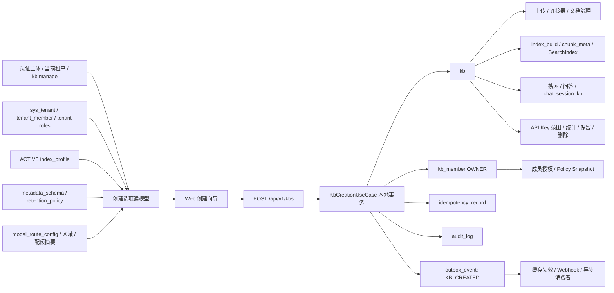
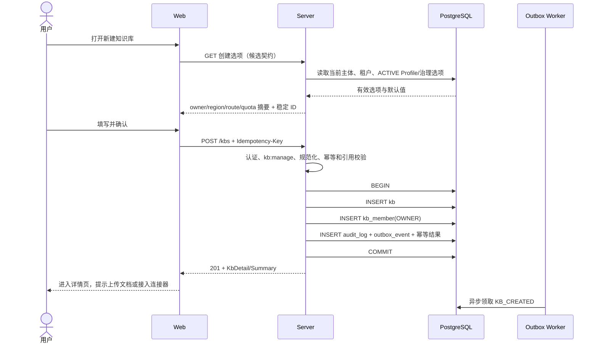

# 创建知识库功能实现分析与方案

> **文档状态**：分析完成，待需求与契约评审 · **版本**：v0.1-analysis · **负责人**：zhanghuaiwei · **最近更新时间**：2026-08-14
> **适用范围**：Web 创建向导、Server 知识库用例、PostgreSQL 知识配置及其上下游能力
> **权威边界**：本文记录仓库现状、差异和推荐方案，不冻结 API、枚举、数据库迁移或权限策略；公共契约仍以评审后的 [`server.openapi.yaml`](../../../api/server.openapi.yaml) 为准。

## 1. 目标与结论

创建知识库不是单表新增，而是建立后续知识接入、治理、授权、索引、检索和问答共同依赖的根资源。一次成功创建至少要保证：

1. 知识库属于当前已验证租户，客户端不能指定或伪造 `tenantId`。
2. 创建者在同一事务内成为该库的 `OWNER`，不能出现“有库无所有者”的中间状态。
3. 知识库绑定可用且同租户的索引 Profile；可选绑定元数据 Schema 和保留策略。
4. 数据区域由服务端继承租户配置，不信任前端展示文案。
5. 创建操作具备权限校验、幂等、防重、审计和可靠事件记录。
6. 创建成功只产生知识库配置事实，不直接调用 RAG 引擎、不创建文档、不写物理向量索引。

当前仓库已经具备创建页面、TypeScript API 双实现、后端入口、DTO、实体、Mapper 和 DDL，但真实业务闭环尚未实现。默认 Web 配置使用 Mock，因此页面“创建成功”不能作为真实后端验收证据；切换为真实 HTTP 后，`KbServiceImpl#createKb` 当前返回 501 `E-9998`。

推荐采用“**稳定 ID 契约 + 服务端派生上下文 + 单本地事务创建 + outbox 异步扩展**”方案。先冻结创建请求、创建选项和响应读模型，再实现后端，最后让前端从真实选项生成向导。

## 2. 分析范围与事实源

### 2.1 已检查范围

- 前端入口与向导：[`kbs/page.tsx`](<../../../../web/app/(main)/kbs/page.tsx>)、[`kbs/new/page.tsx`](<../../../../web/app/(main)/kbs/new/page.tsx>)。
- 前端类型、契约和 transport：[`types/kb.ts`](../../../../web/api-client/types/kb.ts)、[`contracts/kb.ts`](../../../../web/api-client/contracts/kb.ts)、[`http/kb.ts`](../../../../web/api-client/http/kb.ts)、[`mock/kb.ts`](../../../../web/api-client/mock/kb.ts)。
- 后端入口与用例：[`KbController.java`](../../../../service/src/main/java/com/ragkb/service/modules/knowledge/controller/KbController.java)、[`KbService.java`](../../../../service/src/main/java/com/ragkb/service/modules/knowledge/service/KbService.java)、[`KbServiceImpl.java`](../../../../service/src/main/java/com/ragkb/service/modules/knowledge/service/impl/KbServiceImpl.java)。
- 后端请求、响应和持久化模型：[`knowledge/dto`](../../../../service/src/main/java/com/ragkb/service/modules/knowledge/dto)、[`knowledge/vo`](../../../../service/src/main/java/com/ragkb/service/modules/knowledge/vo)、[`knowledge/persistence`](../../../../service/src/main/java/com/ragkb/service/modules/knowledge/persistence)。
- 权限与租户上下文：[`PermissionCatalog.java`](../../../../service/src/main/java/com/ragkb/service/modules/access/service/PermissionCatalog.java)、[`SecurityConfig.java`](../../../../service/src/main/java/com/ragkb/service/config/SecurityConfig.java)、[`DatabaseConfig.java`](../../../../service/src/main/java/com/ragkb/service/config/DatabaseConfig.java)。
- 设计和数据基线：[`03-详细设计.md`](../../../03-详细设计.md)、[`04-数据库设计.md`](../../../04-数据库设计.md)、[`init.sql`](../../../../deploy/ddl/init.sql)、[`V0.3__unified_audit_columns.sql`](../../../../deploy/ddl/migrations/V0.3__unified_audit_columns.sql)。

### 2.2 事实优先级

1. 精确数据库表、列、外键和 CHECK：`deploy/ddl/init.sql` 加已评审迁移。
2. HTTP 路径和请求/响应候选：`docs/api/server.openapi.yaml`，当前仍为评审中草稿。
3. 领域不变量：`docs/03-详细设计.md`、`docs/04-数据库设计.md`。
4. 实际可运行行为：当前代码；Mock、TODO 和注释不等于真实业务实现。
5. `docs/01-需求分析.md` 和 `docs/07-API契约.md` 只保留 v0.1 需求背景，其中与 v0.2 冲突的部分不作为实现依据。

## 3. 当前实现状态

| 层次 | 当前状态 | 结论 |
| --- | --- | --- |
| 页面 | 已有 4 步向导：基本信息 → 归属与治理 → 策略与配额 → 确认 | 可用于产品演示，部分字段没有后端事实源 |
| API client | `createKb(input)` 同时有 Mock 和 HTTP 实现 | 默认 `NEXT_PUBLIC_USE_MOCK` 未设时使用 Mock |
| Mock | 可创建内存 KB、创建 OWNER 成员、写 Mock 审计；重复名称报错 | 不是数据库、权限、事务或真实接口证据 |
| OpenAPI | 已有 `POST /api/v1/kbs`，返回 201；创建者为 OWNER | v0.2 草稿未冻结，和当前 DTO/前端类型有差异 |
| Controller | 已接收请求和可选 `Idempotency-Key` | 只有登录门禁，没有 `kb:manage` 方法级门禁 |
| Service | 接口已定义 | `KbServiceImpl#createKb` 仍是 TODO，真实调用返回 501 |
| Persistence | `kb`、`kb_member`、`index_profile` Entity/Mapper 已存在 | 只有 BaseMapper 骨架，没有创建事务和业务查询 |
| 数据库 | 表、复合租户外键、唯一约束、状态 CHECK 已设计 | DDL/迁移未在本任务中执行；默认 Profile 种子为 `DRAFT` |
| 审计/幂等/outbox | 表和 Entity 已存在 | 知识库创建尚未接入 |
| 测试 | 有 Mock 创建和重复名称测试 | 无 Kb 后端单测、PostgreSQL 集成测试和创建 E2E |
| RAG 引擎 | 不参与 KB 元数据创建 | 后续文档摄取、索引和检索才消费 KB 配置 |

### 3.1 当前页面行为

1. `/kbs` 的“新建知识库”按钮直接进入 `/kbs/new`，按钮和路由未校验 `kb:manage`。
2. 向导在前端逐步校验字段；确认后调用 `api.createKb`。
3. Mock 模式创建一个 `ACTIVE` KB，当前用户为 `OWNER`，文档/分块数为 0。
4. 成功后跳回 `/kbs`；失败时保留表单并显示错误消息。
5. 页面显示的所有者、数据区域、模型策略和配额都是静态文案，不来自当前租户的真实配置。

### 3.2 当前真实 HTTP 行为

```text
NewKbPage
  -> api.createKb
  -> kbApi.createKb
  -> POST {API_BASE}/api/v1/kbs
  -> KbController.createKb
  -> KbServiceImpl.createKb
  -> TodoSupport.notImplemented
  -> HTTP 501 / E-9998
```

## 4. 契约与数据差异

### 4.1 契约就绪度

| 检查项 | 状态 | 说明 |
| --- | --- | --- |
| 路径与方法 | `ready` | 前后端都使用 `POST /api/v1/kbs`；HTTP client 的 baseURL 已包含 `/api/v1` |
| 认证 | `ready` | Security Filter 要求登录；OIDC 与 JWT 的统一业务主体仍需补齐 |
| 创建权限 | `missing` | 前端按钮/路由和后端 Controller 都未强制 `kb:manage` |
| 请求字段 | `conflicting` | 向导/TS/DTO 使用展示字符串，OpenAPI/DDL 使用稳定外键或服务端派生值 |
| 响应字段 | `conflicting` | 前端要求 `role/members/counts/indexProfileName`，OpenAPI `Kb` 未定义这些字段 |
| 默认值 | `conflicting` | `ocrEnabled` 页面和 Mock 默认 false，OpenAPI/DDL 默认 true |
| 幂等 | `conflicting` | OpenAPI描述写操作必填，Controller 接收可选，HTTP client 没有发送 |
| 租户隔离 | `missing` | 创建用例未实现；RLS 仅在 DDL 注释附录中，应用未设置 `app.tenant_id` |
| 状态 | `needs-confirmation` | DB/OpenAPI 无 `CLONING`，前端 `KbStatus` 包含 `CLONING` |
| 错误码 | `needs-confirmation` | 只有通用 400/403/404/409，未明确无可用 Profile、配额和无效治理引用 |
| 版本与兼容 | `missing` | 手写 TS 类型，无 OpenAPI 生成和契约漂移检查 |

### 4.2 创建字段对账

| 业务字段 | 当前页面/TS/DTO | OpenAPI/数据库 | 问题与建议 |
| --- | --- | --- | --- |
| `name` | 页面 2–40 字；DTO 非空、最大 128 | OpenAPI/DB 最大 128 | 长度和大小写唯一语义待统一；服务端必须 trim/规范化 |
| `description` | 页面最大 200；DTO 最大 1024 | OpenAPI/DB 最大 1024 | 前后端最大长度不一致 |
| `visibility` | `PRIVATE/TENANT` | 一致，默认 `PRIVATE` | `TENANT` 只扩大入口可见性还是隐式 VIEWER，需冻结 |
| `owner` | 可编辑文本，但提交时不发送 | 创建者应来自认证主体 | 改为只读展示；禁止客户端指定所有者 |
| `domain` | 提交字符串 | OpenAPI/`kb` 无对应字段 | 当前被后端 DTO 接收后丢失；MVP 移除或先定义稳定 `domainId` |
| `sensitivity` | 提交字符串 | 只存在于 `document`，`kb` 无默认敏感级列 | 不能静默丢弃；若要作为文档默认值需先补契约和数据模型 |
| `retention` | 提交“1 年/3 年”等展示文案 | `kb.retention_policy_id` | 改为 `retentionPolicyId`，校验同租户且 ACTIVE |
| `dataRegion` | 提交中文区域名称，Mock 原样保存 | v0.2 C7 要求服务端继承 `sys_tenant.data_region` | 改为只读摘要，不进入创建请求 |
| `modelPolicy` | 提交展示文案 | KB 无外键；实际规则在 `model_route_config` | 创建页只展示服务端算出的路由摘要，不提交文案 |
| `requiresReview` | 默认 true | OpenAPI/DDL 默认 true | 基本一致 |
| `ocrEnabled` | 页面/Mock 默认 false | OpenAPI/DDL 默认 true | 必须由产品确认并统一 |
| `indexProfileId` | 页面只有固定摘要，TS/DTO 未提交 | `kb.index_profile_id NOT NULL` | P0 阻断；需稳定 ID 或明确的服务端默认 Profile |
| `metadataSchemaId` | 页面设计中提到，当前未选择/提交 | OpenAPI/DB 可选 | 需要真实 ACTIVE Schema 选项 |
| 配额摘要 | 固定“50 GB/10,000 篇”等文案 | 当前无冻结的配额接口/表 | 不能当成真实限制；应由 create-options 返回或显示“暂不可用” |

### 4.3 响应与状态差异

- 后端 `KbVo` 比 OpenAPI `Kb` 多 `role`、`documentCount`、`chunkCount`、`indexProfileName`、`members`，但少 `indexProfileId`、`metadataSchemaId`、`retentionPolicyId`、`activeIndexBuildId`。
- 前端 `KbMember.userName` 与 OpenAPI `KbMember.displayName` 不一致；前端未建模 `joinedAt`。
- 前端把成员数组放在所有 KB 列表对象中，会增加列表查询成本；推荐拆分 `KbSummary` 与 `KbDetail`，成员继续由成员端点查询。
- `ACTIVE` 表示生命周期可用，不代表已经有可检索内容。新建库应允许 `ACTIVE + 0 文档 + activeIndexBuildId=null`，页面另显示“空库/待接入”健康态。
- 创建流程是同步 201，不需要通用 Task；`CLONING`、删除和索引构建才是异步链路。

## 5. 业务角色与边界

### 5.1 推荐权限规则

- 租户级 `TENANT_ADMIN`、`KNOWLEDGE_ADMIN` 当前都映射到 `kb:manage`，可创建知识库。
- 普通 `MEMBER` 只有 `kb:list`，不可创建。
- 新资源尚无 KB 角色，因此创建权限不能依赖 `kb_member`；创建成功后才授予创建者 `OWNER`。
- MVP 推荐只允许有全局用户身份的交互式用户创建。API Key 没有可成为 OWNER 的 `userId`，且新 KB 不在既有 `allowedKbIds` 中，是否允许机器创建应单独评审。
- 前端隐藏/禁用入口只改善体验，后端必须使用 `@PreAuthorize("hasAuthority('kb:manage')")` 或等价的用例级门禁。

### 5.2 创建边界

创建成功时：

- 写 KB 配置、初始 OWNER、审计、幂等结果和 outbox。
- 返回一个可进入详情页的空知识库。

创建时不做：

- 不创建文档、文档版本、切片、Policy Snapshot 或 Chat Session。
- 不调用 embedding/OCR/LLM provider。
- 不创建物理索引或 `index_build`；首次文档摄取或显式重建时再创建。
- 不根据中文展示字符串动态创建保留策略、元数据 Schema 或模型路由规则。
- 不实现克隆、归档、删除、成员管理等邻接用例。

## 6. 方案比较与推荐 MVP

| 方案 | 做法 | 优点 | 缺点 | 结论 |
| --- | --- | --- | --- | --- |
| A. 直接补 `KbServiceImpl` | 按现有 DTO 接收所有字符串，能映射的写入，不能映射的忽略 | 改动小 | 数据静默丢失、区域可伪造、Profile 无法可靠绑定、契约继续分叉 | 不采用 |
| B. 稳定 ID + 创建选项 + 原子事务 | 向导先读可选配置，提交稳定 ID；owner/tenant/region 由服务端派生 | 契约清晰、可校验、可审计、后续治理链路稳定 | 需要先评审 OpenAPI 和补一个创建选项读模型 | **推荐** |
| C. 创建草稿后异步配置 | 先建 DRAFT KB，再异步生成 Profile/策略/索引 | 可承载复杂模板和大规模初始化 | 当前状态机无 DRAFT，增加残缺资源和补偿复杂度 | 后续模板化场景再评估 |

### 6.1 推荐 MVP 范围

MVP 请求只保留已有事实模型能稳定表达的字段：

- `name`
- `description`
- `visibility`
- `indexProfileId`，或经契约确认后由服务端选择唯一的默认 ACTIVE Profile
- `metadataSchemaId`（可选）
- `retentionPolicyId`（可选）
- `requiresReview`
- `ocrEnabled`

服务端派生：`tenantId`、`ownerUserId`、`dataRegion`、`status=ACTIVE`、`policyVersion=1`、审计字段。

MVP 暂不提交：`owner`、`domain`、`sensitivity`、`modelPolicy`、配额展示值。若这些字段被确认是创建必填项，应先扩展唯一 OpenAPI 和数据库模型，不能继续由 DTO 接收后丢弃。

## 7. 推荐架构与调用流程

### 7.1 上下游关系



### 7.2 建议交互流程



## 8. 详细业务逻辑

### 8.1 创建前选项

推荐增加一个聚合的“创建选项”读模型，路径和字段需进入 OpenAPI 评审。它应只返回当前用户可使用的选项：

- 当前所有者的只读 `userId/displayName`。
- 当前租户的数据区域和功能开关。
- 同租户、`ACTIVE`、未逻辑删除的 Index Profile。
- 可绑定的 ACTIVE 元数据 Schema 和保留策略。
- 根据当前区域和策略计算出的模型路由摘要，只用于展示。
- 真实配额摘要；配额能力未实现时明确返回 `unavailable`，不返回伪造数值。
- 服务端默认值及不可变字段说明。

现有元数据 Schema、保留策略已有列表端点，但 Index Profile 没有面向创建向导的列表端点。聚合读模型可以避免前端并发拼装多份候选列表，也能统一过滤同租户、状态和功能开关。

### 8.2 请求校验顺序

1. 解析统一认证主体，取得 `userId`、`tenantId`、租户角色、credential 和 request/trace id。
2. 拒绝无用户主体、租户未激活、成员关系非 ACTIVE 的请求。
3. 校验 `kb:manage`。
4. 校验并认领 `Idempotency-Key`；对规范化请求体计算 SHA-256。
5. 规范化名称和描述；拒绝空白、超长、控制字符和非法枚举。
6. 检查租户状态与创建功能是否可用。
7. 校验 Index Profile 同租户、ACTIVE、未删除；没有可用 Profile 时失败，不能回退到 DRAFT。
8. 校验可选 Schema/保留策略同租户、状态有效且作用域兼容。
9. 执行真实配额检查；没有配额服务时不展示或宣称已执行配额限制。
10. 在本地事务中完成写入。

### 8.3 规范化与唯一性

- 推荐名称入库前 `trim`，明确是否折叠连续空白和是否大小写不敏感。
- 当前 `uq_kb_tenant_name` 是 `(tenant_id, name)` 精确唯一，并包含已经逻辑删除的记录；这和“仅非 DELETED KB 名称唯一”的设计规则不完全一致。
- 若确认删除后允许复用名称，迁移方案应评审为未删除行上的部分唯一索引；若确认大小写不敏感，应同时统一 `lower(name)` 语义。本文不执行该迁移。
- 数据库唯一约束是并发最终防线；应用预查只用于友好提示。捕获唯一冲突后返回稳定 409。

### 8.4 创建事务

建议 `KbServiceImpl#createKb` 或独立的 `KbCreationUseCase` 作为 `@Transactional` 边界，事务中完成：

1. 插入 `kb`：`ACTIVE`、`del_flag=0`、`policy_version=1`、`active_index_build_id=null`。
2. 插入 `kb_member`：当前 `userId`、角色 `OWNER`。
3. 追加 `audit_log`：`action=kb.create`、结果、主体、请求/trace 和最小必要详情。
4. 插入 `outbox_event`：建议事件 `KB_CREATED`，payload 只含稳定 ID、配置引用和版本，不含秘密信息。
5. 将幂等记录置为成功并保存资源 ID/响应摘要。

任何一步失败都回滚 KB、OWNER、审计、outbox 和成功幂等结果，避免产生半成品。事务内禁止调用 RAG、对象存储、Webhook 或模型 provider；这些只能由提交后的 outbox 消费者异步处理。

### 8.5 幂等与并发

- 前端进入最终确认时生成一个幂等键，同一次提交的网络重试必须复用该键；用户修改表单后生成新键。
- 同一 `tenant + operation + key` 且请求摘要相同：返回第一次成功结果。
- 同一键但请求摘要不同：返回 409，防止键被错误复用。
- 同名并发请求使用不同幂等键时，由 KB 名称唯一约束决定只有一个成功。
- `Idempotency-Key` 是否强制必填必须在 OpenAPI 中明确；推荐创建等非安全重试写操作必填。

### 8.6 默认值

- `visibility`：默认 `PRIVATE`。
- `requiresReview`：当前各层基本一致为 true。
- `ocrEnabled`：当前冲突，推荐先按安全/成本策略确认；确认前不以页面默认覆盖数据库默认。
- `dataRegion`：总是来自 `sys_tenant.data_region`。
- `indexProfileId`：必须明确选择规则。当前种子 Profile 是 `DRAFT`，不满足 OpenAPI 的 ACTIVE 约束；上线前必须提供至少一个 ACTIVE Profile 或正式的激活流程。
- `status`：创建后为 `ACTIVE`；空内容通过独立健康态表达，不引入未评审的 `DRAFT` 状态。

## 9. 数据写入与派生关系

### 9.1 创建时直接读取的数据

| 数据/表 | 读取目的 | 关键约束 |
| --- | --- | --- |
| 认证主体 | 用户、租户、credential、角色、request/trace | 只来自已验证 SecurityContext |
| `sys_tenant` | 状态、`data_region`、策略版本 | 必须 ACTIVE |
| `tenant_member` / `tenant_member_role` | 当前用户属于租户且有创建权限 | ACTIVE，不能信任 body 中角色 |
| `index_profile` | 绑定不可变 embedding/chunker 配置 | 同租户、ACTIVE、未删除 |
| `metadata_schema` | 可选文档元数据约束 | 同租户、ACTIVE、作用域兼容 |
| `retention_policy` | 可选保留/处置规则 | 同租户、ACTIVE、作用域兼容 |
| `model_route_config` | 只读策略摘要或创建前校验 | 不把页面文案写入 KB |
| 配额事实源 | 判断是否允许创建/后续容量 | 当前未冻结，不能用静态 Mock 代替 |

### 9.2 创建时直接写入的数据

| 表 | 写入内容 | 是否必须与 KB 同事务 |
| --- | --- | --- |
| `kb` | 根资源、配置引用、区域、状态和策略版本 | 是 |
| `kb_member` | 创建者 `OWNER` | 是 |
| `idempotency_record` | operation/key/请求摘要/资源和响应摘要 | 是，具体认领策略需实现 |
| `audit_log` | `kb.create` 成功证据 | 是；失败/拒绝审计可由独立安全审计路径追加 |
| `outbox_event` | `KB_CREATED` 可靠事件 | 是 |

### 9.3 创建时不写、后续才产生的数据

| 数据 | 产生时机 | 与 KB 的关系 |
| --- | --- | --- |
| `source_connection` / `source_object` / `sync_job` | 用户接入连接器并同步 | `source_connection.kb_id -> kb.id` |
| `document` / `document_version` / `parse_task` | 上传或同步内容 | 文档继承 KB 的区域、治理和 Profile 上下文 |
| `chunk_meta` | 解析、分块和索引 | 记录 `kb_id`、版本、Profile 和 policyVersion |
| `index_build` | 首次构建、换模或全量重建 | 验证后更新 `kb.active_index_build_id` |
| `policy_snapshot` | 搜索/问答前计算授权范围 | 以 KB、主体和 policyVersion 生成短期快照 |
| `chat_session_kb` | 创建问答会话并选择 1–5 个 KB | 只允许当前主体可访问的 ACTIVE KB |
| `api_key_kb` | 管理员给 API Key 配置库范围 | 机器凭证不得越过 allowed KB |
| `cost_record` / `usage_daily` | OCR、embedding、检索、问答发生后 | 以 `kb_id` 聚合成本和用量 |
| `deletion_task` / target / receipt | 删除工作流 | KB 进入 DELETING 后异步处置对象、索引和缓存 |

## 10. 上承下接功能分析

### 10.1 上承能力

| 上游功能 | 为创建提供什么 | 当前状态/缺口 |
| --- | --- | --- |
| 登录与租户切换 | 当前用户和激活租户 | JWT 已有 tenant；OIDC Principal 到统一 SubjectContext 未完成 |
| 租户成员与角色 | `kb:manage` 授权依据 | PermissionCatalog 已定义；KB Controller 未接方法级权限 |
| 租户配置 | 数据区域、状态、策略版本 | 表和 Entity 已有；创建用例未读取 |
| 索引 Profile 管理 | 可绑定的不可变检索配置 | 表/Entity 已有；缺创建选项接口，默认种子为 DRAFT |
| 元数据治理 | 可选 Schema | 列表/发布入口已有，真实 Service 仍是 TODO |
| 保留策略 | 可选 retention policy | 列表/创建入口已有，真实 Service 仍是 TODO |
| 模型路由 | 区域和敏感级允许的 provider 摘要 | 表/Entity 有，路由业务未实现 |
| 配额 | 创建和后续容量门禁 | 只有设计与 Mock 展示，契约/事实源未冻结 |
| 审计/幂等/outbox | 可追溯、可安全重试和可靠扩展 | 表/Entity 有，通用用例未接入 |

### 10.2 直接下接能力

| 下游功能 | 消费的 KB 数据 | 创建配置的影响 |
| --- | --- | --- |
| KB 列表/详情 | 名称、状态、可见性、我的角色、计数 | 创建后立即可见；计数初始为 0 |
| 成员管理 | `kb_member` | 初始 OWNER 是后续邀请、移除和角色变更的授权根 |
| 文档上传 | `kb_id`、OCR、审核、区域、Profile、Schema、保留策略 | 决定摄取、元数据校验、审核和处理区域 |
| 连接器同步 | `kb_id`、状态、区域和治理策略 | ARCHIVED/DELETING 后应停止新同步；ACTIVE 才能建连 |
| 索引构建 | `index_profile_id`、`active_index_build_id` | Profile 绑定错误会导致后续所有文档无法进入同一检索空间 |
| 搜索与问答 | KB 状态、成员/可见性、policyVersion、active build | 空库应返回明确无内容，而不是创建失败 |
| 文档 ACL | KB 角色和可见性 | `TENANT` 不能越过文档 ACL、敏感级和发布状态 |
| API Key | `api_key_kb` 范围 | 新库默认不应自动加入已有 Key，避免意外放权 |
| 统计与成本 | `kb_id` 聚合 | 创建本身无模型成本；后续 OCR/embedding/LLM 才计费 |
| 归档/删除 | status、del_flag、外部派生物 | 后续需按状态机和 deletion task 处置，不能简单物理删除 |
| Webhook/通知 | `KB_CREATED` 等 outbox 事件 | 仅由提交后异步消费者发送，失败不回滚已创建 KB |

### 10.3 需要特别冻结的传播规则

1. `requiresReview` 是上传时复制到文档工作流，还是每次按 KB 当前值动态判断。
2. `ocrEnabled` 是新版本默认值还是对已有文档重处理；推荐只影响后续新摄取，历史重处理需显式任务。
3. 更换 `indexProfileId` 不能原地改变现有索引空间，必须新建 `index_build`、校验并原子切换别名。
4. `dataRegion` 创建后不可变；如需迁移区域，应使用独立的受控迁移流程。
5. `visibility=TENANT` 只扩大入口可见性。当前前端 `role` 非空且 PDP 仅依据 `kb_member`，无法表达“租户可见但非成员”，需要在契约中拆分 `myRole`、入口可见性和有效权限。
6. 成员、组织、ACL 或发布状态变化需要提升 policyVersion 并失效授权快照；创建时初始版本为 1。

## 11. 后端实现拆分

### 11.1 Controller/DTO

- 先按评审后的 OpenAPI 收敛 `KbCreateDto`，删除无事实落点的展示字符串，使用枚举和稳定 ID。
- Controller 保持薄层：Bean Validation、读取幂等头、调用 Service。
- 增加创建权限门禁；用例层仍应再次依赖统一 SubjectContext，不把 Controller 当唯一安全边界。
- `Idempotency-Key` 的必填/可选必须与 OpenAPI 一致。

### 11.2 Service/领域逻辑

- `KbServiceImpl#createKb` 负责编排，不把规则塞进 Controller 或 Mapper XML。
- 建立统一的当前主体/租户解析能力，兼容 form JWT、OIDC Session 和后续服务身份。
- 跨模块读取租户、治理、幂等、审计和 outbox 时遵守模块边界，只通过目标模块的 Service/Port，不直接导入其他模块 Mapper。
- 将名称规范化、引用校验、默认值、状态和事件 payload 做成可单测的领域规则。
- 对 DuplicateKey、无效外键、并发状态变化转换为稳定业务错误，避免把 SQL 细节泄漏给前端。

### 11.3 Persistence

- 单表插入可使用现有 BaseMapper；列表/详情的成员角色和统计聚合应使用专门查询，避免 N+1。
- 每条查询都显式带 `tenant_id`。当前 RLS 未启用且应用没有 `SET LOCAL app.tenant_id`，不能只依赖 `DatabaseConfig` 注释中的目标设计。
- 若后续启用 RLS，仍保留业务层主体/权限校验；RLS 只是纵深防御。
- `BaseAuditEntity` 依赖 V0.3 的 `create_time/update_time/create_by/update_by/del_flag`，部署前必须确认迁移顺序和数据库实际版本。

### 11.4 事务后处理

- outbox dispatcher 发布 `KB_CREATED`，供缓存、Webhook 或其他派生消费者处理。
- 消费者必须按 `eventId` 幂等；失败重试不能改变 KB 已创建事实。
- 创建事件不应触发空索引构建；只有存在可发布文档或显式重建命令时才创建 `index_build`。

## 12. 前端实现拆分

1. `/kbs/new` 和所有“新建知识库”按钮使用 `KB_MANAGE` 做体验门禁；无权限直达显示 403。
2. 打开页面时读取创建选项，替换硬编码 owner、region、Profile、路由和配额。
3. 选择框提交稳定 ID，label 仅用于显示；移除不会落库的字段，或等待契约补齐后再展示为可编辑。
4. 统一前后端长度、枚举、默认值和空值语义。
5. 最终提交生成并复用 `Idempotency-Key`，防止双击和网络重试重复创建。
6. 409 区分“名称冲突”和“幂等键请求摘要冲突”；403、配额、无可用 Profile 显示可操作建议。
7. 成功后推荐进入 `/kbs/{id}`，展示“上传文档 / 接入连接器 / 邀请成员”下一步；也可保留返回列表，但需高亮新建项。
8. 不再把 Mock 静态配额描述为真实租户剩余额度。

## 13. 错误与失败处理建议

| 场景 | HTTP | 稳定语义 |
| --- | --- | --- |
| 未登录/会话过期 | 401 | 重新认证 |
| 无 `kb:manage` 或非 ACTIVE 租户成员 | 403 | 不允许创建 |
| 字段非法、无可用默认配置 | 400 或经契约确认的业务错误 | 指明字段或缺失配置 |
| Profile/Schema/Policy 不存在或跨租户 | 404（防枚举）或 400，需统一 | 不泄漏其他租户资源 |
| 名称已存在 | 409 | 提示修改名称 |
| 幂等键复用但请求不同 | 409 | 生成新键后重试 |
| 配额超限 | 413/429 或稳定业务错误，需冻结 | 展示当前用量、上限和处理建议 |
| 数据库/内部失败 | 500 | 全事务回滚；日志带 request/trace，不回传 SQL |

错误响应不得包含 SQL、租户外数据、内部 provider 配置或秘密；审计 detail 不记录完整敏感表单和 token。

## 14. 测试与验收

### 14.1 后端单元测试

- 创建者成为 OWNER，KB 与成员同时成功或同时回滚。
- owner、tenantId、dataRegion 不接受客户端覆盖。
- 名称 trim、空白、长度、枚举和默认值边界。
- 无 `kb:manage`、非 ACTIVE tenant/member、API Key 主体默认拒绝。
- DRAFT/RETIRED Profile、跨租户 Profile/Schema/Policy 被拒绝。
- 相同幂等键 + 相同请求返回同一 KB；相同键 + 不同请求返回 409。
- 同名并发创建只有一个成功。
- outbox/audit 写入失败时整个创建事务回滚。

### 14.2 PostgreSQL 集成测试

- 使用实际 init + V0.3/V0.4/V0.5 迁移验证 Entity 映射和约束。
- 验证复合租户外键不能关联其他租户的配置或用户。
- 验证逻辑删除、名称复用和唯一索引的最终评审语义。
- 验证分页/list/detail 查询没有 N+1，且不会返回跨租户数据。
- 若启用 RLS，验证未设置 tenant context 时返回 0 行/拒绝，而不是跨租户放行。

### 14.3 前端与契约测试

- 不同权限上下文下创建按钮、路由和提交行为正确。
- create-options loading/empty/error/disabled 状态完整。
- 表单提交字段与 OpenAPI 一致，不包含展示 label。
- 双击只发一个有效创建操作，网络重试复用幂等键。
- Mock 与 HTTP transport 通过同一契约测试；逐步减少 Mock 特有行为。
- OpenAPI 生成/漂移检查覆盖请求、响应、枚举、默认值和错误码。

### 14.4 端到端验收场景

1. 管理员登录并激活租户。
2. 打开向导，所有者/区域/Profile/治理/配额来自服务端。
3. 创建 PRIVATE KB，响应 201，详情显示当前用户 OWNER、0 文档。
4. 数据库存在一条 KB、一条 OWNER、对应审计、幂等和 outbox；无 document/chunk/index build。
5. 同请求重放得到同一资源；修改请求后复用键得到 409。
6. MEMBER 无入口，直接请求 API 得到 403。
7. 另一租户不能看到或绑定该 KB 和配置。
8. 上传第一份文档后，正确继承审核/OCR/区域/Profile 配置并进入后续摄取链路。

## 15. 迁移、发布与回滚影响

### 15.1 契约影响

- 删除或替换 `domain/sensitivity/retention/dataRegion/modelPolicy` 是前端手写类型和 DTO 的破坏性收敛；当前真实后端尚未实现，可在冻结前一次性修正。
- 若增加创建选项端点、拆分 Summary/Detail 或允许 `myRole=null`，必须同步 OpenAPI、前端类型、Mock、HTTP client 和测试。
- `ocrEnabled` 默认值变更会影响用户预期和 OCR 成本，应在发布说明中明确。

### 15.2 数据库影响

- 可能需要激活或新增默认 Index Profile。
- 可能需要调整 KB 名称唯一索引以支持逻辑删除后复用和大小写规则。
- 若业务确认需要默认敏感级或业务域，需要先增加正式列/关系和迁移，不能塞入描述或 JSON 临时字段。
- 本文没有执行 DDL、迁移或真实数据变更；上述操作均需 DBA 预览、备份和回滚方案。

### 15.3 发布顺序

1. 评审需求与契约决策。
2. 准备兼容性数据库迁移和 ACTIVE Profile。
3. 部署后端创建选项与创建用例。
4. 用契约测试验证后端。
5. 部署前端并在测试环境切换 `NEXT_PUBLIC_USE_MOCK=false`。
6. 执行跨租户、权限、幂等和 E2E 验收。
7. 观察错误率、重复创建、outbox 积压和审计完整性后再扩大流量。

回滚前端时可恢复旧页面但不能继续向真实后端发送已废弃字段；回滚后端时需保持已经创建的 KB 可读。数据库迁移优先采用 Expand/Contract，不做不可恢复的直接删列。

## 16. 风险、待确认事项与下一产物

### 16.1 P0 阻断项

1. **唯一创建请求**：采用现有 OpenAPI ID 字段，还是由服务端选择默认 Profile。
2. **可用 Profile**：当前默认种子为 DRAFT，谁负责激活、如何选择默认值。
3. **权限**：确认只有 `kb:manage` 可创建，以及 API Key 是否允许创建。
4. **字段去留**：`domain`、KB 默认 `sensitivity`、`modelPolicy` 是否是必须持久化的业务事实。
5. **OCR 默认值**：false 还是 true。
6. **TENANT 可见性**：非成员能看到什么、`myRole` 如何表达、是否能搜索/问答。
7. **幂等头**：是否强制必填、保留周期和失败重试语义。
8. **租户隔离**：MVP 采用显式 tenant 条件；RLS 何时启用并由谁设置事务上下文。

### 16.2 P1 决策

1. 名称长度、大小写、逻辑删除后复用规则。
2. 创建成功跳详情还是返回列表。
3. 是否提供向导草稿保存；当前产品设计提出但页面未实现。
4. 配额的事实源、预警与硬限制边界。
5. `KbSummary/KbDetail` 是否拆分，避免列表返回成员数组。

### 16.3 明确不做

- 本分析不修改 v0.2 权威设计、OpenAPI、业务代码、DDL 或真实数据库。
- 不把 Mock 创建结果描述为真实后端通过。
- 不在契约未确认前给出可执行 SQL 或固化新增枚举。
- 不把克隆、删除、索引重建和 RAG 接入并入创建 MVP。

### 16.4 下一产物

完成上述 P0 决策后，下一份产物应是“创建知识库契约差异评审记录”：在唯一 OpenAPI 中确认创建选项、创建请求/响应、权限、幂等、错误码和默认值；随后再拆分后端、前端、数据迁移和测试任务。
