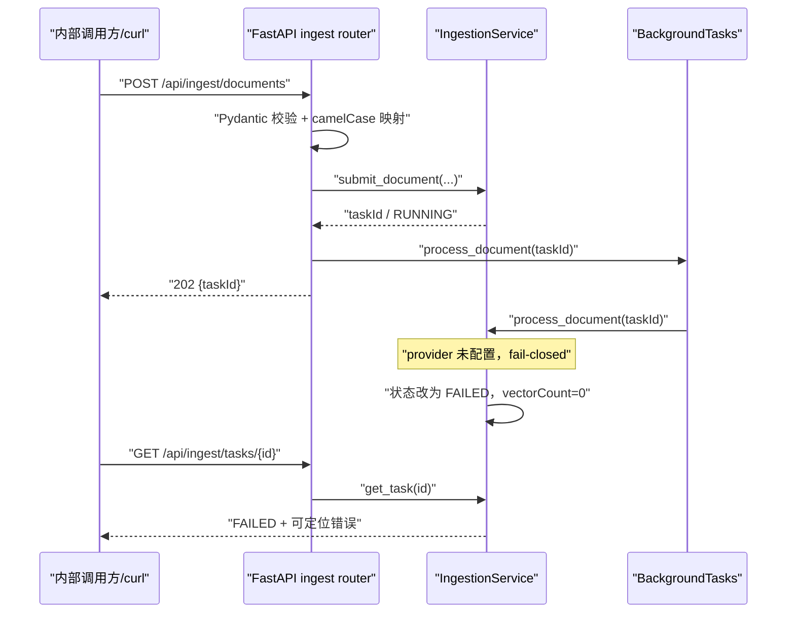
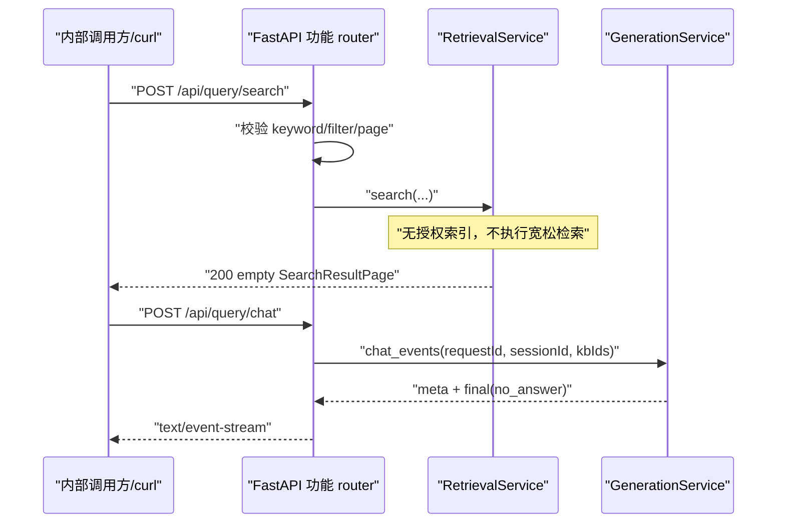
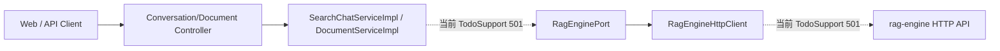
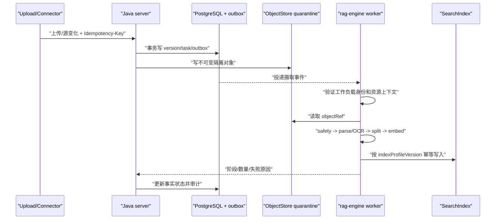
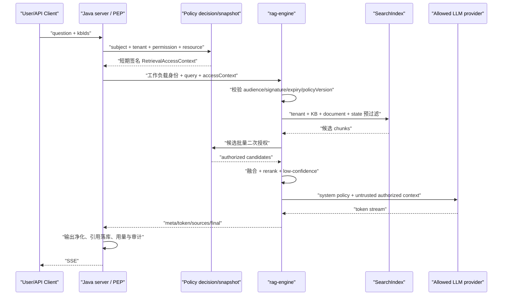

# rag-engine 最小实现与调用流程

> **文档状态**：已实现基线 · **版本**：v0.2.1-feature-packages · **负责人**：zhanghuaiwei · **最近更新**：2026-08-11
> **适用范围**：`rag-engine/`、`service/modules/rag/` · **内部契约**：[`../../../api/rag-engine.openapi.yaml`](../../../api/rag-engine.openapi.yaml)（v0.1，待升级/冻结）

## 1. 结论

本次实现的是可启动、可校验、可联调、不会伪造 RAG 成果的最小闭环，不是生产 RAG：

- 现有 v0.1 OpenAPI 的 8 个内部端点均已挂载，JSON 使用 camelCase。
- 摄取采用 `202 + taskId + 状态查询` 形状；未配置 provider 时任务明确进入 `FAILED`，不会假报已解析或已写向量。
- 搜索在没有已授权索引时返回空分页；问答输出 `meta -> final` SSE 且结果为 `no_answer`，不回显问题、不伪造答案和引用。
- 精排提供确定性的本地词项覆盖率实现，仅供协议联调；删除在没有索引时幂等返回 0。
- `/healthz` 只表示进程存活；`/api/engine/health` 返回 `degraded`，明确 Embedding/LLM 不可用。
- 已接入 `pydantic-settings` 运行配置、`.env.example` 和 `python -m rag_engine` 启动入口；未增加外部依赖、数据库、部署配置、模型凭证或隐藏协议字段。

`service` 侧的 `SearchChatServiceImpl` 与 `RagEngineHttpClient` 仍是 TODO，所以目前可运行的是“直接 HTTP 调用 rag-engine”的内部契约闭环，不应描述为 Web -> Java -> Python 端到端已打通。

## 2. 按功能组织的代码结构

```text
rag_engine/
  main.py / container.py                 FastAPI 工厂与应用组合根
  api/                                   路由聚合、依赖解析
  common/                                camelCase DTO 基类、跨功能 KbConfig
  config/                                RAG_ENGINE_* 类型安全配置
  ingestion/                             摄取/任务/删除的 router/schema/model/repository/service
  retrieval/                             搜索的 router/schema/model/port/service
  rerank/                                精排的 router/schema/model/port/service
  generation/                            问答/SSE 的 router/schema/model/port/service
  engine/                                能力健康/路由探测的 router/schema/service
  health/                                liveness
  auth/ parsing/ safety/ indexing/       已定义功能点的领域模型与 provider 端口
  providers/                             外部实例的显式注册表
  observability/                         日志配置
```

边界规则：一个业务功能一个包，`router` 只处理协议映射，业务规则进入同包 `service`；只有跨多个功能且不含业务编排的类型才进入 `common`；真实供应商 SDK 只能进入 provider adapter，并由 `ProviderRegistry` 显式装配。原 `application/domain/ports` 横向包已移除，结构测试防止回退。

## 3. 当前端点行为

| 端点 | 最小行为 | 当前用途 | 生产前必须替换/补充 |
| --- | --- | --- | --- |
| `POST /api/ingest/documents` | 返回 202/taskId，后台任务随后失败 | 验证异步受理与任务轮询 | 安全扫描、ObjectStore、解析、分块、Embedding、SearchIndex、幂等/outbox |
| `GET /api/ingest/tasks/{id}` | 返回进程内快照；未知任务 404 | Java 状态映射联调 | 持久化状态、进度、重试/取消、跨副本读取 |
| `POST /api/ingest/delete` | 幂等返回 `deletedCount=0` | 验证删除协议 | tenant/version 归属校验、分索引删除、删除证明 |
| `POST /api/query/search` | 返回请求 page/size 对应的空分页 | 验证查询 DTO 与分页 | 授权过滤、BM25/向量召回、融合、高亮、候选二次授权 |
| `POST /api/query/chat` | SSE `meta -> final(no_answer)` | 验证流式代理与事件解析 | 授权检索、精排、低置信、LLM token、引用、取消、输出安全 |
| `POST /api/query/rerank` | 本地词项覆盖率排序，稳定截断 topN | 无模型环境联调 | 合规 RerankerProvider、批量/超时/熔断/指标 |
| `GET /api/engine/health` | `degraded`，列出可用/不可用能力 | readiness/路由缓存联调 | provider registry、健康缓存和稳定错误映射 |
| `POST /api/engine/route-status` | 不发网络请求，返回不可用 | 路由决策协议联调 | 按 routeType/modelName 查询 provider 健康缓存 |

## 4. 当前可运行调用流程

### 4.1 摄取与任务查询



当前任务仓库是有界进程内 `OrderedDict`（默认最多 1024 条），仅用于开发联调。进程重启、任务淘汰或请求落到另一副本都可能得到 404，因此不能用于生产任务事实源。

### 4.2 搜索与问答



问答最小流不产生 `token` 和 `sources`。这是显式的安全降级：没有可信检索来源时，不把用户输入加工成貌似真实的模型答案。

### 4.3 精排与健康探测

1. `/api/query/rerank` 将中文按单字、英文按单词切分。
2. `score = 查询词项与候选词项交集数 / 查询词项数`，分数范围 `[0,1]`。
3. 先按分数降序，同分保持原输入顺序，再截断 `topN`。
4. `/healthz` 只检查 HTTP 进程；`/api/engine/health` 检查能力状态，两者不得互相替代。
5. `/api/engine/route-status` 当前不会主动调用外部模型，避免健康探测放大下游故障。

## 5. Java 服务当前调用链与断点



具体断点：

- `SearchChatServiceImpl#search`、`SearchChatServiceImpl#ask` 尚未组装租户、权限和问答请求。
- `RagEngineHttpClient#parseDocument/#getIngestTaskStatus/#deleteVectors/#chatStream/#search/#rerank/#health/#routeStatus` 尚未实现 HTTP 调用。
- v0.1 OpenAPI 没有 service auth、签名授权上下文、统一 tenant/indexProfile/idempotency，不能安全实现生产查询。

因此下一步不是直接让 Java 把浏览器参数透传给 Python，而应先冻结 v0.2 内部契约，再实现 Java DTO、签名器、SSE 代理和错误映射。

## 6. 生产目标调用流程

### 6.1 摄取目标



### 6.2 查询与问答目标



## 7. 代码 TODO 对照

| 方法 | 需要替换的真实能力 |
| --- | --- |
| `IngestionService.submit_document` | 持久化任务、outbox、幂等键 |
| `IngestionService.process_document` | safety、ObjectStore、Parser、chunk、Embedding、SearchIndex、阶段推进 |
| `IngestionService.delete_vectors` | tenant/version 归属、索引删除与删除证明 |
| `RetrievalService.search` | 授权上下文验证、过滤召回、融合、高亮、二次授权 |
| `RerankService.rerank` | RerankerProvider、路由策略、超时/熔断/指标 |
| `GenerationService.chat_events` | 检索、精排、LLM 流、引用、取消、输出安全 |
| `EngineService.route_status` | provider 健康缓存与真实探测延迟 |

所有 TODO 都带具体方法名，方便检索和拆分后续任务；未实现能力通过状态/空结果明确表达，不使用 `pass`、伪造 mock 命中或无说明的宽松 fallback。

## 8. v0.2 契约阻断项

生产接入前，必须先评审并更新唯一 OpenAPI；本文不新增竞争字段：

1. 定义工作负载认证方式、audience、密钥/证书轮换和稳定 401/403 错误。
2. Query/Search 强制携带由 server 签发的 `RetrievalAccessContext`，缺失、过期、签名无效、策略过旧都拒绝。
3. Ingest/Delete/Task 统一 tenantId、kbId、documentId、versionId、indexProfileVersion，并禁止跨租户 taskId 猜测。
4. 异步命令加入 Idempotency-Key、进度、可重试性、取消和重放语义。
5. 冻结 SSE meta/token/sources/final/error 字段、断连取消和是否支持重连。
6. 冻结错误体、requestId、限流、超时、payload 大小和候选数量上限。

当前 v0.1 的“集群内网、无用户级鉴权”只能表示不在 Python 重做用户登录，不能解释为可以信任任意内网请求。

## 9. 验证证据

已配置命令：

```bash
cd rag-engine
uv run pytest -q
uv run ruff check .
```

当前共有 15 个测试，覆盖 8 个内部端点挂载、camelCase DTO、摄取 fail-closed、任务 404、删除幂等、搜索空分页、SSE 顺序与不回显问题、精排排序、liveness/readiness 分离、路由不可用、非法/未知字段拒绝、环境变量覆盖、配置文件选择、应用装配、任务容量以及功能包/空文件结构约束。真实解析、索引、模型质量、权限泄漏、跨租户和 Java 端到端仍未验收。

## 10. 影响说明

- **API**：未修改权威 OpenAPI；实现对齐现有 v0.1 路径和字段。
- **数据库/数据**：无迁移、无真实数据写入；摄取状态只在 Python 进程内。
- **配置/部署**：新增 `RAG_ENGINE_*` 运行变量和 `.env.example`；推荐 `uv run python -m rag_engine`。没有修改 compose/Kubernetes 等部署配置。
- **权限**：尚未实现服务身份/RetrievalAccessContext，是生产阻断项。
- **外部系统**：未调用对象存储、搜索引擎或模型 provider，不需要凭证。
