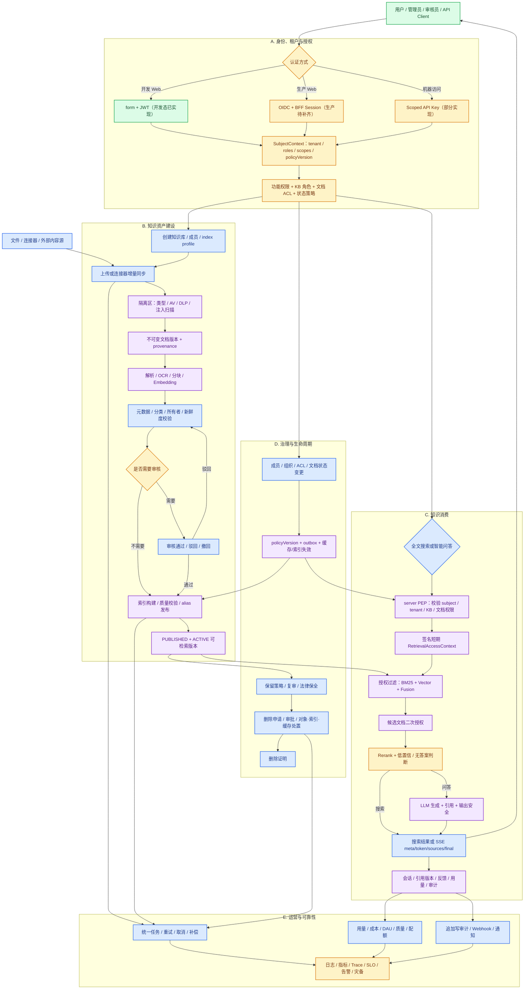

# 当前系统功能点、实现状态与业务流程

> **文档状态**：现状审计 · **版本**：v0.2.1-audit · **负责人**：zhanghuaiwei · **最近更新**：2026-08-11
> **审计范围**：`web/`、`service/`、`rag-engine/`、`deploy/ddl/init.sql`、`docs/api/*.openapi.yaml`、自动化测试
> **权威需求**：[`../../../01-需求分析.md`](../../../01-需求分析.md) · **通用化增量**：[`../requirements/README.md`](../requirements/README.md)

## 1. 执行结论

当前系统已经定义了较完整的功能版图、产品界面、模块边界、API 草案和数据模型；TODO 也是已经纳入系统范围的功能点，只是其实现状态为“待实现”。当前主要问题不是“没有这些功能点”，而是不同功能点的实现成熟度差异较大：

- **产品展示层较完整**：Web 有 22 个页面，覆盖知识库、文档、搜索、问答、治理、分析和管理中心；默认 transport 是 mock，适合演示信息架构和交互。
- **开发态认证基础已实现**：form 模式的账号密码认证、JWT access/refresh、Redis refresh 轮换/复用检测、登出黑名单、租户切换和会话权限视图有真实代码与单元测试。
- **生产认证仍未闭环**：OIDC 登录框架已配置，但 OIDC 身份到用户/租户成员关系的数据库解析仍是 TODO；cookie 会话模式的 CSRF 仍被关闭。
- **业务后端功能点已经广泛定义**：Java 暴露约 112 个 HTTP 操作，具备 Controller、DTO、实体、Mapper 和 48 张表的初始化 DDL；其中 107 处 `TodoSupport.notImplemented` 代表已定义、待实现的业务方法。
- **核心知识业务功能点已纳入范围，但多数待实现**：知识库、文档、上传、连接器、审核、搜索、问答、统计、Webhook、通知和任务均有页面、接口或代码占位；当前调用仍返回 501，默认关闭数据库，对象存储、搜索索引和模型 provider 尚未接入。
- **rag-engine 已定义最小协议和后续能力边界**：v0.1 的 8 个内部端点可调用并有测试；解析、OCR、Embedding、索引、Reranker、LLM、服务身份和授权上下文等功能点已在端口、契约、TODO 或设计中体现，但真实实现待完成。当前摄取明确失败、搜索返回空结果、问答返回 `no_answer`，不会伪造 RAG 能力。
- **当前工作区还有未完成的数据审计列重构**：实体已切换到 `BaseAuditEntity`，但 4 处旧 getter/setter 仍未同步，最终 JDK 21 构建检查当前不能通过；新增 v0.3 SQL 也尚未接入 compose/Flyway 执行链。

因此当前成熟度应定义为：

> **功能范围较完整、实现成熟度不均衡的产品原型 + 认证/权限基础 + 三端工程骨架，尚不是可上线的企业 RAG 业务系统。**

**审计结论：Request Changes。** 在 P0 安全和核心业务闭环完成前，不具备生产发布条件。

## 2. 功能点与实现状态判定口径

本文所称“功能点”是产品/业务功能项，不是 IFPUG 功能点计量单位。功能点是否存在，与该功能是否已经开发完成是两个独立维度：

- 需求、页面、API、Controller、Service/Port、领域模型、DDL 或明确 TODO 中任一处已定义的能力，均计入当前系统功能点。
- TODO、501 占位和未接 provider 表示“功能点已存在、实现待完成”，不能表述为“系统没有这个功能”。
- 只有在需求、契约、代码和产品设计中均未定义、经分析后建议新增的能力，才属于“待新增功能点”。

| 标记 | 含义 | 可否作为业务验收证据 |
| --- | --- | --- |
| ✅ 已实现 | 有真实逻辑、明确失败行为和自动化测试 | 可作为代码级证据；仍需集成/环境验收 |
| 🟡 部分实现 | 部分链路真实，关键依赖、权限或生产路径未闭环 | 不可按完整功能验收 |
| 🧪 Mock 演示 | 页面和交互可运行，数据来自内存 mock | 只能验收 UI/交互，不代表后端能力 |
| 📝 TODO 待实现 | 功能点已通过 Controller/DTO/Port/实体/Mapper/契约或 TODO 定义，Service 返回 501 或 provider 未接入 | 已计入功能范围，不可按已完成功能验收 |
| ⛔ 实现阻断 | 功能点存在，但编译、安全、契约或关键依赖问题阻止其运行或交付 | 必须先消除阻断 |

判断功能点范围时以需求、契约和代码定义为依据；判断实现完成度时以真实调用链为依据。不能因为“有页面”“有表”“有接口路径”或“有 TODO”就判定已经实现，也不能因为尚未实现就否认该功能点存在。

## 3. 当前已有功能

### 3.1 功能成熟度矩阵

下表每一行都属于当前系统已有功能点；“TODO 待实现”描述的是完成度，不是功能点缺失。

| 业务域 | 已定义的功能点 | Web 状态 | Java server 状态 | 数据/引擎状态 | 实现状态 |
| --- | --- | --- | --- | --- | --- |
| 登录与会话 | 登录、退出、会话恢复、租户切换 | ✅ AuthProvider、内存 access token、refresh cookie | ✅ form/JWT；🟡 OIDC 框架 | Redis refresh/blacklist 已实现；OIDC 身份目录未实现 | 🟡 开发可用，生产未闭环 |
| 角色、权限与菜单 | 按权限/feature 过滤菜单，路由和动作守卫 | ✅ 权限驱动静态目录 | 🟡 权限目录和文档策略已实现，但绝大多数业务入口未调用 | DB 关闭时默认拒绝；DB 开启后可查 KB 成员/文档 ACL | 🟡 体验层较完整，服务端执行不足 |
| API Key | 列表、创建、只展示一次、吊销 | 🧪 页面和 mock；HTTP client 已有 | 🟡 创建/轮换/吊销、摘要存储、认证过滤器已实现 | 仅 `db.enabled=true` 生效；无实际限流，allowedKb 未进入业务授权 | 🟡 管理链基本存在，资源约束未闭环 |
| 知识库 | 列表、创建、详情、设置、成员、克隆、归档 | 🧪 页面完整 | 📝 13 个 Service 方法全部待实现 | 实体/Mapper/DDL 已有，真实事务待实现 | 🧪/📝 |
| 文档资产 | 列表、上传、详情、版本、回滚、重试、收藏、ACL、预览入口、删除 | 🧪 页面完整 | 📝 22 个 Service 方法全部待实现 | 对象存储、上传合并和真实版本流转待实现 | 🧪/📝 |
| 文档预览与下载 | 详情页预览、摘录、下载及权限控制 | 🧪 Mock 内容；下载只提示 toast | 📝 OpenAPI 已定义，Controller 与实现待补齐 | 预览派生文件和文件流待实现 | 📝 |
| 内容源连接器 | CRUD、连接校验、同步、增量游标和 ACL 传播 | 🧪 展示 | 📝 Controller 存在，9 个 Service 方法待实现 | connector adapter、游标和 ACL 同步待实现 | 📝 |
| 摄取、解析与索引 | 上传/同步、扫描、解析、OCR、分块、Embedding、索引发布 | 🧪 Mock 状态 | 📝 Java ingestion/rag client 待实现 | 🟡 Python 任务协议存在，provider 待接入 | 📝 主链待实现 |
| 全文搜索 | 关键词、KB/类型/日期过滤、排序、分页和授权检索 | 🧪 页面和 mock 搜索 | 📝 Search Service 与 Java rag client 待实现 | Python 空分页协议已实现，SearchIndex 待接入 | 📝 |
| 智能问答 | 会话、新会话、KB 范围、多轮、反馈、SSE、检索与引用 | 🧪 页面和 mock 流 | 📝 Conversation Service 与 SSE 代理待实现 | Python `no_answer` 协议已实现，检索和 LLM 待接入 | 📝 |
| 审核发布 | 审核队列、批量通过/驳回、发布配置和索引联动 | 🧪 页面完整 | 📝 Governance Service 待实现 | 表结构存在，状态机、事务和索引联动待实现 | 📝 |
| 元数据与分类 | schema 列表、创建、发布、校验、词表和发布门禁 | 🧪 页面完整 | 📝 Controller/DTO/实体存在 | 校验执行、受控词表和发布门禁待实现 | 📝 |
| 保留、法律保全、删除证明 | 策略、hold、删除任务、跨存储处置和回执 | 🧪 页面完整 | 📝 Governance Service 待实现 | 对象/索引/缓存/备份删除编排待实现 | 📝 |
| 组织与成员 | 用户启停、组织树、用户归属、OIDC/SCIM 同步 | 🧪 页面和组件完整 | 📝 Admin Service 与 OIDC/SCIM 同步待实现 | 用户/组织/成员表存在 | 📝 |
| 标签、收藏、通知、任务 | 标签管理、收藏列表、通知中心、任务中心 | 🧪 页面/组件完整 | 📝 相关 Service 待实现 | 表结构存在，持久化业务流程待实现 | 📝 |
| 统计与大屏 | 用量、成本、DAU、热门文档、健康度、CSV、大屏 | 🧪 图表和导出可演示 | 📝 Analytics Service 6 个方法待实现 | 用量采集、成本核算和聚合任务待实现 | 🧪/📝 |
| 审计与 Webhook | 审计列表、Webhook 创建/暂停、签名投递、重试和死信 | 🧪 页面完整 | 📝 Admin Service 待实现 | 追加写审计和投递 worker 待实现 | 📝 |
| 运维探针 | Web health route、Java ping/Actuator、Python healthz | ✅ | ✅ | ✅ 仅进程级；业务依赖 readiness 不完整 | 🟡 |

### 3.2 可以确认的真实实现

以下功能点已经具备可执行实现，区别于“功能点已定义但实现待完成”的部分：

1. **Web 工程与交互基础**
   - 22 个页面、统一 API client、mock/http 双 transport。
   - 统一异步加载/错误/空状态、SSE parser、权限菜单、路由守卫和动作守卫。
   - 默认 `NEXT_PUBLIC_USE_MOCK=true`，因此默认体验不调用 Java 业务服务。

2. **开发态 form/JWT 认证代码**
   - BCrypt 内存开发用户认证。
   - HS256 JWT 签发与 iss/aud/typ/exp/nbf/jti 校验。
   - access token 黑名单、refresh token 族轮换和复用检测。
   - 登录、刷新、登出、会话、租户切换和权限/feature 会话视图。
   - 该链路依赖 Redis；真实用户仍未进入数据库身份目录。
   - 这些逻辑曾在本次审计早期以 JDK 21 通过 57 个测试；当前工作区随后出现并行中的审计字段重构编译错误，因此最终快照不能视为可启动交付物。

3. **权限基础**
   - 集中的租户角色→权限目录，未知角色默认不授予权限。
   - 文档状态、KB 角色、用户/组织/租户角色/KB 角色 ACL 的决策代码。
   - 数据库未开启时由 `DenyByDefaultAccessPolicy` 默认拒绝。
   - 当前只有 API Key 管理 Controller 使用了 `@PreAuthorize`；文档策略尚未进入业务用例。

4. **API Key 基础**
   - 256-bit 随机明文、server pepper + SHA-256 摘要、prefix、一次性展示。
   - DB 存储、吊销、轮换和 Bearer `rk_` 分流认证。
   - 尚未实现速率限制，scope/allowedKbIds 也没有被搜索、问答、文档服务消费。

5. **rag-engine 最小协议实现**
   - 8 个 v0.1 内部端点、Pydantic 校验、camelCase DTO、任务查询、幂等空删除、本地词法精排、SSE 和能力健康状态。
   - 无真实 provider 时显式失败或返回空/no_answer，不伪造 RAG 结果。

6. **工程基础**
   - Java 模块化单体采用 package-by-feature + Port/Adapter。
   - Python provider-neutral ports；Web 页面不直接拼请求地址。
   - 48 张表的 v0.2 初始化 DDL、实体和 Mapper 覆盖主要领域。
   - 代码级测试覆盖包结构、认证、权限目录/决策、Web transport/权限工具和 Python 内部 API。

## 4. 现有功能点的待实现项与关键阻断

### 4.1 Critical / P0：生产前必须修复

1. **先恢复可构建状态并统一数据库基线**
   - 当前编译失败：`DocumentAccessQueryService` 仍调用已移除的 `getDeletedAt()`；`ApiKeyDbStore` 仍调用 `getCreatedAt()/setCreatedBy()`。
   - 实体已经改用 `create_time/update_time/create_by/update_by/del_flag`，但 compose 仍只执行旧 `init.sql`；新增 `V0.3__unified_audit_columns.sql` 没有被 compose 或 Flyway 执行。
   - 必须决定“更新全量 init 基线”还是“正式引入 Flyway 增量迁移”，并保证实体、Mapper、DDL、测试环境同版本。

2. **107 个已定义的核心业务方法仍待实现**
   - admin 17、analytics 6、connector 9、conversation 10、document 22、governance 16、identity 3、knowledge 13、rag client 8、task 3。
   - 影响：切换 Web 到 HTTP transport 后，除认证/探针/API Key 部分能力外，大多数页面不可用。

3. **生产 OIDC/BFF 未闭环且 CSRF 关闭**
   - OIDC Authorization Code 框架可跳转 IdP，但 `JdbcIdentityDirectory` 的用户映射、租户成员和 policyVersion 查询仍为 TODO。
   - OIDC 使用 cookie 会话却禁用 CSRF；生产必须启用 CSRF token 或可靠的 Origin/同源防护，并统一 cookie 名、Domain、Secure、SameSite 和回跳地址。
   - API Key 认证过滤器只挂在 form filter chain；OIDC 模式没有挂载该过滤器。API Key 管理用例又只识别 JWT principal，OIDC 用户无法直接完成管理操作。

4. **服务端授权没有进入大多数业务入口**
   - Spring Security 当前主要做到“已认证”；只有 API Key 管理 Controller 使用 `@PreAuthorize`。
   - 已实现的 `AccessPolicyUseCase` 没有被文档、搜索、问答、预览、下载、引用等用例调用。
   - 当前文档 ACL 算法只会在 KB 基础权限上“提升”权限，尚未实现需求所述“存在 ACL 时覆盖 KB 权限”或显式 deny 语义，不能直接作为最终授权规则。
   - 如果直接补 CRUD 而不先接授权，会形成“登录即可访问任意租户资源”的高风险实现。

5. **多租户隔离未形成运行时闭环**
   - 当前没有 TenantLine；DDL 中 RLS 只是附录注释，未启用；应用也没有为每个事务设置 `app.tenant_id`。
   - 少数已实现查询手工加 tenant 条件，但这不足以覆盖未来 48 张表和所有 Mapper。

6. **server ↔ rag-engine 没有安全契约和调用实现**
   - Java `RagEngineHttpClient` 的 8 个方法仍是 TODO。
   - Python v0.1 契约缺少工作负载身份、签名 `RetrievalAccessContext`、policyVersion、统一 tenant/version/indexProfile 和幂等语义。
   - 在该问题解决前不能接入真实索引，否则存在跨租户和 ACL 泄漏风险。

7. **知识资产与 RAG 主链功能点已定义，但运行实现待完成**
   - 对象存储、隔离区、安全扫描、解析/OCR、分块、Embedding、SearchIndex、索引发布、授权检索、候选复核、LLM、引用落库和输出安全，已经在需求、端口、契约、页面或 TODO 中形成不同程度的功能定义。
   - 当前尚未形成可运行闭环，这是从“原型”进入“可用知识库”的最核心实现范围。

8. **机器契约仍未冻结且与 Controller 不完全一致**
   - OpenAPI 有但 Controller 缺少：文档 excerpt、preview、download、metadata 更新。
   - Controller 有但 OpenAPI 缺少：文档 PATCH、Webhook PATCH。
   - `server.openapi.yaml` 仍标记为 `0.2.0-draft`；`rag-engine.openapi.yaml` 仍是安全能力不足的 v0.1。

### 4.2 Major / P1：现有功能点的实现与完善

1. **上传与异步任务可靠性**：分片/秒传、持久化任务、Idempotency-Key、outbox、重试、取消、补偿和跨副本查询。
2. **内容安全**：真实类型、压缩炸弹、恶意软件、DLP/PII/secret、提示词注入和输出净化。
3. **连接器与权限传播**：对象存储/网络盘、SharePoint/OneDrive、Confluence、网页；增量游标、源 ACL、撤权和删除墓碑。
4. **治理状态机**：必填元数据、审核、发布/撤回、保留、法律保全、删除审批与删除证明。
5. **检索与生成质量**：BM25/向量融合、Reranker、低置信拒答、可验证引用、历史引用重新授权、黄金集和 RAG 评测门禁。
6. **运营闭环**：追加写审计、使用/成本采集、配额、Webhook 签名/SSRF 防护/重试死信、通知和任务中心。
7. **API Key 完整授权**：scope、allowedKbIds、过期、吊销、限流和审计必须进入每个机器可访问用例。
8. **数据库迁移和隔离**：Flyway、复合租户约束、RLS/TenantLine 二选一的运行实现、备份恢复与数据保留。

### 4.3 Minor / P2：现有功能点的生产增强与可选扩展

1. SCIM 2.0 用户/组生命周期和嵌套组。
2. 更多 connector/provider adapter 与能力声明、供应商退出方案。
3. 配额计费、租户套餐、feature 配置和白标能力；当前不需要先增加菜单表。
4. 多语言、无障碍、搜索建议、答案追问推荐和反馈闭环。
5. 多区域灾备、容量压测、AI 红队、SBOM/镜像漏洞扫描和行业模板。

## 5. 代码审计中的主要质量问题

### 5.1 必须随功能实现修复

- `ApiKeyDbStore.list()` 对每个 key 再查询一次 KB 关联，实际形成 N+1；应一次批量读取 `api_key_kb` 后分组。
- `rotateApiKey(keyId, idempotencyKey)` 当前没有使用传入的幂等键；重复提交会连续轮换并使前一次新密钥立即失效。
- API Key 的 `rateLimitPerMinute` 已入库但认证/网关没有执行限流。
- 进程内 `idempotencySeen` 无 TTL、无容量上限、不可跨副本；只能用于开发，不可代替 `idempotency_record`。
- Python 摄取任务存在内存中，重启、多副本或淘汰后会 404；只能用于契约联调。
- `service/README.md` 仍把已经实现的 JWT/Redis 代码描述成 TODO，工程状态文档需要对账。
- `.ai/project.json` 当前缺少一个 JSON 逗号且工具链备注已过时，会影响自动化读取。

### 5.2 做得较好的部分

- Java 包结构、Port/Adapter、DTO/实体职责总体清楚，没有把业务逻辑堆进 Controller。
- Web 通过单一 API client 切换 mock/http，页面没有散落完整请求地址。
- 权限目录和未知角色默认拒绝、DB 关闭时默认拒绝文档访问，是正确的 fail-closed 方向。
- JWT 严格校验 issuer/audience/type/时效，refresh 轮换使用 Redis Lua CAS，API Key 不保存明文。
- rag-engine 在 provider 未配置时不伪造成功、搜索命中或模型回答。
- 三端都已建立可执行测试命令，核心基础逻辑已有自动化覆盖。

## 6. 建议实现与完善顺序

### Gate 0：契约与安全基线

1. 先修复审计字段重构的编译错误，统一实体与 DDL，并把增量 SQL 纳入正式 migration runner。
2. 冻结 web ↔ server 与 server ↔ rag-engine OpenAPI，补齐 4 个已定义但尚无 Controller 的入口，并统一 2 个仅存在于 Controller 的入口。
3. 冻结 `SubjectContext`、`RetrievalAccessContext`、tenant/policyVersion、错误体、幂等和 SSE。
4. 完成 OIDC 身份目录、会话/CSRF、统一 401/403/404、API Key scope/allowedKb/限流。
5. 让 OIDC 用户和 API Key 在同一生产 filter chain 中工作，并统一用户/API Key principal 到 SubjectContext 的映射。
6. 选定并实现多租户运行机制：应用 tenant context + PostgreSQL RLS，或经评审采用等价强制方案。
7. 将 `@PreAuthorize`/用例 PEP 与 `AccessPolicyUseCase` 接到所有资源入口，并冻结 ACL 覆盖/deny 优先级。

**退出条件**：未认证返回 401、功能权限不足返回 403、资源不可见按策略返回 403/404；任何缺失 tenant/授权上下文都默认拒绝。

### 企业 MVP 1：知识资产闭环

1. 实现知识库 CRUD、成员角色、归档/删除和基础配置。
2. 接入 PostgreSQL、Flyway、S3-compatible ObjectStore。
3. 实现安全上传、分片/幂等、不可变文档版本、状态机和任务/outbox。
4. 实现文档列表/详情/元数据/ACL/预览/下载/收藏及对应资源授权。
5. 实现基础审核发布，让未发布/禁用/删除文档不能进入在线索引。

**退出条件**：用户可以在真实数据库和对象存储中完成“建库→上传→审核→发布→预览”，且越权测试通过。

### 企业 MVP 2：检索问答闭环

1. 实现 Java `RagEngineHttpClient`、服务身份和签名授权上下文。
2. 接入安全扫描、Parser/OCR、chunk、Embedding 和 SearchIndex。
3. 实现不可变 index profile、build 校验和 alias 发布。
4. 实现授权预过滤、BM25/向量融合、候选二次授权和 Reranker。
5. 实现 LLM 流、低置信拒答、引用、反馈、SSE 取消和输出安全。

**退出条件**：已发布且有权文档可搜索/问答；撤权文档无法从结果、答案、引用、预览和历史入口泄漏。

### P1：通用治理与运营

1. 连接器 SDK、首批连接器、增量/ACL/删除传播。
2. 元数据 schema、复审、保留、法律保全和可验证删除。
3. 追加写审计、用量/成本、配额、Webhook、通知和统一任务中心。
4. 可观测性、备份恢复、SLO、容量压测、黄金集、RAG 质量与安全回归。

## 7. 系统总体业务流程图

下图展示当前系统已经定义的总体业务功能流，并在节点上标注实现成熟度。紫色节点同样是当前系统功能点，只表示其实现待完成；它既可作为业务全景图，也可作为实施看板。

颜色说明：绿色为已有真实实现，黄色为部分实现，蓝色为 mock/产品演示，紫色为已经纳入系统范围但仍待实现的功能点。

## 8. 业务流程中的关键不变量

1. tenant、角色、scope 和 allowedKbIds 只能来自验证后的会话/JWT/API Key，不接受请求 body 自报。
2. 未认证、策略不可用、授权上下文缺失/过期、policyVersion 不可解析时默认拒绝。
3. 未通过安全扫描、未发布、已禁用、已删除或无权访问的文档不能进入搜索、问答、引用、预览、下载和导出。
4. 文档内容是模型的不可信数据，不能覆盖系统指令；模型输出不能触发任意网络或业务写操作。
5. 引用必须绑定文档版本和位置；历史引用每次打开都重新授权。
6. 外部对象存储、索引、模型和 Webhook 不能加入数据库事务，必须用 outbox、幂等消费者和补偿保证最终一致。
7. Embedding 模型/维度不能按请求自动切换；换模必须新建 index profile、全量重建、质量校验和 alias 原子切换。
8. 删除受保留/法律保全约束，并产生对象、索引、缓存等处置结果和可审计证明。

## 9. 待业务确认的问题

1. 企业 MVP 首批内容入口只做安全文件上传，还是同时交付对象存储/SharePoint/Confluence 中的哪一种连接器？
2. 生产首选 IdP 是 Keycloak、Entra ID、Okta 还是客户自有 OIDC？是否首期需要 SCIM？
3. 首批 Parser/OCR、Embedding、SearchIndex、Reranker 和 LLM provider 分别选本地还是云端？数据驻留边界是什么？
4. 哪些知识库默认强制审核？OWNER 是否允许审核自己提交的文档？
5. 文档级 ACL 是仅允许“显式授予”，还是还需要显式拒绝（deny）及其优先级？当前代码只实现权限提升，没有 deny 语义。
6. 搜索/问答的延迟、并发、质量阈值、拒答阈值和月度成本上限是多少？
7. 删除证明是否需要覆盖备份介质，还是先覆盖在线数据库、对象存储、索引和缓存？

## 10. 验证证据与限制

本次审计执行结果：

| 模块 | 命令 | 结果 |
| --- | --- | --- |
| service | JDK 21 `mvn -B -q test` | ❌ 最终快照编译失败：审计字段重构后仍有 4 处旧访问器；重构出现前同轮审计曾有 57 tests 通过，该结果不能替代最终检查 |
| web | `pnpm test` | ✅ 10 files / 44 tests 通过 |
| web | `pnpm typecheck` | ✅ 通过 |
| rag-engine | `uv run pytest -q` | ✅ 15 tests 通过，覆盖 v0.1 端点、环境配置和功能包结构；有 TestClient/httpx2 弃用警告 |
| rag-engine | `uv run ruff check .` | ✅ 通过 |

补充说明：默认 JDK 26 执行 service 测试时，当前 Byte Buddy 只支持到 Java 24，会导致 Mockito 初始化失败；项目测试必须使用目标 JDK 21。切换到 JDK 21 后曾通过 57 个测试，但随后出现的并行审计字段重构造成当前编译失败，这是最终需要处理的代码/Schema 一致性问题。

这些测试只证明当前工程基础和已实现代码路径；没有真实 PostgreSQL、Redis 集成环境、对象存储、搜索索引、IdP、模型 provider、浏览器 E2E、跨租户泄漏、性能、灾备或 RAG 质量验收，因此不能推导生产可用。

## 11. 审计 Verdict

| 维度 | 结论 |
| --- | --- |
| 功能点覆盖 | 页面、契约、模型和 TODO 已覆盖较广的业务功能版图；核心业务功能点大多仍待实现 |
| 架构方向 | 模块化单体 + 独立 rag-engine 的方向合理，无需再拆微服务 |
| 安全 | fail-closed 基础较好，但 OIDC、CSRF、多租户、资源授权和内部服务认证仍是 P0 |
| 可维护性 | 分包和 Port/Adapter 良好；契约漂移、文档漂移和 TODO 数量需治理 |
| 测试 | Web/Python 基础测试可运行；Java 当前被审计字段重构编译错误阻断；真实集成、E2E、安全、质量和性能测试缺失 |
| 最终结论 | **Request Changes：完成 Gate 0 + 企业 MVP 1/2 后再评估生产发布** |
