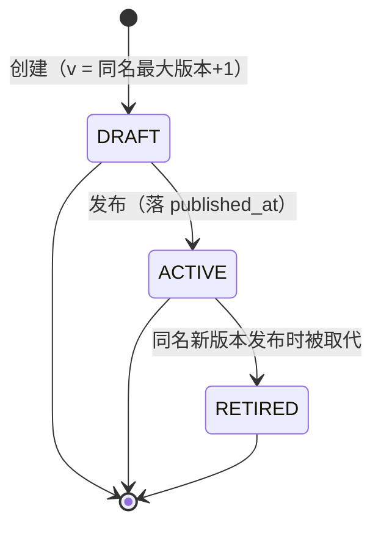
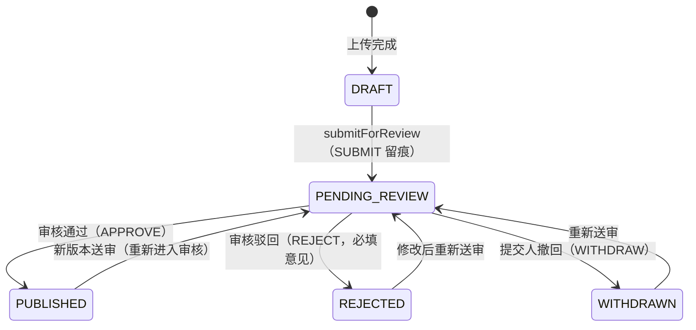
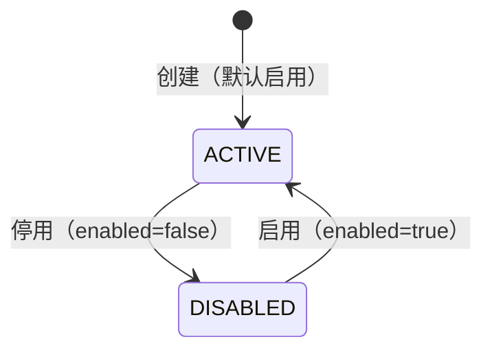
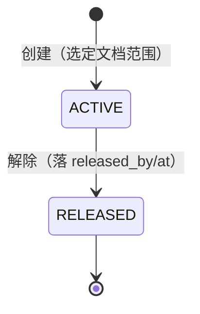
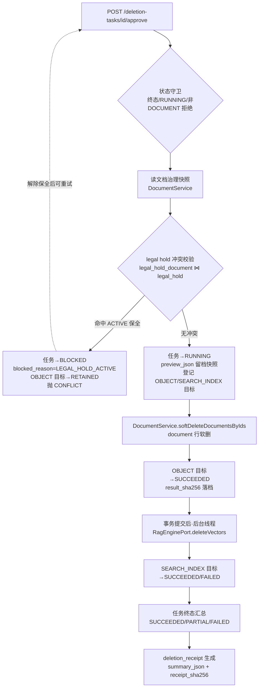
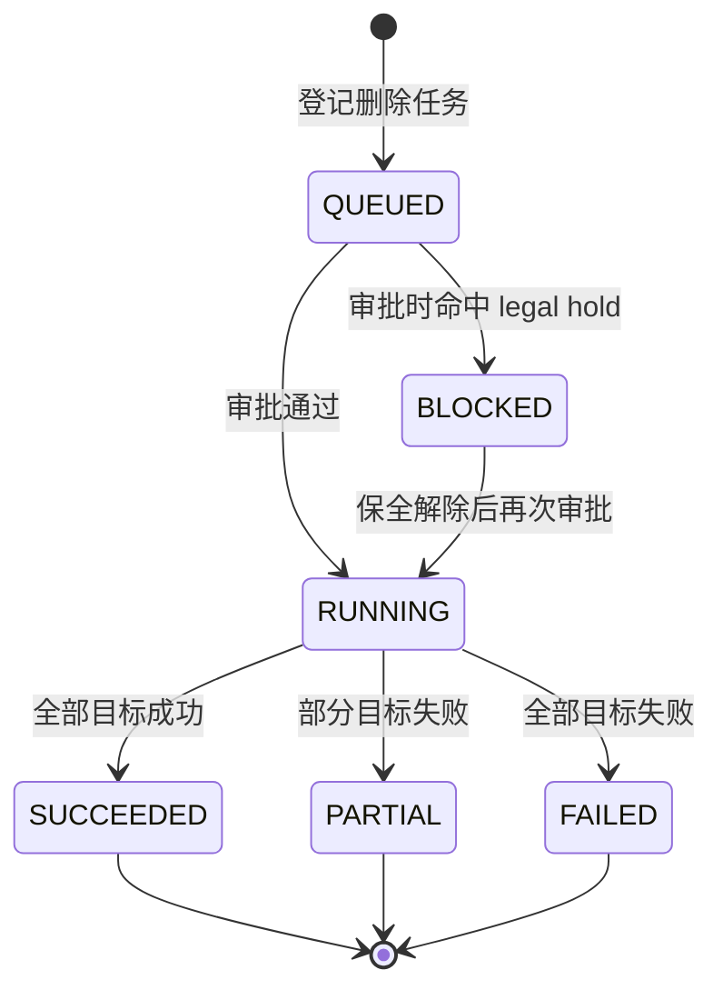

# 治理中心四条业务流程设计（governance-flows）

> 实现代码：`service/src/main/java/com/ragkb/service/modules/governance/service/impl/GovernanceServiceImpl.java`
> 存储权威：`deploy/ddl/init.sql`（CHECK 约束）；API 权威：`web/api-client/types/governance.ts`。
> 两套枚举不一致处由服务层在出入参边界做一一映射（见 §6 映射表）。

## 1. 元数据 schema（GKB-04）

### 实现逻辑

- **创建**（`createMetadataSchema`）：同名 schema 在租户内按版本链递增（`schema_version = 最大版本 + 1`，首版 v1）；`description + fields` 一并序列化进 `schema_json`（实体无独立 description 列）；新建一律 `DRAFT`。
- **发布**（`publishMetadataSchema`）：仅 `DRAFT` 可发布（`DRAFT → ACTIVE` 并落 `published_at`）；已 `ACTIVE` 幂等返回；已 `RETIRED` 拒绝（历史版本不能复活）。发布成功后，同 `(tenant_id, name)` 的其他 `ACTIVE` 版本统一置 `RETIRED`（新版本取代旧版本）。
- **不可变性**：模块内没有 schema 更新端点 —— 发布（ACTIVE）后的版本只能通过「新建更高版本草稿 → 发布」演进，历史版本行永不改写。
- **列表**：名称 + 版本号升序；`schema_json` 解析失败的脏数据不阻断列表（字段降级为空并告警）。

### 状态机

> 存储层枚举为 `DRAFT/ACTIVE/RETIRED`（`ck_metadata_schema_status`）；API 契约为 `DRAFT/PUBLISHED`。服务层映射：`ACTIVE → PUBLISHED`，`RETIRED → PUBLISHED`（曾发布过的历史版本），`DRAFT → DRAFT`。

## 2. 内容审核（F2.13）

### 实现逻辑

审核的**状态与留痕都在 document 领域**（`document.review_status` + `document_review` 追加写证据表），governance 模块只做编排与展示组装，全部经 `DocumentService` 协作：

- **队列**（`listReviews`）：`DocumentService.listPendingReviews` 分页返回 `review_status=PENDING_REVIEW` 的未删文档 + 最近一条 `SUBMIT` 留痕；governance 补齐 `kbName`（KbService）与提交人显示名（UserAccountService）。
- **通过**（`approveReview`）：`PENDING_REVIEW → PUBLISHED` + 追加 `APPROVE` 留痕（comment 可空）。
- **驳回**（`rejectReview`）：意见为空直接 `BAD_REQUEST`（与前端「驳回必须填写审核意见」一致）；`PENDING_REVIEW → REJECTED` + 追加 `REJECT` 留痕。
- **撤回**（`withdrawDocument`）：`PENDING_REVIEW → WITHDRAWN` + 追加 `WITHDRAW` 留痕（队列即刻移除）。
- `document_review` 为追加写证据表（DDL 对运行时角色 REVOKE UPDATE/DELETE），所有动作只 INSERT。

### 契约说明：reviewId 实为 documentId

前端契约（`web/api-client/http/review.ts` 与审核页面）以 **documentId** 调用 `/reviews/{id}/approve|reject`（`ReviewItem` 无 reviewId 字段，行键为 documentId）。后端路径参数虽命名为 `reviewId`，实现按「文档粒度审核」处理 —— 一篇待审文档的当前轮送审即其最近一条 SUBMIT 留痕，二者一一对应。

### 审核状态机（document.review_status）

## 3. 保留策略

### 实现逻辑

- **创建**（`createRetentionPolicy`）：枚举白名单校验（appliesTo ∈ TENANT/KB/CATEGORY，action ∈ AUTO_EXPIRE/REVIEW/RETAIN）→ 映射为存储枚举落库；保留时长按 **30 天/月** 近似换算为 `retention_days`；租户内同名预检（`uq_retention_policy_name` 兜底并发）；新建默认 `ACTIVE`（启用）。
- **启停**（`toggleRetentionPolicy`）：`ACTIVE ↔ DISABLED` 双向可逆；目标状态与现状一致时幂等返回；实体带 `row_version` 乐观锁，并发冲突提示刷新。
- **关联范围**：`scope_type` 支持租户全局（TENANT）与知识库（KB）/分类（CLASSIFICATION）级；**KB 级目标 id 依赖契约补 `targetId` 字段**（当前 `RetentionPolicyInput` 未提供，`scope_key` 暂留空，见 §7 遗留）。

### 状态机

## 4. 法律保全

### 实现逻辑

- **创建**（`createLegalHold`）：逐个校验文档存在、未软删且属当前租户（经 `DocumentService.documentGovernanceBrief`，跨租户按不存在拒绝）→ 落 `legal_hold`（`ACTIVE`）+ 批量落 `legal_hold_document` 关联（去重后挂载，`uq (tenant,hold,document)` 防重复）。
- **解除**（`releaseLegalHold`）：`ACTIVE → RELEASED`，记录 `released_by/released_at`；已解除幂等返回（`ck_legal_hold_release` 要求 RELEASED 必须带 released_at）。解除后文档恢复可删除。
- **删除联动**：保全中的文档禁止物理删除 —— 删除审批（§5）执行前强制校验，命中即阻断。校验实现为两段查询（先取文档挂载的保全 id，再筛 `status=ACTIVE`），均为本模块表，无需跨模块 join。

### 状态机

## 5. 删除审批与删除证明

### 实现逻辑（approveDeletion 主链路）

1. **归属与状态守卫**：`requireDeletionTask` 校验租户；终态（SUCCEEDED/PARTIAL/FAILED/CANCELLED）拒绝重复审批；RUNNING 拒绝并发提交；仅支持 `resource_type=DOCUMENT`（KB 级联删除走 knowledge 模块 `deleteKb` 链路）。
2. **legal hold 冲突校验（危险操作红线）**：目标文档被任一 `ACTIVE` 保全覆盖时 —— 任务转 `BLOCKED`（`legal_hold_blocked=true`、`blocked_reason_code=LEGAL_HOLD_ACTIVE`）、OBJECT 目标行置 `RETAINED` 留证据、整体抛 `CONFLICT` 回绝审批。解除保全后可再次审批（BLOCKED → RUNNING）。
3. **快照留档**：审批时把文档元数据（documentId/kbId/title/fileName/sensitivity）写入 `deletion_task.preview_json` —— 文档软删后列表与证明的展示字段均来自此快照。
4. **分层处置**（按 `deletion_target` 逐个推进）：
   - `OBJECT`（存储/元数据层）：经 `DocumentService.softDeleteDocumentsByIds` 软删（`lifecycle=DELETING + del_flag=1`，两列一致满足 ck_document_del_flag）；完成即 `SUCCEEDED` 并落 `result_sha256`（处置动作证据摘要）；文档已被并发删除时按 `SKIPPED` 幂等收口。
   - `SEARCH_INDEX`（索引层）：事务提交后由后台单线程执行器调用 `RagEnginePort.deleteVectors` 清向量（外部 HTTP 不进 DB 事务；失败置 `FAILED + last_error_code=RAG_ENGINE_ERROR`，任务收敛为 PARTIAL）。
5. **终态汇总**（后台线程）：按目标行完成/失败计数推进任务 —— 无失败 `SUCCEEDED`、有失败有完成 `PARTIAL`、全失败 `FAILED`，落 `completed_at`。
6. **删除证明**（`deletion_receipt`，一任务一条）：任务到达终态后生成；`summary_json` 留档操作人（operatorId）/审批与完成时间/对象清单（各存储层状态与证据摘要）；`receipt_sha256` = summary_json UTF-8 字节的 SHA-256，供审计方独立核验。BLOCKED 中途不落证明（证明只描述真实删除结果）。

### 数据流转

### 任务状态机（deletion_task）

> API 契约的 `DeletionTaskStatus` 为 `PENDING_APPROVAL/RUNNING/SUCCEEDED/FAILED`；映射：`QUEUED/BLOCKED → PENDING_APPROVAL`（BLOCKED 条件解除后可重审）、`PARTIAL/CANCELLED → FAILED`（需人工复核）。

## 6. 契约 ↔ 存储枚举映射表

| 契约字段（前端） | 存储列（DDL CHECK） | 映射 |
| --- | --- | --- |
| `MetadataSchema.status: DRAFT \| PUBLISHED` | `metadata_schema.status ∈ DRAFT/ACTIVE/RETIRED` | ACTIVE/RETIRED → PUBLISHED |
| `RetentionPolicy.appliesTo: TENANT \| KB \| CATEGORY` | `scope_type ∈ TENANT/KB/CLASSIFICATION` | CATEGORY ↔ CLASSIFICATION |
| `RetentionPolicy.action: AUTO_EXPIRE \| REVIEW \| RETAIN` | `disposition ∈ ARCHIVE/DELETE/REVIEW` | AUTO_EXPIRE↔DELETE、RETAIN↔ARCHIVE、REVIEW↔REVIEW |
| `RetentionPolicy.durationMonths`（月） | `retention_days`（天） | ×30 落库、/30 展示（30 天/月近似） |
| `DeletionTaskStatus: PENDING_APPROVAL \| RUNNING \| SUCCEEDED \| FAILED` | `status ∈ QUEUED/RUNNING/BLOCKED/PARTIAL/SUCCEEDED/FAILED/CANCELLED` | 见 §5 |
| `DeletionReceipt.id: string` | `id BIGINT` | 表主键转字符串 |

## 7. 边界条件与已知约束

- **legal hold 与删除冲突**：`approveDeletion` 在软删前校验（fail-closed）；BLOCKED 任务的目标行置 RETAINED 保留证据链；BLOCKED 不写 receipt。多保全叠加时任一 ACTIVE 均阻断（回执信息列出全部命中保全名）。
- **最后审核人 / 审批权限**：当前契约无权限模型字段，审核与删除审批未做角色细分（任何认证成员可操作）—— 接入 RBAC 后需补「审核员/租户管理员」校验，属遗留项。
- **多租户**：查询带 tenant_id + del_flag=0；按 id 操作经 requireXxx 校验归属；跨租户一律按不存在拒绝。历史数据 tenant_id 为 0/null 时兜底默认租户 1（与 KbServiceImpl 约定一致）；dev/API Key（无 JWT 租户）查询不过滤、写入落默认租户。
- **幂等与并发**：终态任务拒绝重复审批；RUNNING 拒绝并发提交；schema 版本 / 策略与保全名称的唯一约束冲突映射为 CONFLICT；`deletion_receipt` 一任务一条（先查后插 + 唯一约束双保险）。
- **任务登记入口缺口**：`deletion_task` 行的登记方（文档删除申请 `DocumentService.deleteDocument` 目前仅登记轻量任务，未落 deletion_task 行）待 document 模块接线；本模块的任务队列展示与审批执行已完整实现，数据落库后即可运转。
- **KB 级保留策略**：`RetentionPolicyInput` 契约缺 `targetId` 字段，KB/CATEGORY 级策略暂无法指定目标（`scope_key` 留空）；契约补字段后接入。
- **进度语义**：`progress.storage` 表示 document 行软删 + 对象引用摘除完成；`progress.index` 表示向量删除完成；`cache/backup` 两层为预留能力（如实置 false）。对象存储原文的物理清理按保留期另行执行（`backup_expires_at` 预留）。
- **审核粒度**：审批端点以 documentId 为路径参数（契约如此），审核动作作用于文档当前轮送审（最近一条 SUBMIT 留痕对应版本）。
