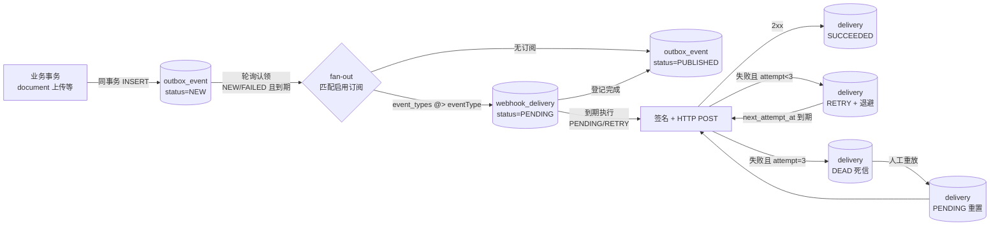
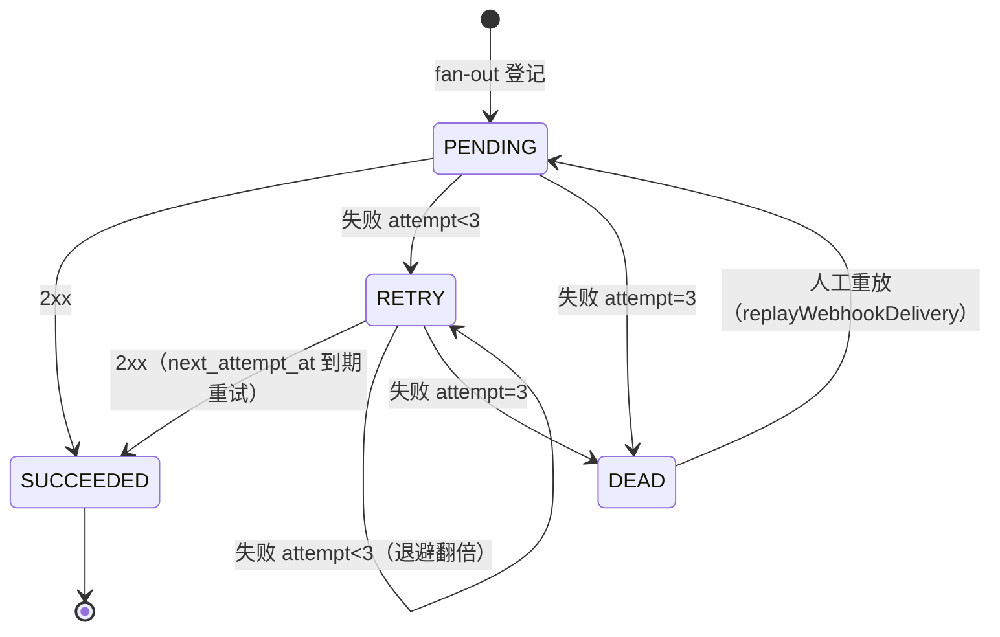

# Webhook 投递引擎设计（签名 / 重试 / 死信）

> 实现文件：`service/src/main/java/com/ragkb/service/modules/integration/service/impl/WebhookDeliveryServiceImpl.java`
> HTTP 适配：`integration/adapter/WebhookHttpClient.java`；队列 SQL：`resources/mapper/WebhookDeliveryQueueMapper.xml`

## 1. 总体架构（outbox 模式）

业务模块（如 ingestion 上传文档）在自己的事务内经 `OutboxPort.append` 写一条
`outbox_event`（与业务写同事务提交，保证「业务可见即事件可见」）。投递引擎**只轮询**，
不做事件内 HTTP：



- **轮询器**：`@Scheduled(fixedDelay = ragkb.webhook.dispatch-interval-ms, 默认 5s)`，
  `@ConditionalOnProperty(ragkb.db.enabled=true)` + `AtomicBoolean busy` 防重入
  （模式对齐 `IngestionDispatchScheduler`）。
- **每轮两段**：① fan-out（认领 outbox → 匹配订阅 → 幂等登记 delivery → outbox 置
  PUBLISHED）；② deliver（执行到期的 PENDING/RETRY 投递）。
- **投递语义 at-least-once**：重复认领同一事件时 `ON CONFLICT DO NOTHING` 跳过已登记行；
  崩溃后由下一轮自然续跑。订阅方须以 `X-RagKB-Event-Id`（outbox 的 UUID）幂等去重。

## 2. 签名方案（防篡改 + 防重放）

### 2.1 请求头

| 头 | 值 | 说明 |
| --- | --- | --- |
| `Content-Type` | `application/json` | 固定 JSON |
| `X-RagKB-Event-Id` | `<UUID>` | outbox `event_id`，全局唯一，接收方去重键 |
| `X-RagKB-Event-Type` | `<eventType>` | 如 `document.uploaded` |
| `X-RagKB-Delivery` | `<deliveryId>` | 投递记录主键，排障定位 |
| `X-RagKB-Signature` | `t=<unix秒>,v1=<hex>` | HMAC-SHA256 签名 |

### 2.2 计算与验签

```
v1 = hex( HMAC-SHA256( secret, "<t>." + rawBody ) )
```

- `t` 为签名时刻的 Unix 秒，**参与 HMAC 运算**（接收方必须用它重算，防攻击者篡改时间戳）。
- 接收方验签流程：解析 `t` 与 `v1` → 校验 `|now - t| ≤ 300s`（建议 5 分钟新鲜度窗口，
  超时拒绝，防重放）→ 用创建订阅时下发的 `whsec_` 密钥重算 HMAC 比对 `v1`（恒定时间比较）。
- secret 为订阅创建时一次性下发的 `whsec_` + base64url(32B CSPRNG)，服务端存
  `webhook_subscription.secret_ref`（签名需恢复明文，无法只存哈希；生产建议接 KMS），
  **绝不写日志**（HTTP 适配器日志只记目标 host 与结果状态）。

## 3. 重试与死信策略

| 层级 | 上限 | 退避 | 死信动作 |
| --- | --- | --- | --- |
| 投递（webhook_delivery） | `ragkb.webhook.max-attempts`（默认 3 次，含首次） | 指数退避：第 n 次失败后 `30s << (n-1)`（30s → 60s） | 置 `DEAD`，不再自动重试 |
| outbox 事件处理（fan-out 阶段） | 5 次 | 固定 1 分钟 | 置 outbox `DEAD` + `dead_letter_at`，不再认领 |

- 第 3 次失败**直接置 DEAD**（不再安排第 4 次等待），`attempt_count` 记录总尝试次数。
- HTTP 判定：2xx = 成功；非 2xx / 超时（`TIMEOUT`）/ 网络故障（`NETWORK_ERROR`）均计一次失败，
  `http_status`（可为 null）与 `last_error_code` 落库供排障。
- 成功时记录响应体 SHA-256 摘要（`response_sha256`，对账证据；不存原文防行膨胀）与
  `delivered_at`。
- **死信恢复仅人工**：`IntegrationUseCase.replayWebhookDelivery` 将 DEAD 行重置为
  `PENDING`、`attempt_count=0`、立即到期（重放是人工决策，不再退避）。

### 3.1 状态机



> 说明：DDL 的 `SENDING` 瞬态不落库——单线程轮询器内 PENDING 直接投递后写终态，
> 避免进程崩溃产生悬挂 SENDING 行；崩溃场景由下一轮自然重试（at-least-once）。

## 4. 投递时序图

```mermaid
sequenceDiagram
    autonumber
    participant Biz as 业务模块<br/>(ingestion 等)
    participant DB as PostgreSQL
    participant Eng as WebhookDeliveryServiceImpl<br/>(@Scheduled 轮询)
    participant Sub as 订阅方回调地址<br/>(https)

    Biz->>DB: 事务: 业务写 + INSERT outbox_event(NEW)
    Note over Biz,DB: OutboxAppender: REQUIRED 同事务

    loop 每 5s（fixedDelay + busy 防重入）
        Eng->>DB: 认领 status IN (NEW,FAILED) AND available_at<=now
        Eng->>DB: 查启用订阅 event_types @> '["<eventType>"]'
        Eng->>DB: INSERT webhook_delivery(PENDING)<br/>ON CONFLICT DO NOTHING
        Eng->>DB: UPDATE outbox_event → PUBLISHED
        Eng->>DB: 查到期投递 (PENDING/RETRY) JOIN 订阅/事件
        loop 每条到期投递
            Note over Eng: t=now(); v1=HMAC-SHA256(secret,"<t>."+payload)
            Eng->>Sub: POST payload<br/>X-RagKB-Signature: t=...,v1=...
            Sub-->>Eng: 2xx / 非2xx / 超时
            Eng->>DB: SUCCEEDED(+sha256,delivered_at)<br/>或 RETRY(+退避) 或 DEAD
        end
    end
```

## 5. 手动干预入口（IntegrationUseCase）

| 方法 | 语义 |
| --- | --- |
| `deliverWebhook(tenantId, subscriptionId, eventId)` | 为指定订阅手动投递指定 outbox 事件（`eventId` = outbox 主键字符串化）；幂等登记后同步执行一次，返回已完成 Task |
| `replayWebhookDelivery(tenantId, deliveryId, idempotencyKey)` | 死信重放：重置 PENDING + 清零尝试次数，下一轮投递周期（默认 5s）内执行 |

> 两个入口当前无 Controller 暴露（契约层未定义），供运维后续接 CLI / 管理端点调用。
> `idempotencyKey` 参数已接收未生效（幂等设施未接线，对齐 KbServiceImpl 现状）。

## 6. 配置项

| 配置 | 默认 | 说明 |
| --- | --- | --- |
| `ragkb.webhook.dispatch-interval-ms` | 5000 | 轮询周期（fan-out + 到期投递） |
| `ragkb.webhook.max-attempts` | 3 | 单条投递最大尝试次数（含首次），超限死信 |
| `ragkb.webhook.timeout-ms` | 10000 | 单次 HTTP POST 连接与读取超时 |

## 7. 测试

`service/src/test/java/com/ragkb/service/modules/integration/service/impl/WebhookDeliveryServiceImplTest.java`
（15 例，HTTP 经 `WebhookSenderPort` mock 注入，**不真正调用外部 URL**）：

- 签名：与独立 HMAC 重算一致；body / 时间戳变化 → 签名变化。
- fan-out：多订阅逐个登记 + outbox 置 PUBLISHED；无订阅直接 PUBLISHED；
  登记故障退避；5 次后 outbox 死信。
- 投递：成功回写 SUCCEEDED + 响应摘要；首败 RETRY(30s)；二败 RETRY(60s)；三败 DEAD。
- 契约方法：手动投递（跨租户 404 / 非数字 eventId 400）；死信重放（未知记录 404）。

## 8. 遗留风险

| 项 | 说明 |
| --- | --- |
| 单实例轮询 | 多实例部署会重复 fan-out（唯一约束保证不重复投递，但有空转）；上 `FOR UPDATE SKIP LOCKED` 或分布式锁后再水平扩容 |
| SSRF 面 | `target_url` 仅校验 https 前缀，未限制私网地址；建议后续加内网 IP 黑名单 |
| secret 明文落库 | 表结构（secret_ref 单列）下的最小方案，接 KMS 后改为引用句柄 |
| 无 dead-letter 告警 | outbox DEAD / delivery DEAD 目前仅 ERROR/WARN 日志，需接监控告警 |
| 事件类型字典 | `event_types` 取值（如 document.uploaded）尚无集中注册表，订阅方靠文档约定 |
