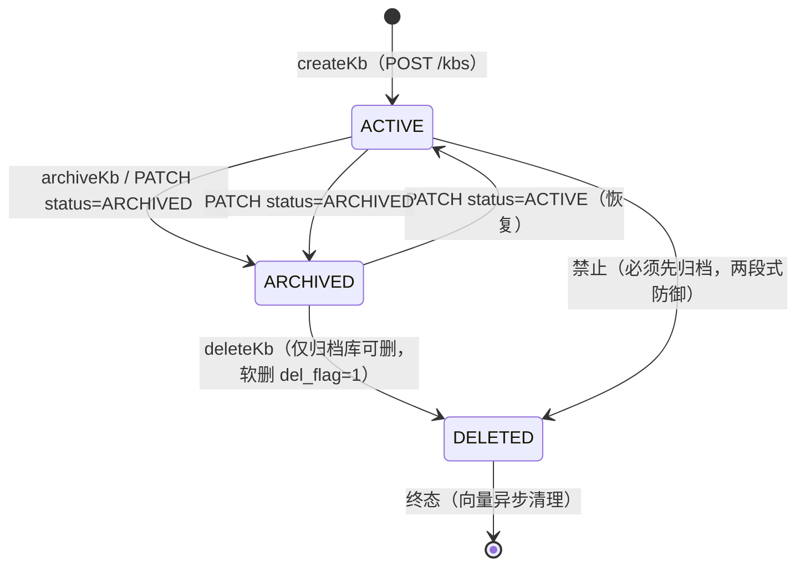
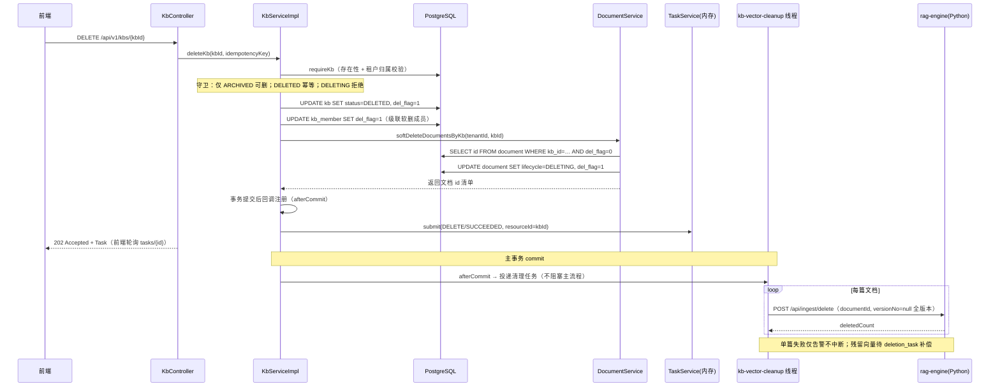
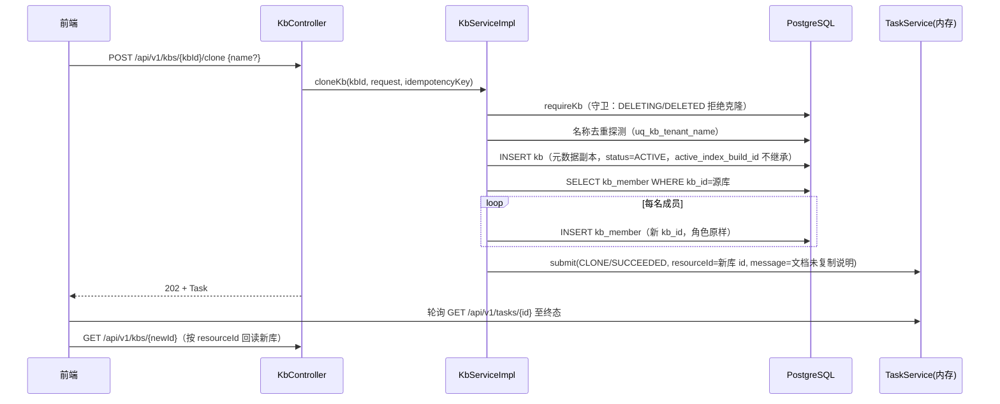

# 知识库生命周期、成员管理与索引构建实现

> 实现位置：`service/.../modules/knowledge/service/impl/KbServiceImpl.java`（Controller 仅做 HTTP 编排，不含业务逻辑）。
> 本文记录各用例的业务规则、数据流转与遗留边界，状态/枚举值均对齐 `deploy/ddl/init.sql` 的 CHECK 约束。

## 1. 生命周期总览



状态机要点（`kb.status` CHECK：`ACTIVE / ARCHIVED / DELETING / DELETED`）：

| 状态 | 语义 | 可执行操作 |
| --- | --- | --- |
| ACTIVE | 运行中 | 上传 / 问答 / 编辑 / 归档 / 克隆 / 索引构建 |
| ARCHIVED | 软归档（可恢复） | 编辑被冻结（仅允许 status 恢复）、删除；上传被 `initUpload` 的 ACTIVE 校验拦截 |
| DELETING | 删除中间态（预留两段式删除） | 拒绝重复提交 |
| DELETED | 软删终态（`del_flag=1`） | 幂等重放返回完成态任务 |

## 2. 各用例业务实现逻辑

### 2.1 更新 updateKb（PATCH /kbs/{kbId}）

- 入参 `KbUpdateDto`（name/description/visibility/requiresReview/ocrEnabled/status），PATCH 语义：仅覆盖非空字段。
- 治理归属（metadataSchemaId/retentionPolicyId）与索引配置（indexProfileId）**不在契约字段内**，不可经本端点变更（索引配置不可变是 ADR-3 的派生数据前提）。
- 校验链：租户归属 → 终态保护（DELETING/DELETED 拒绝）→ 归档冻结（ARCHIVED 仅允许携带 `status=ACTIVE` 恢复）→ 枚举白名单（visibility ∈ {PRIVATE, TENANT}；status ∈ {ACTIVE, ARCHIVED}）→ 名称租户内唯一预检（`uq_kb_tenant_name` 兜底并发窗口）。
- 更新携带 `row_version` 乐观锁（`OptimisticLockerInnerInterceptor`），0 行受影响映射为 4099 CONFLICT。
- 返回详情视图 `toDetailVo`：聚合成员（含显示名）、当前用户角色、documentCount、indexProfileName。

### 2.2 归档 archiveKb（POST /kbs/{kbId}/archive）

- 软归档：仅置 `status=ARCHIVED`，`del_flag` 保持 0（满足 `ck_kb_del_flag` 约束）。
- 幂等：重复归档直接返回现状；DELETING/DELETED 拒绝（状态机单向）。
- 归档后的效果面：
  - 上传：`DocumentService.initUpload` 已有 `!"ACTIVE".equals(kb.status())` 拦截；
  - 问答/检索：检索链路按库状态过滤（接线点在 rag/conversation 模块）；
  - **列表不过滤归档库**：web 列表页对 ARCHIVED 渲染「已归档」标签（`web/app/(main)/kbs/page.tsx`），归档库需保持可见可恢复，契约也未提供 `includeArchived` 参数——如需隐藏式归档，须先扩展契约。

### 2.3 删除 deleteKb（DELETE /kbs/{kbId}，危险操作）

两段式防御：契约无二次确认字段，故**强制「先归档再删除」**（fail-closed），ACTIVE 库直接删除返回 CONFLICT「请先归档知识库后再删除」。

同步事务内（`@Transactional`）：

1. 知识库软删：`status=DELETED` + `del_flag=1`（`del_flag` 为 `@TableLogic` 字段，实体更新不落 SET，用 wrapper `setSql("del_flag = 1")` 显式置位满足 `ck_kb_del_flag`）；
2. 级联软删成员：`kb_member` 逻辑删除（`@TableLogic` → `UPDATE del_flag=1`）；
3. 级联标记文档：经 `DocumentService.softDeleteDocumentsByKb(tenantId, kbId)`（跨模块只经 Service），将库内全部未删文档置 `lifecycle=DELETING + del_flag=1`，返回文档 id 清单；
4. 事务提交后异步清理向量（见数据流转图）。

幂等语义：DELETED 状态重放返回 SUCCEEDED 任务；DELETING 状态拒绝重复提交。

### 2.4 克隆 cloneKb（POST /kbs/{kbId}/clone，异步任务）

- 复制范围（最小实现，契约 `CloneKbDto` 仅含 `name`）：**元数据 + 成员**；不复制 id/审计字段/乐观锁/`active_index_build_id`；副本以全新 ACTIVE 状态起建。
- 命名：缺省「原名（副本）」，租户内重名时自动追加（副本2）（副本3）…（基名截断至 112 字符预留后缀空间，防超 varchar(128)）。
- **文档与向量不复制**：`document_version.object_key` 指向源库对象存储原文，复制记录而不重摄取会产生「共享原文+双份索引」的歧义；任务 `message` 如实说明「文档与向量未复制，需在副本中重新上传」。
- 同步完成后返回 `CLONE / SUCCEEDED` 任务（`resourceId`=新库 id），前端 `waitForTask` 终态后 `GET /kbs/{newId}` 回读——对齐 `completeUpload` 的任务模式。

### 2.5 成员管理（listKbMembers / addOrUpdateKbMember / removeKbMember）

- 角色模型（`ck_kb_member_role`）：`OWNER / EDITOR / VIEWER`，能力映射见 `PermissionCatalog.KB_ROLE_PERMISSIONS`（OWNER=kb:manage，EDITOR=kb:edit，VIEWER=kb:view）。
- 新增/更新（upsert 语义，`uq_kb_member (tenant,kb,user)` 唯一）：
  - 角色白名单校验 → 目标用户必须是**本租户成员**（经 `UserAccountService.displayNamesOf` 查询天然限定租户，未命中即拒绝，防跨租户拉人）→ 命中既有关系则改角色（同角色幂等），否则插入新行；
  - 并发撞唯一约束捕获 `DuplicateKeyException` → 4099 CONFLICT。
- 最后一名 OWNER 保护：移除或降级 OWNER 前必须存在其他 OWNER（`countOwners <= 1` 即拒绝），保证库始终有责任人。
- 成员显示名经 identity 模块 `UserAccountService` 批量解析（`sys_user.display_name`）；db 关闭（无 identity 实现 bean）时显示名降级为空串。
- 软删成员：`@TableLogic` 逻辑删除，`joinedAt` 取关系建立时间 `kb_member.create_time`。

### 2.6 索引构建（triggerIndexBuild / listIndexBuilds / getIndexBuild）

- 触发（POST /kbs/{kbId}/index-builds）：仅 ACTIVE 库可构建；写 `index_build` 记录（`status=QUEUED`），关键列生成规则：
  - `build_no`：同 (tenant, kb, profile) 内 `max(build_no)+1`（`uq_index_build_no` 兜底）；
  - `idempotency_key`：客户端 `Idempotency-Key` 优先，否则自动生成（`uq_index_build_idempotency` 防重复提交）；
  - `physical_name`：`kb-{kbId}-b{buildNo}-{uuid8}`（全局唯一）；`read_alias`：`kb-{kbId}-read`；
  - `document_count`：库内未删文档数（经 `DocumentService` 计数）。
- **fail-closed 边界**：rag-engine 当前仅有单文档摄取/删除端点，缺「按库重建索引」能力（`RagEnginePort` 未提供该端口）。本实现只登记 QUEUED 构建记录并返回 `INDEX_BUILD / QUEUED` 任务，不假报进度；真实构建由后续索引 worker / rag-engine 新端点推进（与 `IngestionUseCaseImpl` 的 fail-closed 约定一致）。
- 历史/详情：分页按 `build_no` 倒序；`profileVersion` 经 `index_profile` 批量回填（避免 N+1）；`quality_report`（JSONB→String）解析为 `qualityGate` 对象，历史脏值原样透出不阻断列表；跨租户访问按 404 处理（不泄露资源存在性）。

## 3. 数据流转图（含跨服务调用）

### 3.1 删除知识库（同步软删 + 异步向量清理）



### 3.2 克隆知识库（同步复制 + 任务回读）



### 3.3 成员管理与索引构建

```mermaid
flowchart LR
    subgraph knowledge 模块
        KC[KbController]
        KS[KbServiceImpl]
        KM[(kb_member)]
        IB[(index_build)]
        IP[(index_profile)]
    end
    subgraph 跨模块协作（仅经 Service/Port）
        DS[DocumentService<br/>文档计数 / 级联软删]
        US[UserAccountService<br/>成员显示名 + 租户归属校验]
    end
    KC -->|members CRUD| KS
    KS --> KM
    KS -->|构建记录 QUEUED| IB
    KS -->|profileVersion 回填| IP
    KS -->|displayNamesOf| US
    US --> SU[(sys_user × tenant_member)]
    KS -->|listDocuments.total| DS
    DS --> DOC[(document)]
```

## 4. 多租户隔离与安全约定

- 所有按 `kbId` 的操作先经 `requireKb`：资源存在 + 当前认证租户与库归属租户一致（deny-by-default）；`getIndexBuild` 对跨租户访问按 404 处理（不泄露存在性）。
- 子表（kb_member / index_build）查询一律显式带 `tenant_id`；历史数据 `tenant_id=0/null` 兜底默认租户 1（与 `kbBrief` 数据修复约定一致）。
- 审计：`BaseAuditEntity` 的 `create_by/update_by/create_time/update_time` 由 `AuditMetaObjectHandler` 自动填充；`del_flag` 逻辑删除全局生效。
- 权限码：`kb:manage`（租户级，TENANT_ADMIN/KNOWLEDGE_ADMIN）门禁管理端点，库内能力由 KB 角色映射（见 `PermissionCatalog`）；端点级 `@PreAuthorize` 接线属 access 模块后续工作。

## 5. 遗留边界与风险

| # | 事项 | 说明 |
| --- | --- | --- |
| 1 | cloneKb 文档复制策略 | 契约未定义文档复制字段；当前仅复制元数据+成员。若后续需要「引用式复制」（共享 object_key）或「重摄取式复制」（副本重新解析），须先扩展 `CloneKbDto` 契约并处理 `document_version` 归属。 |
| 2 | 向量级联删除粒度 | rag-engine 无「按库删向量」端点，删除库时逐文档调用 `ingest/delete`；单篇失败仅日志告警、无自动重试，残留向量需 deletion_task 补偿任务回收。清理线程为进程内单线程（守护线程），重启丢队列、多副本不共享——生产应落 deletion_task 表。 |
| 3 | 索引构建 worker 缺位 | `index_build` 记录停留 QUEUED，任务不假报进度；待 rag-engine 提供按库重建端点或本地 worker 消费推进（BUILDING→VALIDATING→READY→PUBLISHED + `kb.active_index_build_id` 切换）。 |
| 4 | TaskService 为内存实现 | CLONE/DELETE/INDEX_BUILD 任务重启即失（与上传/摄取任务同一性质），生产需换任务表。 |
| 5 | chunkCount 置 0 | 聚合依赖 indexing 模块（chunk_meta）查询端口，尚未提供；`KbVo.chunkCount` 当前如实为 0。 |
| 6 | 归档库列表可见性 | 归档库仍在列表展示（web 渲染「已归档」标签、契约无 includeArchived 参数）；「列表默认过滤」需契约扩展后再做。 |
