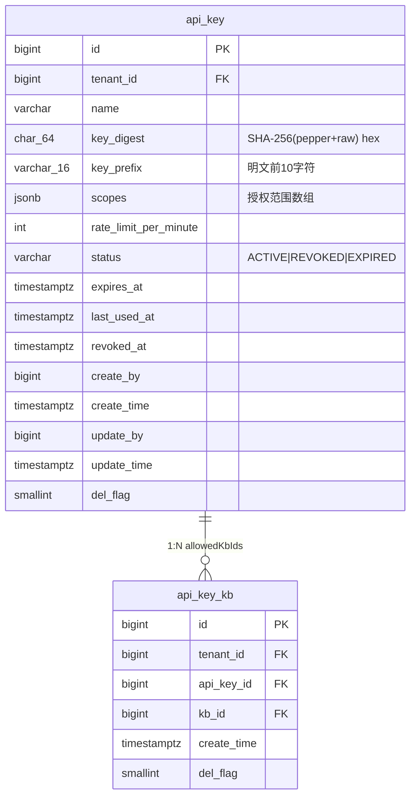
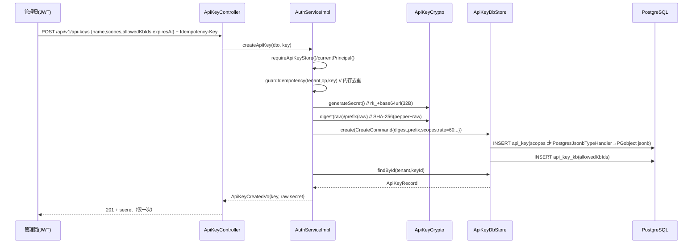

# API Key 管理业务（功能边界与业务流）

> 范围：`/api/v1/api-keys` 后台管理接口 + 机器访问鉴权链路。
> 权威契约以 `service/` 代码与 `deploy/ddl/init.sql` 为准；本文件用于对齐前后端与运维认知。
> 关联模块：identity（实体/端口/适配器）、access（权限码 `api-key:manage`）。

## 1. 概述

API Key 是**机器访问**凭证（区别于 JWT 的「人——Web 会话」）。租户管理员为程序化调用（脚本、集成、Agent）签发长期密钥，调用方以 `Authorization: Bearer rk_...` 访问受保护接口。

- **入库只有摘要与前缀**，明文仅创建/轮换时返回一次，不进日志、不落库、不可找回。
- **租户隔离**：所有读写以当前主体 `tenantId` 过滤，跨租户不可见。
- **生命周期**：ACTIVE →（rotate 仍为 ACTIVE，换 digest/prefix）→ REVOKED（逻辑删除，不物理删）。

## 2. 功能边界

### 2.1 在范围内（已实现）

| 能力 | 说明 |
| --- | --- |
| 创建 `POST /api/v1/api-keys` | 管理员签发；返回明文 secret 一次；`Idempotency-Key` 去重。 |
| 列表 `GET /api/v1/api-keys` | 租户下全部 key（含已吊销），按创建时间倒序；仅元数据，无明文。 |
| 详情 `GET /{keyId}` | 租户内按 id 查；不存在返回 404。 |
| 吊销 `DELETE /{keyId}` | 逻辑删除：`status=REVOKED` + `revoked_at=now`。 |
| 轮换 `POST /{keyId}/rotate` | 换 digest+prefix，status 保持 ACTIVE；返回新明文一次。 |
| 机器访问鉴权 | `ApiKeyAuthenticationFilter`（`db.enabled=true` 挂载，先于 JWT）按 `rk_` 分流，prefix+digest 命中 ACTIVE 未过期记录。 |
| 限频更新 `last_used_at` | ≥60s 一次，避免每请求写热点行。 |
| 过期判定 | 鉴权时 `expires_at <= now` 视为不命中（按不存在处理）。 |

### 2.2 不在范围 / 未实现（明确边界）

| 项 | 现状 | 说明 |
| --- | --- | --- |
| 持久化幂等 | 进程内 `ConcurrentHashMap` | 重启丢失、多实例不共享；落 `idempotency_record` 为人工实现点。 |
| 限流执行 | `rate_limit_per_minute` 仅存库 | 默认 60、CHECK 1–100000；**无 RateLilter 过滤器执行限流**。 |
| 过期状态回收 | 无调度器 | 过期 key 仍 `status=ACTIVE`（鉴权拒绝但列表仍显示 ACTIVE）；无 `EXPIRED` 自动置位。 |
| `allowedKbIds` 轮换 | rotate 不改关联 | rotate 只换 digest/prefix，`api_key_kb` 关联不变。 |
| 用量核算 | 无 | 无 per-key 调用计量与配额展示。 |
| 跨租户管理 | 无 | 管理操作仅限本租户；无平台级 admin 视角。 |
| 审计落库 | 未接线 | 创建/吊销/轮换事件未写 `audit_log`。 |

## 3. 领域对象与存储



- `api_key`：主表，统一审计列对齐 `V0.3__unified_audit_columns.sql`；`scopes` 为 JSONB 数组（`CHECK jsonb_typeof='array'`）；`key_digest` 唯一且 `CHECK ^[0-9a-f]{64}$`；`(tenant_id,name)` 唯一。
- `api_key_kb`：key→kb 多对多授权；`(tenant_id,api_key_id,kb_id)` 唯一。

## 4. 接口契约

类级约束：`@PreAuthorize("hasAuthority('api-key:manage')")` —— 仅持有 `api-key:manage` 权限码的角色（由 `PermissionCatalog` 聚合）可调用；否则 403。

| 方法 | 路径 | 入参 | 成功 | 失败 |
| --- | --- | --- | --- | --- |
| GET | `/api/v1/api-keys` | — | 200 `List<ApiKeyVo>` | 401 / 403 |
| POST | `/api/v1/api-keys` | body `ApiKeyCreateDto` + 头 `Idempotency-Key?` | 201 `ApiKeyCreatedVo` | 400 / 401 / 403 / 409 |
| GET | `/api/v1/api-keys/{keyId}` | path `keyId` | 200 `ApiKeyVo` | 401 / 403 / 404 |
| DELETE | `/api/v1/api-keys/{keyId}` | path `keyId` | 204 | 401 / 403 / 404 |
| POST | `/api/v1/api-keys/{keyId}/rotate` | path `keyId` + 头 `Idempotency-Key?` | 201 `ApiKeyCreatedVo` | 401 / 403 / 404 |

- `ApiKeyCreateDto`：`name`(必填,≤128) + `scopes`(必填,非空数组) + `allowedKbIds?` + `expiresAt?`。
- `ApiKeyVo`：元数据（`keyPrefix`、`scopes`、`kbIds`、`status`、`expiresAt`、`lastUsedAt`、`createdAt`），**无明文**。
- `ApiKeyCreatedVo`：`{ key: ApiKeyVo, secret: "rk_..." }` —— `secret` 仅此一次返回。

## 5. 业务流

### 5.1 创建



### 5.2 机器访问鉴权

```mermaid
sequenceDiagram
    participant M as 机器调用方
    participant F as ApiKeyAuthenticationFilter
    participant CR as ApiKeyCrypto
    participant ST as ApiKeyDbStore
    participant DB as PostgreSQL
    M->>F: Bearer rk_...
    F->>CR: looksLikeApiKey?  // rk_ 前缀分流
    alt 非 rk_
      F->>F: 交给 JwtAuthenticationFilter
    else rk_
      F->>CR: prefix(raw)/digest(raw)
      F->>ST: findActiveByPrefixAndDigest(prefix,digest)
      ST->>DB: SELECT ... status='ACTIVE' LIMIT 1
      alt 命中且未过期
        ST-->>F: ApiKeyRecord
        F->>ST: maybeTouchLastUsed(≥60s)
        F->>F: authorities=scopes; principal=ApiKeyPrincipal
        F->>F: 写 SecurityContext → 继续
      else 未命中/已过期/已吊销
        F-->>M: 401 E-1001
      end
    end
```

> 与 JWT 并存：`rk_` 前缀由认证层识别分流，API Key 不交给 JWT Parser；二者共享 `Authorization: Bearer` 头。

### 5.3 轮换与吊销

- **轮换**：`updateDigestAndPrefix` 换新 digest+prefix，`status` 保持 ACTIVE；旧明文立即失效（digest 不再命中）。返回新明文一次。
- **吊销**：`status=REVOKED` + `revoked_at=now`；鉴权时 `status='ACTIVE'` 过滤不再命中，即时失效。

## 6. 安全边界

- **不存明文**：库中只有 `key_digest`（带 pepper 的 SHA-256）与 `key_prefix`；`pepper` 来自 `RAGKB_API_KEY_PEPPER`（变更致全部 key 失效）。
- **租户隔离**：list/findById/revoke/rotate 全部以 `tenantId` 过滤；跨租户查询返回 404（不泄漏存在性）。
- **权限**：管理操作统一 `api-key:manage`；机器调用方以 `scopes` 为 authorities，受方法级 `@PreAuthorize` 二次约束。
- **失败语义**：鉴权失败 401（不区分「不存在/已过期/已吊销」，防枚举）。
- **幂等**：`Idempotency-Key` 重复命中返回 409（仅进程内，见 §2.2）。

## 7. 错误码语义

| code | HTTP | 含义 |
| --- | --- | --- |
| `0` | 200 | 成功 |
| `E-1000` | 400 | 参数校验失败（name/scopes 缺失等） |
| `E-1001` | 401 | 未认证 / key 无效或过期 |
| `E-1002` | 403 | 无 `api-key:manage` 权限 |
| `E-1003` | 404 | 租户内 key 不存在 |
| `E-1004` | 409 | 幂等键重复 |
| `E-9998` | 503 | 基础设施不可用（DB/Redis 故障，fail-closed）— 见 §8 待办 |
| `E-9999` | 500 | 未捕获异常 |

## 8. 已知修复与遗留

- **已修复（本次）**：`POST /api/v1/api-keys` 创建返回 500。
  - 根因：`ApiKey.scopes` 用 MyBatis-Plus `JacksonTypeHandler` 写入时绑定为 `varchar`，PostgreSQL `jsonb` 列拒绝 `varchar→jsonb` 隐式转换，INSERT 抛 `BadSqlGrammarException`（非 `ApiException`）→ 全局兜底 500。
  - 修复：新增 `common/persistence/PostgresJsonbTypeHandler`（`PGobject(type=jsonb)` 写入、Jackson 读取），`ApiKey.scopes` 改用它；`postgresql` 依赖由 `runtime` 调整为 `compile`（编译期需 `PGobject`）。
  - 等价替代：JDBC URL 追加 `?stringtype=unspecified`（全局生效，需改数据源配置）。

- **遗留（未在本次改动，建议后续小切口推进）**：
  1. 鉴权链路基础设施异常未隔离：`JwtAuthenticationFilter` 只 `catch ApiException`，Redis 故障时 `blacklistPort.isBlacklisted()` 抛连接异常 → 兜底 500。按既定约束应 fail-closed 503（E-9998），并给 Redis 适配器加 `@ConditionalOnProperty` + Scaffold 兜底。
  2. 过期状态回收调度器缺失（§2.2）。
  3. 持久化幂等（`idempotency_record`）未落库（§2.2）。
  4. `rate_limit_per_minute` 仅存库未执行限流（§2.2）。

## 9. 涉及代码

- 控制器：`service/.../identity/controller/ApiKeyController.java`
- 用例：`service/.../identity/service/impl/AuthServiceImpl.java`（API Key 段）
- 端口/适配器：`identity/port/ApiKeyStorePort.java`、`identity/adapter/ApiKeyDbStore.java`、`identity/adapter/ApiKeyCrypto.java`
- 鉴权过滤器：`service/.../config/ApiKeyAuthenticationFilter.java`、`config/JwtAuthenticationFilter.java`
- 实体：`identity/persistence/entity/ApiKey.java`、`ApiKeyKb.java`
- 持久化工具：`common/persistence/PostgresJsonbTypeHandler.java`、`AuditMetaObjectHandler.java`
- DDL：`deploy/ddl/init.sql`、`deploy/ddl/migrations/V0.3__unified_audit_columns.sql`
