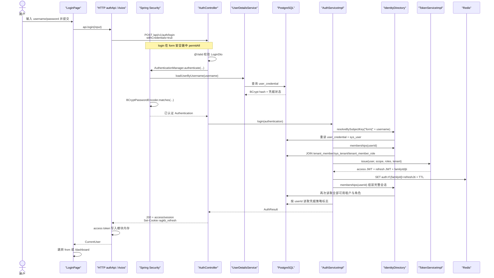

# `/api/v1/auth/login` 实现链路

- 状态：当前实现说明
- 版本：v1.0
- 负责人：zhanghuaiwei
- 最近更新：2026-08-13
- 代码基线：`3f6f818` 及本文生成时的本地工作区改动
- 权威接口契约：[server.openapi.yaml](../../../api/server.openapi.yaml)
- 相关全局盘点：[认证授权体系现状](../../enterprise-generalization/design/authentication-authorization-current-state.md)

## 1. 范围与结论

本文只说明 `POST /api/v1/auth/login` 的当前实现链路，包括前端发起请求、Spring Security 密码认证、身份与租户解析、JWT 签发、Redis refresh family 持久化、Cookie/响应写回和异常映射。

该接口仅用于 `ragkb.auth.mode=form`。在真实 HTTP 模式下，前端提交用户名和密码；后端验证本地凭据后，从服务端身份目录选择第一个可用租户，签发 access/refresh JWT，把 access token 放入响应体，把 refresh token 写入 HttpOnly Cookie。生产目标模式是 OIDC，不走本接口。

> 注意：前端 `NEXT_PUBLIC_USE_MOCK` 未显式设为 `false` 时默认使用 mock；mock 登录不会调用本接口，也不会校验真实账号密码。

## 2. 接口契约摘要

| 项 | 当前约定 |
| --- | --- |
| Method / Path | `POST /api/v1/auth/login` |
| Content-Type | `application/json` |
| 认证要求 | 无；form 安全链中为 `permitAll` |
| 请求体 | `username: string`、`password: string`，后端均为 `@NotBlank` |
| 成功状态 | HTTP 200，统一信封 `code = "0"` |
| access token | `data.accessToken`，前端仅存内存 |
| refresh token | `Set-Cookie: ragkb_refresh=...; HttpOnly; Path=/api/v1/auth; SameSite=Lax` |
| 默认有效期 | access 15 分钟；refresh 30 天 |
| 失败响应 | 统一信封 `{ code, message, data: null }`；具体差异见[异常链路](#8-异常链路与当前差异) |

请求示例：

```http
POST /api/v1/auth/login HTTP/1.1
Content-Type: application/json

{
  "username": "admin",
  "password": "<password>"
}
```

成功响应结构示例（令牌已省略）：

```http
HTTP/1.1 200 OK
Set-Cookie: ragkb_refresh=<refresh-jwt>; HttpOnly; Path=/api/v1/auth; SameSite=Lax; Max-Age=2592000
Content-Type: application/json

{
  "code": "0",
  "message": "OK",
  "data": {
    "accessToken": "<access-jwt>",
    "tokenType": "Bearer",
    "expiresIn": 900,
    "session": {
      "userId": 1,
      "subjectKey": "form|admin",
      "displayName": "Bootstrap Admin",
      "activeTenant": {
        "tenantId": 1,
        "tenantCode": "default",
        "tenantRoles": ["TENANT_ADMIN"]
      },
      "tenants": [
        {
          "tenantId": 1,
          "tenantCode": "default",
          "tenantRoles": ["TENANT_ADMIN"]
        }
      ],
      "tenantRoles": ["TENANT_ADMIN"],
      "credentialScopes": ["web"],
      "permissions": ["dashboard:view", "api-key:manage"],
      "features": ["governance", "analytics"],
      "policyVersion": 1,
      "mustChangePassword": false,
      "passwordExpired": false
    }
  }
}
```

示例中的集合只展示字段形状，实际租户、角色、权限和 feature 均由服务端数据与 `PermissionCatalog` 计算，不应按示例值断言。

## 3. 端到端时序



## 4. 前端调用链

### 4.1 页面入口

[web/app/login/page.tsx](../../../../web/app/login/page.tsx) 使用 Ant Design 表单收集账号和密码：

1. 浏览器侧要求账号非空、密码非空且至少 6 位。
2. 提交时只对 `username` 执行 `trim()`，密码原样发送。
3. 调用 `api.login({ username, password })`。
4. 成功后跳到合法的 `from` 路径；没有 `from` 时跳 `/dashboard`。
5. 失败时展示 HTTP 客户端归一化后的 `error.message`。

前端的“密码至少 6 位”不是后端契约；直接调用 API 时，后端目前只要求密码非空。

### 4.2 mock / HTTP 分流

[web/api-client/client.ts](../../../../web/api-client/client.ts) 根据 `publicEnv.useMock` 选择 transport：

- `NEXT_PUBLIC_USE_MOCK=false`：进入真实 [HTTP authApi](../../../../web/api-client/http/auth.ts)。
- 未设置或不是字符串 `false`：进入 [mock authApi](../../../../web/api-client/mock/auth.ts)，任意非空账号密码都可登录。

真实 HTTP 模式下，[web/config/env.ts](../../../../web/config/env.ts) 默认把：

```text
http://localhost:8080 + /api/v1 + /auth/login
```

拼成 `http://localhost:8080/api/v1/auth/login`。环境示例文件已显式配置 `NEXT_PUBLIC_USE_MOCK=false`。

### 4.3 HTTP transport

[web/api-client/http/auth.ts](../../../../web/api-client/http/auth.ts) 调用：

```ts
request<TokenResponse>({
  method: "POST",
  url: "/auth/login",
  data: { username, password },
});
```

[web/api-client/http/client.ts](../../../../web/api-client/http/client.ts) 的相关行为是：

- Axios `baseURL` 已包含 `/api/v1`。
- `withCredentials: true`，允许浏览器接收 refresh Cookie，并在后续刷新/登出请求中携带它。
- 登录属于认证端点，请求拦截器不会附加旧的 Bearer token。
- 登录自身返回 401 时不会触发 refresh，避免递归刷新。
- 成功响应先从 `{ code, message, data }` 信封解壳，再调用 `setAuth(accessToken, expiresIn)`。
- access token 只写入 [web/lib/auth.ts](../../../../web/lib/auth.ts) 的模块级内存变量，不进入 localStorage/sessionStorage。
- 后端 `AuthSession` 会被映射为前端 `CurrentUser`；其中 `tenantName` 当前实际取 `tenantCode`，邮箱和组织名暂为空字符串。

## 5. 后端入口与安全链

### 5.1 路由与参数校验

[AuthController](../../../../service/src/main/java/com/ragkb/service/modules/identity/controller/AuthController.java) 的类级路径为 `/api/v1/auth`，方法级路径为 `login`，组合为 `/api/v1/auth/login`。

`LoginDto` 对 `username`、`password` 使用 `@NotBlank`。校验失败由 `GlobalExceptionHandler.handleValidation` 转为 HTTP 400 / `E-1000`，业务方法不会执行。

### 5.2 SecurityFilterChain

[SecurityConfig](../../../../service/src/main/java/com/ragkb/service/config/SecurityConfig.java) 在 form 模式下：

- 将 `/api/v1/auth/login` 配为 `permitAll`。
- 使用 `SessionCreationPolicy.STATELESS`，禁用框架 formLogin 和默认 logout。
- 当前关闭 CSRF。
- `JwtAuthenticationFilter` 位于用户名密码过滤器之前；登录请求通常没有 Bearer token，因此直接放行。
- `CredentialPolicyGateFilter` 只处理已经建立的 JWT 主体；登录请求仍是匿名主体，因此直接放行。

在 `ragkb.auth.mode=oidc` 时，OIDC 安全链没有把该路径列入 `permitAll`；未认证请求不会进入正常账号密码登录链路。

### 5.3 显式认证

Controller 不依赖 Spring Security 的表单登录过滤器，而是显式构造：

```java
UsernamePasswordAuthenticationToken.unauthenticated(username, password)
```

并调用 `AuthenticationManager.authenticate(...)`。默认 `DaoAuthenticationProvider` 使用当前装配的 `UserDetailsService` 加载账号，再使用 `BCryptPasswordEncoder` 比对明文密码与数据库/内存中的 BCrypt hash。密码明文不会传入业务服务，也不会写入数据库。

## 6. 身份源、数据库读取与租户选择

身份源由两个开关共同决定：

| 条件 | UserDetailsService | IdentityDirectory | 数据来源 |
| --- | --- | --- | --- |
| `mode=form`、`db.enabled=true` | `JdbcUserDetailsService` | `JdbcIdentityDirectory` | PostgreSQL |
| `mode=form`、`db.enabled=false` | `InMemoryUserDetailsManager` | `LocalIdentityDirectory` | `RAGKB_DEV_*` 内存配置 |

### 6.1 数据库模式

密码认证阶段：

1. [JdbcUserDetailsService](../../../../service/src/main/java/com/ragkb/service/modules/identity/adapter/JdbcUserDetailsService.java) 调用 `UserCredentialStorePort.findByUsername`。
2. [JdbcUserCredentialStore](../../../../service/src/main/java/com/ragkb/service/modules/identity/adapter/JdbcUserCredentialStore.java) 通过 MyBatis-Plus 查询 `user_credential`；逻辑删除行会由 `del_flag` 规则排除。
3. `DISABLED` 账号被禁用；`LOCKED` 且 `locked_until` 仍在未来的账号也被禁用。
4. Spring Security 完成 BCrypt 比对，成功后返回 `Authentication`。

业务身份解析阶段：

1. `AuthServiceImpl` 把认证主体转换为 `subjectKey = form|<username>`。
2. [JdbcIdentityDirectory](../../../../service/src/main/java/com/ragkb/service/modules/identity/adapter/JdbcIdentityDirectory.java) 再次查询 `user_credential`，要求凭据状态严格为 `ACTIVE`。
3. 按 `user_id` 查询 `sys_user`，要求用户状态为 `ACTIVE`。
4. 查询用户全部有效成员关系。SQL 位于 [TenantMemberMapper.xml](../../../../service/src/main/resources/mapper/TenantMemberMapper.xml)，要求：
   - `tenant_member.status = ACTIVE`；
   - `sys_tenant.status = ACTIVE`；
   - 两者均未逻辑删除；
   - LEFT JOIN `tenant_member_role`，在 Java 中按租户聚合角色。
5. 登录默认选择查询结果中的第一个有效租户。当前 SQL 按 `tenant_id` 升序，因此实际选择最小 `tenant_id`，请求体不能指定租户。

组装响应会话时会再次查询全部有效租户，并按 `user_id` 查询 `user_credential`，填充 `mustChangePassword` 与 `passwordExpired`。

因此一次成功的数据库登录当前通常包含以下读取：

| 次数 | 读取 |
| --- | --- |
| 1 | 按 username 读取 `user_credential`，用于密码认证 |
| 2 | 按 username 重读 `user_credential`，用于身份解析 |
| 3 | 按 id 读取 `sys_user` |
| 4 | JOIN 读取成员关系，选择默认租户 |
| 5 | 再次 JOIN 读取成员关系，组装 `tenants` |
| 6 | 按 userId 读取 `user_credential`，组装凭据策略标志 |

### 6.2 无数据库兜底模式

[SecurityConfig](../../../../service/src/main/java/com/ragkb/service/config/SecurityConfig.java) 从 `RAGKB_DEV_USERNAME`、`RAGKB_DEV_PASSWORD`、`RAGKB_DEV_ROLES` 创建内存用户；[LocalIdentityDirectory](../../../../service/src/main/java/com/ragkb/service/modules/identity/adapter/LocalIdentityDirectory.java) 把该用户固定映射到 `userId=1`、`tenantId=1`、`tenantCode=default`。

该分支只适合作为开发/演示兜底，不代表数据库账号链路已通过。

## 7. 业务服务、令牌与响应写回

### 7.1 会话权限视图

[AuthServiceImpl](../../../../service/src/main/java/com/ragkb/service/modules/identity/service/impl/AuthServiceImpl.java) 取得身份和当前租户后：

1. 固定本次表单凭证能力为 `credentialScopes = ["web"]`。
2. 使用 [PermissionCatalog](../../../../service/src/main/java/com/ragkb/service/modules/access/service/PermissionCatalog.java) 将租户角色展开为稳定权限码。
3. 由权限集合推导 `features`。
4. 把活动租户、全部租户、角色、权限、策略版本和密码策略标志写入 `AuthSessionVo`。

客户端提交的数据不包含也不能决定 `userId`、`tenantId`、角色或权限。

### 7.2 JWT 签发

[TokenServiceImpl](../../../../service/src/main/java/com/ragkb/service/modules/identity/service/impl/TokenServiceImpl.java) 使用 HS256 签发一对 JWT：

| 项 | access | refresh |
| --- | --- | --- |
| `typ` | `access` | `refresh` |
| 公共信息 | `jti`、`sub`、`iss`、`aud=ragkb:web`、`iat`、`nbf`、`exp`、`uid`、`ten` | 同左 |
| 额外 claims | `scp`、`rls` | `rfid`（refresh family id） |
| 默认 TTL | 15 分钟 | 30 天 |
| 返回位置 | JSON 响应体 | HttpOnly Cookie |

JWT 密钥来自 `RAGKB_JWT_SECRET`，编码后不足 32 字节或为空时服务启动失败。refresh 不固化角色，后续刷新会从身份目录重新读取成员关系。

### 7.3 Redis 与成功边界

令牌生成后，[RedisRefreshTokenStoreAdapter](../../../../service/src/main/java/com/ragkb/service/modules/identity/adapter/RedisRefreshTokenStoreAdapter.java) 执行：

```text
SET auth:rf:{refreshFamilyId} {refreshJti} EX {refreshTtl}
```

Redis 保存成功后才继续构造响应。Redis 异常不会降级放行，而是由全局异常处理转成 HTTP 500 / `E-9999`；此时客户端不会收到 refresh Cookie。

### 7.4 Cookie 与 JSON

Controller 最后把 refresh token 写为：

- 名称：`ragkb_refresh`
- `HttpOnly=true`
- `Secure=${RAGKB_COOKIE_SECURE:false}`
- `SameSite=Lax`
- `Path=/api/v1/auth`
- `Max-Age=${RAGKB_JWT_REFRESH_COOKIE_MAX_AGE_SECONDS:2592000}`

响应体经 `ApiResponse.ok` 包装为 `{ code: "0", message: "OK", data: TokenResponseVo }`。浏览器能保存跨源 Cookie还要求后端 CORS 允许当前前端 Origin，当前配置由 `RAGKB_CORS_ALLOWED_ORIGINS` 提供，并启用 `allowCredentials(true)`。

## 8. 异常链路与当前差异

| 场景 | 当前 HTTP / code | 来源与说明 |
| --- | --- | --- |
| username/password 缺失或空白 | 400 / `E-1000` | Bean Validation；消息为首个字段错误 |
| 用户不存在、密码错误、账号被 Spring Security 判定为禁用/锁定 | **500 / `E-1001`** | 当前本地工作区的 `GlobalExceptionHandler.handleAuthentication` 返回 500 并透传异常消息 |
| 密码已通过，但身份目录发现凭据或 `sys_user` 非 ACTIVE | 401 / `E-1001` | `AuthServiceImpl.requireIdentity` |
| 用户没有有效租户 | 403 / `E-1002` | `AuthServiceImpl.firstActiveMembership` |
| Redis 或其他未处理异常 | 500 / `E-9999` | `GlobalExceptionHandler.handleUnexpected` |

### 8.1 已发现的契约差异

权威 OpenAPI 声明登录认证失败为 HTTP 401；当前工作区却把 `AuthenticationException` 映射为 HTTP 500，同时返回 Spring Security 原始异常消息。该差异还会导致前端把错误视为服务器错误，并可能暴露“用户不存在/账号禁用/密码错误”等内部细节。本文只记录现状，不修改该业务行为。

### 8.2 凭据策略尚未闭环

[CredentialPolicyEventListener](../../../../service/src/main/java/com/ragkb/service/modules/identity/adapter/CredentialPolicyEventListener.java) 的成功/失败事件方法目前为空，因此：

- 登录失败不会调用 `recordLoginFailure`，失败计数和自动锁定不会推进。
- 登录成功不会调用 `recordLoginSuccess`，失败计数不会清零，`last_login_at` 也不会更新。
- `JdbcUserDetailsService` 会让锁定时间已过的 `LOCKED` 凭据通过密码认证，但随后 `JdbcIdentityDirectory` 仍要求状态为 `ACTIVE`；由于成功事件没有解锁，该账号最终仍会在业务身份解析阶段被拒绝，自动解锁未闭环。

### 8.3 输入归一化差异

- Web 页面会 trim username，API 本身不会。
- 数据库唯一索引使用 `lower(username)` 保证大小写不敏感唯一，但当前查询使用等值匹配而未调用 `lower()`；因此登录匹配仍可能受数据库列比较大小写影响。

## 9. 配置依赖

主要配置见 [application.yml](../../../../service/src/main/resources/application.yml)：

| 环境变量 | 作用 | 当前默认值 |
| --- | --- | --- |
| `RAGKB_AUTH_MODE` | `form` / `oidc` | `form` |
| `RAGKB_DB_ENABLED` | 使用数据库身份源 | 当前工作区为 `true` |
| `RAGKB_DB_URL` / `RAGKB_DB_USERNAME` / `RAGKB_DB_PASSWORD` | PostgreSQL 连接 | 本地默认地址；密码为空 |
| `REDIS_HOST` / `REDIS_PORT` / `REDIS_PASSWORD` | refresh family 存储 | `localhost:6379` |
| `RAGKB_JWT_SECRET` | HS256 密钥，至少 32 字节 | 仅开发兜底值 |
| `RAGKB_JWT_ACCESS_TTL` | access TTL | `15m` |
| `RAGKB_JWT_REFRESH_TTL` | refresh TTL | `30d` |
| `RAGKB_JWT_REFRESH_COOKIE_MAX_AGE_SECONDS` | Cookie Max-Age | `2592000` |
| `RAGKB_COOKIE_SECURE` | Cookie Secure | `false` |
| `RAGKB_CORS_ALLOWED_ORIGINS` | 允许携带 Cookie 的前端来源 | `http://localhost:3000` |
| `NEXT_PUBLIC_USE_MOCK` | 前端是否走 mock | 未设时为 `true` |
| `NEXT_PUBLIC_API_BASE_URL` / `NEXT_PUBLIC_API_PREFIX` | 前端 API 根地址 | `http://localhost:8080` / `/api/v1` |

数据库 schema 由 [init.sql](../../../../deploy/ddl/init.sql)、[V0.4__local_user_credentials.sql](../../../../deploy/ddl/migrations/V0.4__local_user_credentials.sql) 和 [V0.5__tenant_accounts.sql](../../../../deploy/ddl/migrations/V0.5__tenant_accounts.sql) 提供；应用启动不会自动建表。

## 10. 代码索引

| 环节 | 主要文件 |
| --- | --- |
| 登录页面 | [web/app/login/page.tsx](../../../../web/app/login/page.tsx) |
| API transport | [web/api-client/http/auth.ts](../../../../web/api-client/http/auth.ts)、[web/api-client/http/client.ts](../../../../web/api-client/http/client.ts) |
| access token 内存存储 | [web/lib/auth.ts](../../../../web/lib/auth.ts) |
| 安全配置 | [SecurityConfig.java](../../../../service/src/main/java/com/ragkb/service/config/SecurityConfig.java) |
| HTTP 入口 | [AuthController.java](../../../../service/src/main/java/com/ragkb/service/modules/identity/controller/AuthController.java) |
| 请求/响应 DTO | [LoginDto.java](../../../../service/src/main/java/com/ragkb/service/modules/identity/dto/LoginDto.java)、[TokenResponseVo.java](../../../../service/src/main/java/com/ragkb/service/modules/identity/vo/TokenResponseVo.java)、[AuthSessionVo.java](../../../../service/src/main/java/com/ragkb/service/modules/identity/vo/AuthSessionVo.java) |
| 密码认证 | [JdbcUserDetailsService.java](../../../../service/src/main/java/com/ragkb/service/modules/identity/adapter/JdbcUserDetailsService.java)、[JdbcUserCredentialStore.java](../../../../service/src/main/java/com/ragkb/service/modules/identity/adapter/JdbcUserCredentialStore.java) |
| 登录业务 | [AuthServiceImpl.java](../../../../service/src/main/java/com/ragkb/service/modules/identity/service/impl/AuthServiceImpl.java) |
| 身份与租户解析 | [JdbcIdentityDirectory.java](../../../../service/src/main/java/com/ragkb/service/modules/identity/adapter/JdbcIdentityDirectory.java)、[TenantMemberMapper.xml](../../../../service/src/main/resources/mapper/TenantMemberMapper.xml) |
| 权限展开 | [PermissionCatalog.java](../../../../service/src/main/java/com/ragkb/service/modules/access/service/PermissionCatalog.java) |
| JWT | [TokenServiceImpl.java](../../../../service/src/main/java/com/ragkb/service/modules/identity/service/impl/TokenServiceImpl.java) |
| refresh family | [RedisRefreshTokenStoreAdapter.java](../../../../service/src/main/java/com/ragkb/service/modules/identity/adapter/RedisRefreshTokenStoreAdapter.java) |
| Cookie / CORS | [AuthController.java](../../../../service/src/main/java/com/ragkb/service/modules/identity/controller/AuthController.java)、[WebConfig.java](../../../../service/src/main/java/com/ragkb/service/config/WebConfig.java) |
| 异常映射 | [GlobalExceptionHandler.java](../../../../service/src/main/java/com/ragkb/service/common/exception/GlobalExceptionHandler.java) |

## 11. 现有测试与验证缺口

### 11.1 本次已执行验证

| 验证 | 结果 |
| --- | --- |
| 文档本地相对链接检查 | 通过，无失效链接 |
| `git diff --check` | 通过 |
| JDK 21 后端定向测试：`JdbcUserDetailsServiceTest,JdbcIdentityDirectoryTest,AuthServiceImplTest,TokenServiceImplTest,RedisRefreshTokenStoreAdapterTest,BcryptSeedCompatibilityTest` | 通过，共 44 个用例，0 failure / 0 error |
| 前端定向测试：`pnpm vitest run api-client/http/client.test.ts lib/auth.test.ts` | 通过，共 2 个测试文件、8 个用例 |

后端测试初次被系统 Maven 默认选用的 JDK 26 阻塞：当前 Byte Buddy 只支持到 Java 24，Mockito 无法初始化。切换到项目要求的 GraalVM JDK 21 后重跑通过；该初次错误不属于业务断言失败。

### 11.2 覆盖现状

已有自动化测试覆盖：

- `JdbcUserDetailsServiceTest`：凭据存在性、禁用与锁定状态门禁。
- `JdbcIdentityDirectoryTest`：身份 ACTIVE 过滤、租户与角色聚合。
- `AuthServiceImplTest`：登录签发、refresh family 保存、会话权限视图。
- `TokenServiceImplTest`：JWT 签发/解析、类型、签名、issuer、TTL。
- `RedisRefreshTokenStoreAdapterTest`：refresh family 初始化、轮换和吊销。
- `BcryptSeedCompatibilityTest`：数据库 seed BCrypt hash 与约定密码兼容。
- `web/api-client/http/client.test.ts`：登录 401 不触发 refresh。
- `web/lib/auth.test.ts`：access token 只在内存保存及过期清理。

当前没有覆盖 `LoginPage -> HTTP -> AuthController -> AuthenticationManager -> PostgreSQL -> Redis` 的端到端测试，也没有 `AuthController` 的 MockMvc 测试；工作区中的“认证失败返回 HTTP 500”同样没有契约测试守护。因此现有单元测试通过不能等价为该接口全链路验收通过。

## 12. 维护边界

本文是人工维护的当前实现说明，不是 API 权威契约。字段、状态码或 Cookie 约定发生变化时，应先更新 `docs/api/server.openapi.yaml`，再同步后端、前端、测试和本文；实现状态与本文冲突时，以经过验证的当前代码和测试证据为准。
