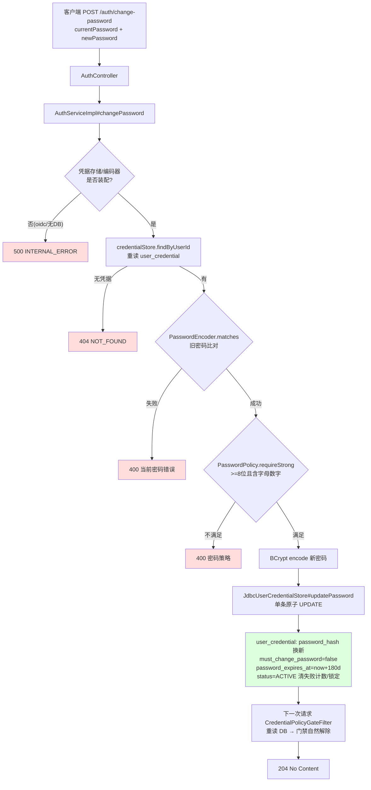
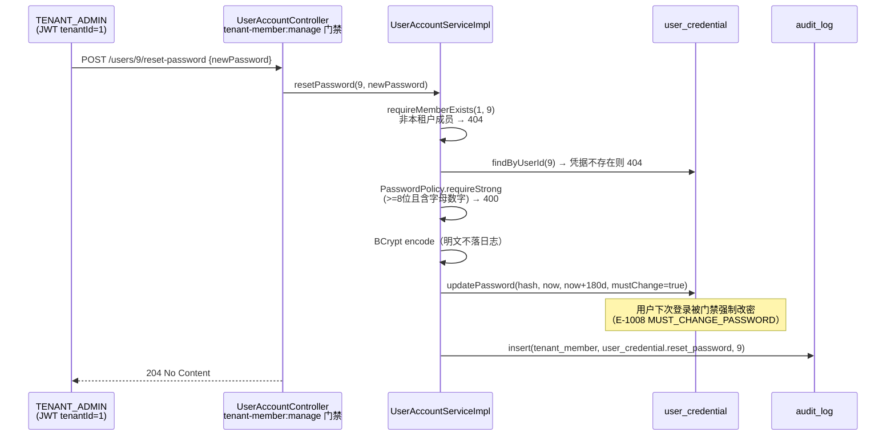
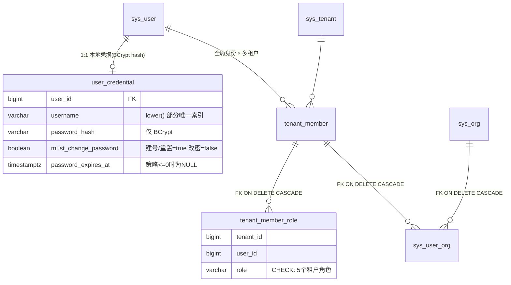

# 身份域：自助改密与租户成员管理实现

- 状态：当前实现说明
- 版本：v1.0
- 负责人：zhanghuaiwei
- 最近更新：2026-08-17
- 权威接口契约：[server.openapi.yaml](../../../api/server.openapi.yaml)
- 相关文档：[auth-login-implementation-chain](auth-login-implementation-chain.md)

## 1. 范围与结论

本文说明 identity 模块 6 个安全敏感用例的实现链路与安全边界：

| 用例 | 入口 | 实现类 |
| --- | --- | --- |
| 自助修改密码 | `POST /api/v1/auth/change-password` | `AuthServiceImpl#changePassword` |
| 创建本地用户 | `POST /api/v1/users` | `UserAccountServiceImpl#createLocalUser` |
| 调整成员组织 | `PATCH /api/v1/users/{userId}/org` | `UserAccountServiceImpl#updateUserOrg` |
| 覆盖式替换角色 | `PUT /api/v1/users/{userId}/roles` | `UserAccountServiceImpl#setRoles` |
| 移出租户 | `DELETE /api/v1/users/{userId}` | `UserAccountServiceImpl#removeFromTenant` |
| 管理员重置密码 | `POST /api/v1/users/{userId}/reset-password` | `UserAccountServiceImpl#resetPassword` |

成员管理 5 个接口由 `UserAccountController` 类级 `@PreAuthorize("hasAuthority('tenant-member:manage')')` 门禁（唯一持有人 `TENANT_ADMIN`）；自助改密仅需 Bearer JWT 认证。Service 层再做资源归属校验（目标必须是当前激活租户 `JwtPrincipal.tenantId()` 内的成员，服务端从 JWT 推导，不信任客户端自报）。

## 2. 密码链路：changePassword / resetPassword / createLocalUser

### 2.1 实现逻辑

**自助改密（`AuthServiceImpl#changePassword`）**

1. 前置装配检查：`UserCredentialStorePort` / `PasswordEncoder` 任一缺失（oidc 部署或未启用 DB）→ `INTERNAL_ERROR`（明确报"需要启用数据库与 form 模式"）；
2. 按当前 JWT 的 `userId` 重读 `user_credential`，无凭据 → `NOT_FOUND`；
3. `passwordEncoder.matches(currentPassword, hash)` 校验旧密码，失败 → `BAD_REQUEST`（防会话被窃后直接改密接管账号）；
4. `PasswordPolicy.requireStrong(newPassword)`：长度 ≥ 8 且同时包含字母与数字（三个密码入口统一策略，严于 DTO 的 `@Size(min=6)` 宽松下限）；
5. 调用 `credentialStore.updatePassword(..., mustChangePassword=false)` 原子更新：新 BCrypt 哈希 + `password_changed_at=now` + `password_expires_at=now+expiryDays`（配置 `ragkb.auth.local.password-expiry-days`，`<=0` 显式写 NULL）+ 凭据恢复健康态（`status=ACTIVE`、清失败计数与锁定）；
6. **不吊销当前 refresh 家族**（既定契约，见 §4.2）。

**管理员重置密码（`resetPassword`）**

1. 资源归属：目标必须是当前租户成员（`selectMembers` 判空 → `NOT_FOUND`），堵死跨租户重置他人密码的越权通道；
2. 目标须有本地凭据（oidc 用户无 → `NOT_FOUND`）；
3. 同一 `PasswordPolicy` 强度校验 → BCrypt 编码；
4. `updatePassword(..., mustChangePassword=true)`：重置密码是一次性密码，目标用户下次登录被 `CredentialPolicyGateFilter` 门禁（403 / `E-1008`）强制改回；
5. 写审计 `user_credential.reset_password`。

**创建本地用户（`createLocalUser`）**

单事务（`@Transactional`）四表插入：

1. `sys_user`（全局身份：email / displayName / ACTIVE）；
2. `user_credential`（username + BCrypt 哈希 + `must_change_password=true` + 过期时间按策略）；
3. `tenant_member`（当前租户，ACTIVE）；
4. `tenant_member_role`（入参角色去重后每角色一行）；
5. 用户名撞 `lower(username)` 部分唯一索引 → 捕获 `DuplicateKeyException` 业务化为 `CONFLICT`（409），事务回滚；
6. 写审计 `tenant_member.create_local`。

### 2.2 改密数据流转

### 2.3 管理员重置密码数据流转

## 3. 成员管理链路：updateUserOrg / setRoles / removeFromTenant

### 3.1 实现逻辑

**updateUserOrg（clear-and-set 单组织）**

1. `requireMemberExists`（资源归属，非成员 → `NOT_FOUND`）；
2. `deleteMemberOrgs`：清空 `sys_user_org` 该成员在当前租户的全部组织关联；
3. `orgId != null` 时：`countOrgInTenant` 校验组织存在且 `ACTIVE` 且属当前租户（否则 `BAD_REQUEST`，防跨租户挂靠）→ `insertMemberOrg`（幂等 ON CONFLICT）；`orgId == null` 即"移出组织"；
4. `loadUserVo` 重读返回。

**setRoles（覆盖式替换）**

守卫顺序：① 不得修改自己的角色（`FORBIDDEN`）→ ② 角色码全部合法（空/未知 → `BAD_REQUEST`，防注入未定义角色绕过权限目录）→ ③ `requireMemberExists` → ④ 最后管理员保护（旧角色含 `TENANT_ADMIN` 且新角色不含时，若租户内 ACTIVE 管理员计数 ≤ 1 → `FORBIDDEN`）。通过后 `hardDeleteByTenantAndUser` 物理清空旧角色行再逐行插入，写审计。

> 角色行必须物理删除：`uq_tenant_member_role (tenant_id,user_id,role)` 是全表唯一约束（不含 del_flag 条件），MyBatis-Plus 默认逻辑删除的行仍占用唯一键，会导致同角色重新插入撞约束。

**removeFromTenant（移出租户）**

守卫顺序：① 不得移出自己（`FORBIDDEN`）→ ② `requireMemberExists` → ③ 最后管理员保护（同上）。通过后写审计（与删除同事务，回滚不留孤儿审计），再 `hardDeleteByTenantAndUser` 物理删除 `tenant_member` 行；`tenant_member_role` / `sys_user_org` 经 FK `ON DELETE CASCADE` 级联清理。**`sys_user` / `user_credential` 全局身份与凭据保留**（规则 18 解读：仅清理租户关系行，非删除用户数据——用户可能仍属于其他租户）。

### 3.2 建号与移出租户数据流转

```mermaid
flowchart TD
    subgraph createLocalUser["createLocalUser（单事务）"]
        A1[POST /users<br/>username/email/displayName/password/roles] --> A2[PasswordPolicy 强度校验 → 400]
        A2 --> A3[BCrypt encode 初始密码]
        A3 --> A4[INSERT sys_user<br/>主键回填]
        A4 --> A5[INSERT user_credential<br/>hash + must_change=true + expiry]
        A5 --> A6[INSERT tenant_member<br/>tenantId=JWT, ACTIVE]
        A6 --> A7[INSERT tenant_member_role × N<br/>角色去重]
        A7 --> A8[审计 tenant_member.create_local]
        A4 -. 用户名撞唯一索引 .-> X1[409 登录账号已存在<br/>事务回滚]
    end

    subgraph removeFromTenant["removeFromTenant（级联清理）"]
        B1[DELETE /users/9] --> B2{移出自己?}
        B2 -- 是 --> X2[403]
        B2 -- 否 --> B3{属于当前租户?}
        B3 -- 否 --> X3[404]
        B3 -- 是 --> B4{目标是最后一名<br/>ACTIVE TENANT_ADMIN?}
        B4 -- 是 --> X4[403]
        B4 -- 否 --> B5[审计 tenant_member.remove]
        B5 --> B6[DELETE tenant_member]
        B6 --> B7[FK CASCADE:<br/>tenant_member_role / sys_user_org]
        B7 --> B8[sys_user / user_credential 保留<br/>全局身份不动]
    end

    style X1 fill:#fdd
    style X2 fill:#fdd
    style X3 fill:#fdd
    style X4 fill:#fdd
    style B8 fill:#dfd
```

### 3.3 涉及表关系

## 4. 安全边界

### 4.1 密码策略（`PasswordPolicy`，三入口统一）

| 项 | 约定 |
| --- | --- |
| 强度 | 长度 ≥ 8 且同时包含字母与数字（严于 DTO `@Size(min=6)` 的宽松下限，Service 层统一施加） |
| 存储 | 只存 BCrypt 哈希，任何日志 / 审计 / 异常信息不含明文 |
| 一次性密码 | `createLocalUser` / `resetPassword` 置 `must_change_password=true`，首登被 `CredentialPolicyGateFilter` 拦截（403 / E-1008）直至改密成功 |
| 过期轮换 | `password_expires_at = now + ragkb.auth.local.password-expiry-days`（`<=0` 显式 NULL=不启用）；过期后门禁 403 / E-1007 引导改密 |
| 改密副作用 | 成功改密/重置同时清失败计数与锁定，凭据恢复 `ACTIVE`（单条原子 UPDATE） |
| 自助改密 | 必须先通过旧密码 `matches` 校验（防会话劫持后改密接管） |

### 4.2 会话与 token 失效

- 自助改密**不吊销当前 refresh 家族**（既定契约：自助改密不强制重新登录；`must_change_password` 标志经门禁每请求重读 DB 自然生效，构造/绕过 token 无法跳过）。
- 管理员重置密码后，目标用户旧 access token 最长 15 分钟自然过期；**当前架构无法按用户吊销全量 refresh 家族**（`RefreshTokenStorePort` 仅按 `familyId` 组织，Redis key `auth:rf:{familyId}` 无 user 维度索引），列为遗留风险（§5）。
- 系统无 per-user token 版本号机制（`JwtPrincipal` 不携带版本 claim），故改密递增版本使旧 token 失效的方案未在本次实现。

### 4.3 最后管理员保护（防租户失管）

- `setRoles` / `removeFromTenant` 在操作会使租户失去最后一名 **ACTIVE 且未删除** 的 `TENANT_ADMIN` 时拒绝（`FORBIDDEN`）；
- 计数由 `UserAccountMapper.countActiveTenantAdmins` 实现（`tenant_member_role JOIN tenant_member` 过滤 SUSPENDED 与逻辑删除行），单一 SQL 口径，防并发下口径漂移；
- 已知缺口：`disableUser`（停用成员）尚未接入该保护（存量谨慎区注释已标注），停用最后一名管理员的路径仍存在，列为遗留风险（§5）。

### 4.4 自我操作保护

- 不得修改自己的角色（`setRoles` → `FORBIDDEN`）：防自抬权限绕过审批，也防自降后无人管理；
- 不得把自己移出租户（`removeFromTenant` → `FORBIDDEN`）。

### 4.5 资源归属与审计

- 所有按 `userId` 的写操作先 `requireMemberExists(tenantId, userId)`（tenantId 从 JWT 推导）——跨租户操作一律 404；
- 组织调整校验目标组织属当前租户且 ACTIVE；
- 建号 / 角色替换 / 移出租户 / 重置密码写 `audit_log`（`UserAccountMapper.insertAuditLog` SQL 直连，identity 模块不跨 Java 模块依赖 admin 持久化；只记 actor / action / resourceId，不落角色明细与密码）。

## 5. 遗留风险与演进方向

| 项 | 现状 | 建议 |
| --- | --- | --- |
| 按用户吊销会话 | 重置密码后目标用户旧 refresh 仍有效至自然过期（最长 30 天） | 引入 per-user 会话版本号（`sys_user.token_version` 或 Redis 计数），签发/轮换时携带并在校验时比对 |
| 停用成员的管理员保护 | `disableUser` 可停用最后一名 ACTIVE 管理员 | 复用 `countActiveTenantAdmins` 守卫（存量谨慎区已标注） |
| `createLocalUser` 幂等 | 未接 `idempotency_record`（进程内去重仅在 `AuthServiceImpl` API Key 链路） | 管理端接入统一幂等键 |
| 审计字段覆盖 | 本链路审计只填 tenant/actor/action/resource/result，source_ip / request_id / detail 为空 | 由全局审计切面（若有）补充请求上下文 |
| DTO 与策略下限不一致 | 契约 DTO `@Size(min=6)`，Service 策略 ≥ 8 | 下一次契约修订时将 OpenAPI 的 min 调整为 8，消除双口径 |

## 6. 验证

- `cd service && mvn -B -q -DskipTests test-compile`：通过；
- identity 单测（`UserAccountServiceImplTest` 22 例 / `AuthServiceImplTest` 15 例 / `JdbcUserCredentialStoreTest` 7 例，共 44 例）：全部通过（JDK 21）。
- 单测覆盖点：改密旧密码校验/强度策略/无存储报错、建号四表事务+首登强制改密+用户名冲突 409、角色替换的自我/未知角色/最后管理员守卫、移出租户的自我/非成员/最后管理员守卫+审计、重置密码的资源归属/强度/强制改密标志、组织调整的 clear-and-set/非法组织/移出组织语义、`updatePassword` 原子 UPDATE 形状（含过期 NULL 分支）。
